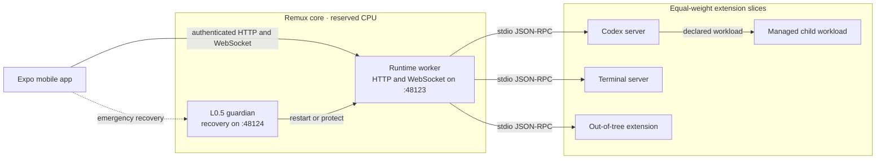

# Remux

Remux is a local-first mobile workspace for tools that run on your own machine.
An Expo app hosts extension viewers as native tabs while a Rust runtime serves
their assets, routes JSON-RPC, supervises extension processes, and keeps the
control plane responsive under heavy extension workloads.

Codex is the most complete extension today. Terminal, Markdown, and Editor
exercise the same manifest, viewer, and optional stdio-server model.

## Architecture



The runtime and guardian live in `remux-core.slice` on reserved logical CPUs.
Each extension gets an equal-weight child slice under
`remux-extensions.slice`; an extension can subdivide its own allocation into
declared interactive, background, or research workloads. Resource placement
is cooperative protection for trusted local code, not a same-user security
sandbox.

See [Runtime Architecture](docs/architecture/remux-runtime.md) for the process,
resource, RPC, and recovery model.

## Repository layout

| Path | Purpose |
| --- | --- |
| `app/` | Expo/React Native shell, tabs, WebView bridge, connection state, and native integrations |
| `crates/remux/` | Rust runtime, guardian, CLI, HTTP/WebSocket router, extension supervisor, and resource manager |
| `crates/remux-extension-host/` | Rust helper for launching extension-owned processes as declared Remux workloads |
| `extensions/` | Bundled extension manifests, viewers, and optional stdio servers |
| `packages/` | Shared TypeScript packages, currently `@remux/viewer-kit` |
| `deploy/` | systemd units and host integrations installed by Remux |
| `docs/` | Maintained architecture, development guides, and implementation records |

Rust workspace members belong under `crates/`; npm workspaces belong under
`app/`, `extensions/`, and `packages/`. Extension roots may live outside this
repository and are discovered from `.remux/config.toml`.

## Quick start

Prerequisites are Linux with systemd user services, Rust/Cargo, Node/npm, and
the Expo toolchain needed by your target device.

Install JavaScript dependencies and build the bundled viewers:

```bash
npm install
npm run viewers:build
```

For a foreground development runtime:

```bash
REMUX_HOST=127.0.0.1 npm run dev
```

Use `REMUX_HOST=0.0.0.0` when a physical device must reach the host. Start the
mobile app separately:

```bash
npm --workspace @remux/app run start
```

For the normal resilient installation, build the release binary and let it
install the CLI symlink, systemd units, and Codex workload skill:

```bash
npm run build:runtime
./target/release/remux install
./target/release/remux restart
```

Pair the app with the bearer token printed by:

```bash
remux token
```

The main runtime defaults to port `48123`; its minimal guardian listens on
`48124`. The guardian remains available when the worker is unhealthy and can
restart it or temporarily freeze non-interactive workloads.

## Common commands

| Command | Purpose |
| --- | --- |
| `npm run dev` | Run the supervisor and worker in the foreground |
| `npm run build:runtime` | Build `target/release/remux` |
| `npm run test:runtime` | Run the Rust runtime unit, integration, chaos, and process tests |
| `npm run viewers:build` | Build bundled viewer assets |
| `npm run typecheck` | Typecheck the root project and linked viewers |
| `npm run app:typecheck` | Typecheck the Expo app |
| `npm run test:codex-server` | Test the Codex extension server |
| `npm run test:codex` | Run Codex viewer Playwright tests |
| `remux status` | Show runtime, resource, and extension status |
| `remux doctor` | Run read-only host diagnostics |
| `remux logs [extension] -f` | Follow runtime or extension logs |

## Extension model

Every extension is rooted by `remux-extension.json`. A manifest can declare:

- one or more static viewers and their build/watch commands;
- launchers and file handlers for the mobile shell;
- an optional newline-delimited stdio JSON-RPC server; and
- in manifest version 2, named child workloads with a resource class,
  lifetime, and thread default.

The runtime remains transcript and process authoritative. Viewers communicate
through `@remux/viewer-kit`; Rust servers can use
`remux-extension-host` when they need a separately managed child process.
Start with the [Extension Authoring Guide](docs/guides/extension-authoring.md).

## Security

Remux exposes shell-grade local capabilities. All HTTP and WebSocket surfaces
except the health probes require a shared bearer token stored at
`.remux/auth-token` with mode `0600`. This is authentication, not transport
encryption: run Remux only on a trusted host and network, normally a tailnet.
Remux does not terminate TLS itself.

## Documentation

- [Documentation map](docs/README.md)
- [Development Guide](docs/guides/development.md)
- [Runtime Architecture](docs/architecture/remux-runtime.md)
- [Extension Authoring](docs/guides/extension-authoring.md)
- [Testing](docs/guides/testing.md)
- [Codex Extension Architecture](docs/architecture/codex-extension.md)

Implementation specs under `docs/specs/` preserve design history. Treat
documents marked `Current` as runtime truth and verify older paths against the
repository layout above.
