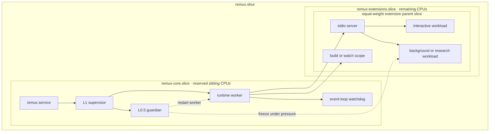
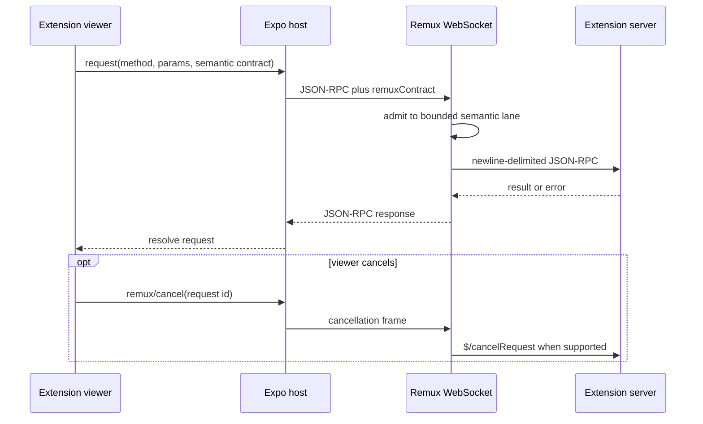

# Remux Runtime Architecture

Status: Current
Last verified: 2026-07-11

Remux is split between a local Rust control plane and an Expo mobile shell.
The runtime owns process and resource supervision, extension discovery, viewer
serving, JSON-RPC routing, filesystem access, logs, and notifications. The app
owns tabs, WebViews, connection state, native pickers, viewport and keyboard
integration, and push registration.

The `remux` package and binary live in `crates/remux/`. The CLI is one surface
of that runtime crate, not a separate application.

## Process and resource hierarchy

The reliability layers are deliberately small:

1. **L0 — systemd:** `deploy/systemd/remux.service` starts at boot, owns the
   whole control cgroup, and restarts the supervisor if that process exits.
2. **L0.5 — guardian:** a minimal HTTP and pressure-control service inside the
   supervisor process remains responsive when the worker is wedged. It can
   restart the worker and freeze or thaw lower-priority scopes.
3. **L1 — supervisor:** `crates/remux/src/supervise.rs` restarts the worker on
   abnormal exit with capped backoff. Exit `75` is an intentional hot restart;
   exit `0` stops the tree.
4. **L2 — extension actors:** each extension server has an independent state
   machine and crash budget. A failed extension cannot terminate Remux.
5. **L3 — process hygiene:** process groups, parent-death signals, run-state
   records, and startup sweeps prevent stale extension trees from surviving a
   worker generation.

The worker also has an event-loop watchdog. A Tokio task stamps a heartbeat;
an OS thread aborts the worker when that heartbeat exceeds the configured
stale interval. L1 then replaces it.

### Guardian surface

The main worker listens on `48123` by default. The guardian listens on `48124`
and intentionally exposes a much smaller authenticated control API:

- `GET /healthz` without authentication;
- authenticated status and extension inventory reads;
- idempotent worker restart, protection engage/release, and extension
  pause/resume/stop/restart operations.

Mutations require an `X-Remux-Operation-Id`. The guardian is a recovery path,
not a second general-purpose application server.

## Resource governance

The installed systemd units reserve the first physical core's sibling threads
for `remux-core.slice`. Extension work is restricted to the complementary CPU
set. Runtime discovery creates one stable, root-qualified parent slice per
extension and gives every extension parent the same CPU weight, including
extensions discovered outside this repository.

Within its parent slice, an extension may consume:

- the supervised server scope;
- lower-weight build and viewer-watch scopes; and
- manifest-declared `interactive`, `background`, or `research` workloads.

Manifest version 2 adds `resources.workloads`. Workload names and policy are
declared by the manifest; callers provide only the semantic workload name,
operation ID, optional thread request, and program. `remux workload exec`
validates ownership, clamps thread counts, publishes common native-library
thread variables, and replaces itself with the child in a transient systemd
scope. The Rust `remux-compute` crate adds typed, finite tasks over the same CLI
contract by re-executing an extension's existing server binary in worker mode.

Background and research workloads are refused when protected placement is not
available. On a compatible cgroup-v2 host, the guardian watches CPU pressure
and worker heartbeat age; when both indicate starvation it freezes lower
priority build/background/research scopes and thaws them after recovery.

This model is designed to protect responsiveness from trusted, accidentally
greedy extensions. It is not a hostile-code sandbox: all processes still run
as the same user.

## Extension lifecycle

Discovery scans each configured extension root for child directories that
contain `remux-extension.json`. The default root is `extensions/`; absolute
out-of-tree roots are supported through `.remux/config.toml` or
`REMUX_EXTENSION_ROOTS`.

`crates/remux/src/extensions/supervisor.rs` owns one actor per extension with
states such as `stopped`, `building`, `starting`, `running`, `backingOff`, and
`failed`. Five crashes within sixty seconds exhaust the crash budget until a
manual start. Stop closes stdin, then escalates through process-group SIGTERM
and SIGKILL, and returns only after the child is reaped.

Server, viewer-build, and viewer-watch commands are all manifest-owned. Missing
build artifacts are produced automatically; explicit rebuild operations can
be launched from Settings. Production executes the declared artifact instead
of `cargo run`. Logs go to an in-memory ring and rotated files under
`.remux/logs/extensions/`.

Each spawned server receives its extension ID/root, protected-mode status, and
the path to the workload launcher. A server can therefore place its own heavy
children without knowing cgroup names or systemd policy.

## HTTP, WebSocket, and RPC

The worker serves health probes, the extension catalog and icons, built viewer
assets, and `/ws`. Viewer routes fall back to their entry HTML and reject path
traversal.

Requests carry a small semantic contract: `query`, `command`, `subscription`,
`job-start`, or `liveness`. Callers do not choose transport lanes or assemble
queue/execution/transfer timeouts. Remux assigns bounded control and extension
lanes, makes query retry behavior explicit, and preserves operation IDs for
commands and job admission.

Ordinary business RPCs have no arbitrary response deadline. They remain
cancellable and are removed on response, connection close, extension
generation change, or explicit cancellation. Transport handshakes, visibility
checks, shutdown escalation, and similar protocol boundaries retain
subsystem-owned deadlines.

Long operations use observable jobs. A `job-start` request admits an operation
idempotently and returns its operation ID; `remux/jobs/read`,
`remux/jobs/cancel`, and `remux/jobs/didChange` expose progress and terminal
state without holding an opaque multi-minute request open.

Core RPC families include system status/resources/restart, extension
start/stop/restart/build/watch/logs, filesystem operations, notification
registration, and extension-prefixed methods such as `remux/codex/*`.

## Monitoring and recovery

The resource monitor combines cgroup accounting with `/proc` fallbacks and
publishes system, runtime, extension, role, and process usage through
`remux/system/resources`. Client-scoped subscriptions stream samples only
while needed. Optional extension memory ceilings generate throttled warnings
and system pushes; they do not kill the extension automatically.

Runtime events are written to `.remux/logs/runtime-<runId>.jsonl`. Live process
groups are recorded under `.remux/run/` with process start ticks as PID-reuse
guards. `remux status`, `remux doctor`, and `remux logs` read these surfaces
without depending on the mobile app.

## Mobile shell

The Expo app under `app/` owns the authenticated connection and native viewer
host. Important boundaries are:

- `RemuxConnectionProvider`: socket generations, reconnect, semantic request
  routing, and diagnostics;
- `BrowserShell` and browser store: extension catalog, tabs, launch targets,
  and restored session state;
- `ExtensionWebView`: viewer bridge, forwarded RPC, native attachments,
  viewport metrics, theme, and reload behavior; and
- Settings and notification providers: runtime/extension operations, resource
  visibility, pairing, push registration, and target navigation.

Hidden viewer tabs remain mounted so extension UI state survives switching.
The server-owned transcript or domain state remains authoritative.

## Security model

All worker HTTP and WebSocket requests except `/health`, `/healthz`, and
`/readyz` require the shared token generated at `.remux/auth-token` with mode
`0600`. Header authentication can establish the cookie needed by WebView
subresources; a query token is supported for constrained clients. The guardian
uses the same token for its control surface.

The token does not provide transport encryption. Remux exposes shell-grade
capabilities to its holder and should run only on a trusted host/network,
normally behind WireGuard or a tailnet. `require_auth = false` is an explicit
lockout-recovery escape hatch, not a normal deployment mode.
