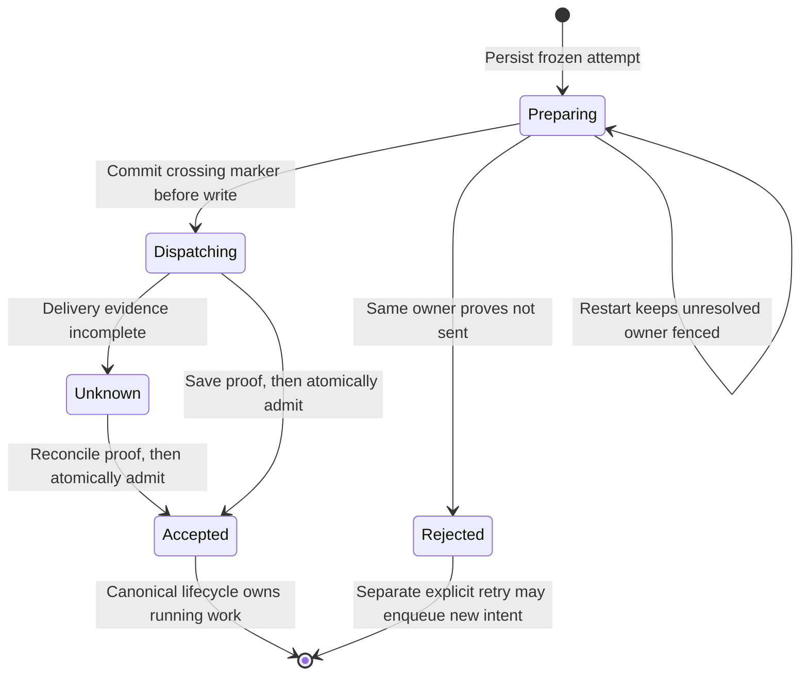

# Agent command delivery — S2a implementation contract

Status: primary-reviewed implementation contract, 2026-09-05. This is the S2a
contract under [remediation pass 1](agent-audit-remediation-pass-1.md), which owns
assignment order and acceptance status. F2/schema 14 and A13 are locally verified;
S2a0 is locally verified. Root delivery is now committed and deployed, with
S2a1 acceptance closure reviewed and deployed in the 2026-09-06 parallel batch. The shared
server cutover proceeds serially: S2a1 adopts root
start with the durable owner; S2a2 adopts steer and manual Compact after primary
review. Both form S2a; neither alone completes C1/V1 or all of S2. This contract
does not itself certify acceptance; the remediation spec records
current evidence and permits independent viewer/host lanes alongside this cutover.

## First cutover

The first production slice covers root queued-send dispatch, live steer, and
manual Compact through one `DeliveryAttemptOwner`, plus the Codex and Claude
adapter evidence needed by those operations. It does not move federation,
branch/edit/fork, viewer Retry/Discard, Stop, or local/auth/artifact receipt
recovery. Federation and branch adopt this same owner in the next serial S2
slice; F2 reservation checks and release rules remain unchanged until that
adoption transaction updates the existing reservation.

There is no second in-flight map. Public command methods continue to enter
`NativeAgentJournal.runAsyncCommand`; the owner is called only by that winner.
There is no second checkout/capacity state machine.

Receipt semantics remain explicit:

- `turn.send` is accepted when its durable queued intent, image grants, reserved
  turn/client IDs, and RPC result commit. Later provider delivery belongs to a
  separate attempt and cannot rewrite that accepted receipt.
- A queued `conversation.compact` receipt is accepted when the durable queued
  compaction intent commits. An immediately dispatched Compact keeps its
  historical RPC behavior only by waiting: accept its receipt when native
  acceptance is proved (Codex correlated response) or when Claude's manual
  boundary proves acceptance and completion together. Possibly-sent failure is
  unresolved, not rejected.
- Live steer has no durable queue-admission boundary. Its receipt is accepted
  only on exact native acceptance; pre-crossing failure rejects it and
  possibly-sent failure leaves it dispatching/unresolved for later command
  reconciliation.

Do not add `request_json` to every receipt. `request_hash` stays unchanged.
Provider recovery data lives on the attempt and is bounded per kind. Later S2d
adopts local mutations by committing the mutation and receipt atomically.
Artifact upload continues to reconcile through its authoritative artifact row
and atomic receipt; no receipt or attempt duplicates base64/blob bytes.
Historical unresolved receipts with no attempt/recovery payload are
`legacy-unreconstructible`, never inferred rejected or replayed as new work.

## Schema 15: exact minimum

Append these tables and indexes; do not rebuild `command_receipts` or existing
queue/F2 tables.

```sql
CREATE TABLE delivery_attempts (
  attempt_id TEXT PRIMARY KEY NOT NULL,
  command_id TEXT NOT NULL UNIQUE,
  kind TEXT NOT NULL CHECK (kind IN ('root-turn', 'steer', 'manual-compact')),
  provider TEXT NOT NULL CHECK (provider IN ('codex', 'claude-code', 'fixture')),
  provider_instance_id TEXT NOT NULL,
  conversation_id TEXT NOT NULL,
  execution_id TEXT NOT NULL,
  intended_turn_id TEXT,
  client_message_id TEXT,
  native_client_message_id TEXT,
  compact_operation_id TEXT,
  recovery_payload_hash TEXT NOT NULL
    CHECK (length(recovery_payload_hash) = 64
      AND recovery_payload_hash NOT GLOB '*[^0-9a-f]*'),
  recovery_payload_json TEXT NOT NULL
    CHECK (json_valid(recovery_payload_json)
      AND length(CAST(recovery_payload_json AS BLOB)) <= 67108864),
  native_session_id TEXT NOT NULL,
  process_generation TEXT,
  native_turn_id TEXT,
  native_operation_id TEXT,
  owner_instance_id TEXT NOT NULL,
  state TEXT NOT NULL
    CHECK (state IN ('preparing', 'dispatching', 'accepted', 'rejected', 'unknown')),
  crossed_at INTEGER,
  accepted_at INTEGER,
  rejected_at INTEGER,
  unknown_at INTEGER,
  acceptance_evidence_json TEXT
    CHECK (acceptance_evidence_json IS NULL OR
      (json_valid(acceptance_evidence_json)
       AND length(CAST(acceptance_evidence_json AS BLOB)) <= 65536)),
  rejection_json TEXT
    CHECK (rejection_json IS NULL OR
      (json_valid(rejection_json)
       AND length(CAST(rejection_json AS BLOB)) <= 65536)),
  recovery_json TEXT
    CHECK (recovery_json IS NULL OR
      (json_valid(recovery_json)
       AND length(CAST(recovery_json AS BLOB)) <= 65536)),
  transcript_gap INTEGER NOT NULL DEFAULT 0 CHECK (transcript_gap IN (0, 1)),
  created_at INTEGER NOT NULL CHECK (created_at >= 0),
  updated_at INTEGER NOT NULL CHECK (updated_at >= created_at),
  CHECK (
    (kind = 'root-turn' AND intended_turn_id IS NOT NULL
      AND client_message_id IS NOT NULL AND native_client_message_id IS NOT NULL
      AND compact_operation_id IS NULL) OR
    (kind = 'steer' AND intended_turn_id IS NOT NULL
      AND client_message_id IS NOT NULL AND native_client_message_id IS NOT NULL
      AND compact_operation_id IS NULL) OR
    (kind = 'manual-compact' AND intended_turn_id IS NULL
      AND client_message_id IS NULL AND compact_operation_id IS NOT NULL)
  ),
  CHECK ((state IN ('preparing', 'rejected') AND crossed_at IS NULL) OR
         (state IN ('dispatching', 'accepted', 'unknown') AND crossed_at IS NOT NULL)),
  CHECK ((state = 'accepted') = (accepted_at IS NOT NULL)),
  CHECK ((state = 'rejected') = (rejected_at IS NOT NULL)),
  CHECK ((state = 'unknown') = (unknown_at IS NOT NULL)),
  CHECK (state != 'accepted' OR acceptance_evidence_json IS NOT NULL),
  CHECK (acceptance_evidence_json IS NULL OR
    state IN ('dispatching', 'unknown', 'accepted')),
  CHECK ((state = 'rejected') = (rejection_json IS NOT NULL)),
  CHECK (crossed_at IS NULL OR (crossed_at >= created_at AND updated_at >= crossed_at)),
  CHECK (accepted_at IS NULL OR (accepted_at >= created_at AND updated_at >= accepted_at)),
  CHECK (rejected_at IS NULL OR (rejected_at >= created_at AND updated_at >= rejected_at)),
  CHECK (unknown_at IS NULL OR (unknown_at >= created_at AND updated_at >= unknown_at)),
  FOREIGN KEY (command_id) REFERENCES command_receipts(command_id) ON DELETE RESTRICT,
  FOREIGN KEY (provider_instance_id) REFERENCES provider_instances(provider_instance_id) ON DELETE RESTRICT,
  FOREIGN KEY (conversation_id) REFERENCES conversations(conversation_id) ON DELETE RESTRICT,
  FOREIGN KEY (execution_id) REFERENCES executions(execution_id) ON DELETE RESTRICT,
  FOREIGN KEY (compact_operation_id) REFERENCES compaction_operations(operation_id) ON DELETE RESTRICT
) STRICT;

CREATE INDEX delivery_attempts_lane
  ON delivery_attempts(conversation_id, state, created_at);
CREATE INDEX delivery_attempts_execution
  ON delivery_attempts(execution_id, state, created_at);

CREATE TABLE delivery_attempt_staging (
  attempt_id TEXT NOT NULL,
  ordinal INTEGER NOT NULL CHECK (ordinal >= 0 AND ordinal < 256),
  observation_id TEXT NOT NULL,
  envelope_json TEXT NOT NULL
    CHECK (json_valid(envelope_json)
      AND length(CAST(envelope_json AS BLOB)) <= 33554432),
  byte_length INTEGER NOT NULL
    CHECK (byte_length = length(CAST(envelope_json AS BLOB))
      AND byte_length <= 33554432),
  observed_at INTEGER NOT NULL CHECK (observed_at >= 0),
  PRIMARY KEY (attempt_id, ordinal),
  UNIQUE (attempt_id, observation_id),
  FOREIGN KEY (attempt_id) REFERENCES delivery_attempts(attempt_id) ON DELETE RESTRICT
) STRICT;
```

Owner code also enforces a 64 MiB aggregate staging limit per attempt in the same
`BEGIN IMMEDIATE` transaction as insertion. SQL's per-row bound prevents a
single oversized row; the aggregate check is `SUM(byte_length) + incoming <=
67108864`. The per-row bound matches the largest valid provider envelope,
`PROVIDER_RUNTIME_LIMITS.finalEventBytes`; ordinary events remain bounded by
`eventBytes`. The 256-row bound follows from ordinal allocation. On overflow, set
`transcript_gap=1`, merge bounded `stage_overflow` detail into `recovery_json`,
retain the lane, and stop using the staged suffix for lifecycle/history
conclusions. An already admitted attempt stays `accepted`; independently recorded positive
proof awaiting admission is retained. Overflow never downgrades positive proof.
Other crossed attempts become `unknown`; an un-crossed preparing owner remains
preparing and fenced. Do not evict old rows.

An incoming envelope that independently proves acceptance is evaluated before
the aggregate stage decision. Its bounded evidence can be persisted and admission attempted even if older
staged material has already set `transcript_gap`; the gap still blocks claims about missing lifecycle or
history, but it cannot erase an independently correlated positive fact. Claude
manual-boundary acceptance requires an uninterrupted observed generation, so a
boundary after a gap does not qualify for this exception. Acceptance evidence
that was already durably recorded before a gap remains valid. Do not exceed
the staging cap to retain an extra acceptance-bearing envelope: persist its
small proof, then append the incoming envelope with admission when possible.
If storage/admission fails, retain the proof and explicit transcript gap; do
not claim the missing envelope was durably captured.

`intended_turn_id` is a reserved identity token and deliberately has no turn
FK. It gains a relationship only when the existing turn-admission transaction
creates the turn. `client_message_id` likewise has no premature canonical FK.
The payload allowlist is parsed by kind before storage. Its own
`recovery_payload_hash` is SHA-256 of that canonical payload; it is deliberately
not compared with `command_receipts.request_hash`, which hashes a different,
larger RPC request:

- root-turn: `{turnId, clientMessageId, nativeClientMessageId, content, model, effort?, serviceTier?,
  access}` using bounded protocol content whose images contain artifact IDs and
  metadata, never artifact bytes;
- steer: the same frozen submission fields plus the expected active native turn;
- manual-compact: `{operationId, nativeInputUuid?}`; Claude requires its exact
  submitted UUID, also stored in `native_client_message_id`; Codex leaves both
  absent/null because this RPC has no native input-message UUID.

No credentials, environment, arbitrary provider response, resume cursor, or
artifact body is permitted. Store canonical JSON and verify its SHA-256 against
`recovery_payload_hash` on load. The 64 MiB storage bound preserves every
currently valid native queued intent: `NativeMessageSendCommand` permits 32 text
parts of 256 KiB characters without an overall encoded cap, whose JSON-escaped
worst case is about 48 MiB plus metadata. This does not widen provider input:
`parseStartProviderTurnInput` and `parseSteerProviderTurnInput` still reject an
encoded value above `PROVIDER_RUNTIME_LIMITS.eventBytes` (256 KiB). Persist the
frozen payload first, then classify that adapter-parser rejection as proven
not-sent; storage must not fail merely because the durable queue accepted the
larger native intent. `command_id UNIQUE` is valid for this cut because each
covered command causes at most one provider dispatch; Retry later creates a new
command and attempt linked in its own schema-reviewed slice.

## Typed boundaries

Add these server-internal types in a focused delivery contract module, imported
by `provider-adapter.ts`; they do not change
provider contract v6 or native wire v9 during S2a1. S2a2 adds a truthful
runtime delivery-hold field and bumps the native wire to v10 as described below;
the server-internal provider method changes still do not alter provider v6.

```ts
type ProviderCrossing =
  | { phase: 'not-sent'; detail: 'validation' | 'closed-before-write' | 'preparation' }
  | { phase: 'possibly-sent'; detail: 'entered-write' | 'stdin-yielded' | 'response-lost' };

type ProviderAcceptanceEvidence =
  | { kind: 'codex-turn-start-response'; threadId: string; turnId: string; nativeClientMessageId: string }
  | { kind: 'codex-turn-steer-response'; threadId: string; turnId: string; nativeClientMessageId: string }
  | { kind: 'codex-compact-response'; threadId: string; requestId: number; connectionGeneration: string }
  | { kind: 'codex-history-client-id'; threadId: string; nativeClientMessageId: string;
      nativeTurnId?: string }
  | { kind: 'claude-root-processing'; sessionId: string; userMessageUuid: string;
      observationUuid: string }
  | { kind: 'claude-manual-compact-boundary'; sessionId: string;
      boundaryUuid: string; processGeneration: string; trigger: 'manual' }
  | { kind: 'fixture-correlated-acceptance'; sessionId: string;
      commandId: string; nativeTurnId?: string };

type ProviderDispatchResult =
  | { outcome: 'accepted'; evidence: ProviderAcceptanceEvidence;
      nativeTurnId?: string; nativeOperationId?: string }
  | { outcome: 'rejected'; crossing: Extract<ProviderCrossing, {phase: 'not-sent'}>;
      error: ProviderDeliveryError }
  | { outcome: 'unknown'; crossing: Extract<ProviderCrossing, {phase: 'possibly-sent'}>;
      error: ProviderDeliveryError; receiptEvidence?: ProviderReceiptEvidence };

type ProviderPresenceRead =
  | { presence: 'present'; evidence: ProviderAcceptanceEvidence }
  | { presence: 'absent'; coverage: ProviderNegativeCoverage }
  | { presence: 'unknown'; reason: string };
```

No current real provider policy may return `absent`; keep the branch for future
source-reviewed capabilities. Codex reads search exact structured client IDs or
native IDs in ownership-free `thread/read` and return the
`codex-history-client-id` evidence variant; partial/empty history is unknown.
Claude `getSessionMessages` exact UUID proves persisted ingress only, not
processing, and therefore cannot return `present` for root delivery. Reads must
not open/resume a writer session. The fixture adapter returns only explicit
command-correlated fixture acceptance and may implement deterministic positive
reads for crash tests; generic fixture events remain nonauthoritative.

The Codex connection reports `not-sent` only before serialization/write. Set
the boundary to `possibly-sent` immediately before the first transport write;
all errors, timeout, close, or malformed/missing response after that point are
unknown unless the same JSON-RPC request returns the reviewed success payload.
For Claude, successful preparation remains pre-crossing; yielding the input to
the SDK/CLI is `possibly-sent`. Local queue push/iterator consumption and stdin
replay are not acceptance.

Claude manual Compact accepts only on a post-watermark
`compact_boundary.compact_metadata.trigger === 'manual'` in the same
uninterrupted process/session generation with one unresolved manual Compact and
no earlier unresolved manual command. That event proves acceptance and
completion together. Generic `status:'compacting'` and untagged
`compact_result:'success'|'failed'` are ambiguous because installed source emits
the same status shape for automatic compaction and strips producer/trigger
identity. They can update diagnostics but cannot settle the attempt. Fixtures
must not invent `parent_tool_use_id` on SDK status or boundary messages.

## Owner methods and transactions



Saving positive evidence and committing canonical admission are distinct
durability steps. Failure between them retains the proof and lane; it does not
permit a second dispatch. `Accepted` does not mean the provider has finished.

```ts
interface DeliveryAttemptOwner {
  prepare(input: PrepareDeliveryAttempt): DeliveryAttempt; // caller transaction
  dispatch<T>(attemptId: string,
    invoke: (boundary: DispatchBoundary) => Promise<ProviderDispatchResult>,
    admit: (tx: JournalTransaction, accepted: AcceptedAttempt) => T
  ): Promise<DeliveryOutcome<T>>;
  recordAcceptance(attemptId: string, evidence: ProviderAcceptanceEvidence): void;
  observe(attemptId: string, envelope: ProviderEventEnvelope): ObserveResult;
  markStreamGap(executionId: string, generation: string, reason: string): void;
  reconcile(attemptId: string, read: ProviderPositiveRead): Promise<ReconcileResult>;
  unresolvedLane(conversationId: string): DeliveryAttempt | undefined;
}

interface DispatchBoundary {
  markPossiblySent(nativeSessionId: string, processGeneration?: string): void;
}

interface ProviderPositiveRead {
  (attempt: FrozenDeliveryAttempt): Promise<ProviderPresenceRead>;
}
```

`prepare` is idempotent by command ID, kind, and frozen payload hash. Queue
enqueue does not create an attempt because a native session may not yet exist.
Root-send and queued-Compact attempts are created only after `ensureSession`
returns, using the already durable queue/operation intent, and before the first
irreversible provider handoff. Immediate Compact and steer create the attempt
after session/preparation validation and before handoff. Attempt creation and
the applicable receipt transition run in one transaction. A preparation error
before attempt creation leaves the durable queued intent available or rejects
the immediate command under its existing pre-dispatch policy.

`markPossiblySent` performs a CAS `preparing -> dispatching`, writes
`crossed_at`, native session/generation, and commits before/at the adapter's
first irreversible transport handoff. An adapter that returns or throws without
calling it is not-sent and may reject. After it is called, an exception is
unknown unless exact reviewed evidence was already observed.

`observe` validates and appends the full bounded provider envelope before it is
allowed into canonical admission-dependent projection. Duplicate observation
identity is a no-op. Candidate acceptance is evaluated from the full ordered
prefix only; optimistic adapter-local events never qualify.

Run asynchronous `prepareProviderEvents` work, including diff artifact sealing,
before the SQL admission transaction. Persist the source envelope first; if
preprocessing is interrupted or cannot reproduce a complete envelope, mark the
attempt's transcript gap and retain ownership. No await occurs inside SQL.

First persist exact positive evidence in `acceptance_evidence_json` in its own
short transaction, leaving the attempt dispatching/unknown until canonical
admission commits. For event-borne evidence, persist its full source envelope
with that evidence within the staging bounds; the explicit overflow rule above
applies if it cannot fit. This is a delivery fact awaiting admission, not permission
to resend; any non-admitted attempt retains its lane. Repeated matching proof is
idempotent; contradictory scope/native identity fails validation. Proof is never
erased by later transport failure or an admission rollback.

Then one `BEGIN IMMEDIATE` transaction CASes the attempt to accepted, performs
`admit`, appends every prepared durable staged envelope using its stable event
ID, and deletes those stage rows. If any append/admission fails, the whole
canonical transaction rolls back: the earlier positive proof and stage remain.
Reconciliation retries admission from that proof before making provider reads;
it never repeats provider dispatch. If the transaction commits but the process
dies before UI invalidation, startup projects the existing journal. A confirmed
existing event ID makes replay idempotent; delete stage only in the same
transaction that confirms durable append. `accepted` thus means positive
provider evidence plus committed canonical admission in this owner contract.

Asynchronous preparation must not erase observations arriving during its await.
Drain only the exact prepared prefix, matched by stable observation identity;
retain any later staged suffix and publish it before newer direct observations.
While that suffix exists, the owner retains its publication/dispatch fence even
if initial canonical admission committed. Repeated drainage never repeats turn
admission. Apply existing pure file-display normalization before staging, or
explicitly account for excluded identities; never zip a filtered result array
back onto source records by index. A controlled test delivers a second event
while preparing the first and verifies durable order and one-time side effects.

For Claude manual boundary, that same transaction accepts the attempt, records
the compaction completion through the existing provider event, and drains the
stage; there is no synthetic early `context.compaction.started` acceptance
fact. For Codex Compact, the correlated response accepts delivery while the
existing compaction operation retains runtime ownership until native completion.

Rejected-before-crossing CASes to rejected and releases only the matching queue
or compaction owner. Unknown retains lane ownership. Accepted root-turn admission
hands ownership to the existing canonical active-turn lifecycle. Accepted
Compact hands it to the existing compaction lifecycle. Accepted steer adds
input to that already-owned active turn and never owns another writer slot.

Crash classification order at startup is:

1. Open/migrate journal and preserve F2 startup fences.
2. Load attempts. A foreign or recovered `preparing` attempt remains preparing,
   gains bounded `owner_unresolved` recovery detail, and blocks its lane. Process
   generation is stream identity, not liveness proof. Only the same live owner
   handling an explicit pre-crossing failure may CAS preparing to rejected.
   `dispatching` becomes unknown; accepted stays accepted even with a gap.
3. Mark gaps for generations whose ordered stream continuity was lost.
4. Reconcile positive evidence using ownership-free reads only.
5. Atomically admit/drain any newly proved attempt or idempotently finish an
   accepted attempt whose stage survived a crash.
6. Only then mark provider readiness and run `dispatchNext`; unresolved unknown
   attempts block their conversation lane. Federation readiness continues to
   honor F2 reservations independently.

## Named adoption and removal points

- Add `delivery-attempt-owner.ts` and journal CRUD/transaction helpers; reuse
  `runAsyncCommand` and existing event identities.
- In `dispatchNext`, replace `PendingTurnAdmission`,
  `pendingTurnAdmissions`, and the optimistic staged
  `turn.started|user.message` acceptance test with owner prepare/observe/admit.
- Route provider event intake to `owner.observe` before admission-dependent
  projection; retain direct projection for events unrelated to an unresolved
  attempt.
- Replace `dispatchCompaction`'s synthetic started/try-catch acceptance and
  `terminateAmbiguousCompaction` queue release with attempt outcomes. Recovery
  may mark unknown but must not call `dispatchNext` past that owner.
- Replace covered uses of `ProviderCommandAcceptance` in Codex/Claude
  start/steer/compact with `ProviderDispatchResult`. Keep an explicit temporary
  single `requireLegacyAcceptance(result)` helper only for interrupt and later
  federation/branch callers; do not add parallel adapter methods or another
  owner. It returns the old `{accepted:true,nativeTurnId?}` only for an accepted
  result and throws a typed rejected/unknown error otherwise. Delete the helper
  when those named S2 slices adopt the owner. Existing F2 code continues
  treating any throw after provider invocation as possibly sent and retains its
  reservation fence.
- Replace blanket `markAmbiguousCommandsForRecovery` with a per-kind startup
  switch. Covered kinds delegate to attempts; untouched externally-effecting
  kinds remain unresolved/legacy-unreconstructible for their later slice. Do
  not rewrite them to rejected or `recovery_failed`.
- Do not fabricate a projection revision from head or metadata revisions in
  this cut. Root admission uses the existing atomic journal transaction followed
  by invalidation. The branch/admission cutover must separately decide whether
  to add the minimal conversation projection-revision schema/helper required by
  its compare-and-swap contract. Do not implement S4 sync generations, client
  refresh ownership, or a new projection subsystem here.

## Required acceptance tests

1. Fresh/migrated schema-15 parity, all checks/FKs/indexes, no changed source-row
   hashes, and reserved future turn IDs accepted without turn rows.
   A v14 database containing conflicting future delivery-table/index names
   must fail inside the migration transaction and remain v14. Name-only
   object-existence checks cannot establish structural compatibility. This
   gate is scoped to the new delivery objects; S5 owns broader schema repair.
2. Same command during received/dispatching uses C3a's one promise and one
   attempt; changed kind/payload conflicts; restart never redispatches.
3. Root queued-send receipt remains accepted at intent commit while its attempt
   progresses independently through accepted/rejected/unknown.
4. Explicit same-live-owner pre-crossing failure rejects safely; recovered
   preparing stays unresolved and blocks. Crash after crossing but
   before response is unknown; crash during acceptance/admission/stage drain
   yields either full rollback with intact stage or one admitted turn with all
   staged events, never a split state.
5. Duplicate stage identity is idempotent; row/byte overflow sets the gap marker
   and blocks suffix inference. Overflow after exact acceptance preserves
   accepted evidence and lane/lifecycle ownership.
6. Codex exact correlated turn/start, steer, and compact responses accept;
   transport entry without response is unknown; partial/empty `thread/read`
   never proves absence.
7. Claude exact root processing output with the submitted UUID accepts; replay,
   local enqueue, `getSessionMessages` presence, and error-result UUID do not.
8. Claude generic compacting/success/failure status and auto-tagged boundary do
   not settle manual Compact. A post-watermark manual-tagged boundary settles
   acceptance and completion once. Gap, restart, prior unresolved manual
   operation, and replayed boundary remain unknown. Fixtures use actual SDK
   fields and no status/boundary `parent_tool_use_id`.
9. Unknown root send or Compact blocks later FIFO work; accepted terminal
   lifecycle releases through existing rules. Steer never claims an additional
   lane. Recovery completes before provider readiness/dispatch.
10. Existing F2 held/unknown reservation and exact-release tests remain green;
    this slice neither creates reservation state nor releases one from generic
    adapter failure. Provider contract v6 remains unchanged; S2a1 retains native
    wire v9 and S2a2 validates the explicit v10 runtime change below.

## S2a2 runtime delivery hold

S2a2 adds a required server-derived `deliveryHeld: boolean` to
`AgentRuntimeResource`, with native protocol v10. Schema 15 and provider contract
v6 remain unchanged. This change is planned for the serial steer/Compact
assignment after S2a1 acceptance; do not add the field during S2a1.

Derive the field from the shared journal lane predicate: a preparing,
dispatching, or unknown attempt, or an accepted attempt with an undrained
staging suffix, retains the hold. Use that same predicate for server writer
guards and queue claims. A visible queue row is insufficient because steer has
none and an unknown root intent may have been hidden. Compact eligibility must
require `deliveryHeld === false` alongside its existing capability and
lifecycle checks. Do not represent delivery uncertainty by inventing running
compaction, changing the advertised provider capability, or changing the
conversation's native execution state. Update strict native protocol fixtures
and compatibility checks with the version change.

## Primary review resolutions and integration requirements

- `journal.transaction` nests with savepoints. `admitQueuedTurn` and
  `appendProviderEvents` share one outer `BEGIN IMMEDIATE`; perform asynchronous
  preparation before entering it. Handle preprocessing failure as a continuity
  gap, never as proof of native rejection. Extract post-commit notifications and
  terminal side effects from event persistence so stage drainage does not append
  an event twice or skip its lifecycle handling.
- Installed Codex 0.153.4 generated `TurnSteerParams.ts` explicitly includes
  `clientUserMessageId?: string | null` and requires `expectedTurnId`;
  `TurnSteerResponse.ts` returns `turnId`. Use a unique stable per-steer native
  message ID. This source question is resolved; partial history still cannot
  prove absence. The generated source capture is in the implementation evidence
  directory `codex-protocol/v2/`.
- Persist `native_client_message_id` separately from the viewer's
  `client_message_id`: current Codex root sends use the reserved Remux turn ID,
  and Claude supplies a UUID derived from the command ID. Bind the exact outgoing
  value in both the frozen payload and its column before handoff; evidence must
  match that value, not the viewer client ID. Do not reconstruct it later from an
  unversioned algorithm.
  Manual Compact may retain its input UUID as ingress correlation, never as
  proof of processing. A connection-local Codex request ID is scoped by its
  connection generation; it is not a durable provider operation ID.
- Owner preparation validates command kind and immutable queue/operation scope,
  provider-instance/provider relationship, execution/conversation relationship,
  payload identities/hash, and native session binding. Independent SQL FKs do not
  establish that these rows belong to the same scope. Reject mismatches before
  dispatch and test them. Acceptance evidence must match this frozen scope.
- The 64 MiB recovery payload bound preserves current native input limits;
  provider parsers retain their stricter 256 KiB encoded dispatch bound. The
  32 MiB staging-row and 64 MiB aggregate bounds preserve the current final-event
  contract. Verify these relationships in tests and never silently truncate
  terminal data. Overflow is explicit lost transcript continuity.
- Only root/steer/Compact use this owner in the first cutover. Preparation failure
  before an attempt exists must settle the matching durable intent using proven
  not-sent evidence. A claimed queue item with no attempt after process loss is
  legacy/unresolved until evidence establishes more; do not redispatch it.
- A returned accepted provider result is immutable proof even if subsequent
  projection or UI invalidation fails. `recordAcceptance` durably stores it
  before the atomic canonical admission transaction; a failed admission retains
  that proof and staged data. A storage failure before proof can be persisted
  retains the unresolved crossing hold and requires later positive evidence; it
  never permits another dispatch. No canonical turn or accepted owner state is
  exposed from a partially committed admission transaction.
- Existing failed/unknown queue rendering and Retry/Discard controls are adopted
  in the following queue slice. During this server cutover every unresolved owner
  must still block dispatch, including when its visible queue entry is removed.
  Do not call C1/V1 complete until failed entries advance FIFO and retry/recheck
  semantics are implemented and tested end to end.

## Reviewed native evidence

| Operation | Positive acceptance | Not-sent / rejection | Recovery limits |
| --- | --- | --- | --- |
| Codex root start | Exact `turn/start` response with `turn.id`; bound structured `userMessage.clientId` proves presence | Pre-write validation/preparation/closed-peer failure only; entered write is possibly sent | Exact native client/thread identity; empty or partial `thread/read` is unknown |
| Codex steer | Exact `turn/steer` response with expected native turn; exact per-steer client ID in structured history | Same transport rule; no reviewed native rejection-code classifier | Active turn alone does not prove this extra input was received |
| Codex manual Compact | Exact `thread/compact/start` successful response, scoped to request and connection | Same transport rule | Empty response has no native operation ID; no restart-safe acknowledgment lookup |
| Claude root start | Bound root assistant/non-ping partial or success-result frame with exact submitted `user_message_uuid` | Preparation/validation before the handoff only | Local enqueue, stdin replay, error-result UUID and persisted user input alone are insufficient; no negative history proof |
| Claude manual Compact | Post-watermark manual-tagged boundary in exclusive uninterrupted process/session | Validation before handoff only | Generic compacting/success/failure status, auto boundary, gap or restart cannot settle it |
| Claude steer | Unsupported; remains unadvertised | Capability unavailable before dispatch | No invented support |
| Fixture | Explicit fixture command acknowledgment with exact IDs | Controlled fixture crossing failure | Tests describe fixture-only guarantees separately |

Sources: installed Codex generated types captured under
`/tmp/remux-audit-implementation/codex-protocol/v2/`; installed Claude SDK 0.3.258
`extensions/agent/node_modules/@anthropic-ai/claude-agent-sdk/sdk.d.ts`; installed
CLI 2.1.258 source excerpts and byte offsets recorded in the remediation spec's
S2 source preflight. These are source/controlled-fixture assertions, not live
provider acceptance tests. No current real-provider policy proves absence.
