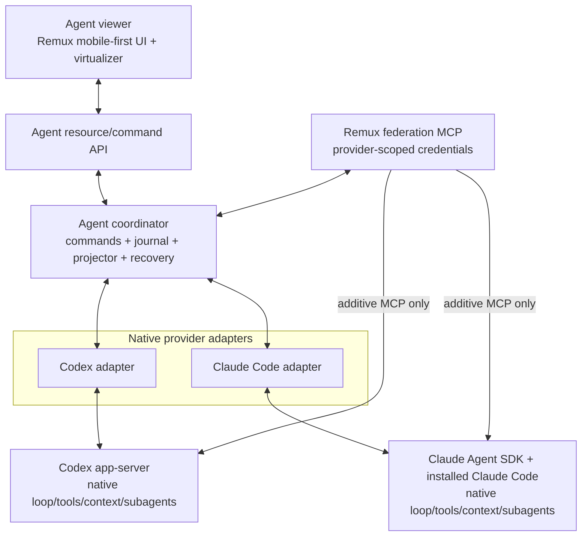

Status: Active Spec — implementation landed; live subscription federation acceptance passed and physical-phone acceptance pending
Last verified: 2026-09-02
Canonical code: `extensions/agent/`, the hosted-view contracts in
`packages/viewer-kit/` and `app/src/surfaces/viewer/`, and the extension gateway
in `crates/remux/`. The current Codex acceptance oracle remains
`extensions/codex/` until the live and physical-phone cutover gates pass.
Supersedes: `agent-explicit-turn-context-v1.md`,
`agent-turns-and-work-units.md`,
`agent-inference-trace-and-resilient-streaming.md`, and the runtime/product
direction in `multi-provider-agent-workspace-extension.md`. The proven viewer,
transcript, lifecycle, and mobile requirements in those documents remain input
evidence where this spec explicitly retains them.
Version 2 amendments: `agent-canonical-turn-journal-v2.md` replaces the
Version 1 semantic-event projection with ordered turns/passes/blocks and adds
bounded federated-child rediscovery; `agent-composer-control-plane-v2.md` adds
provider-scoped composer state, normalized usage, and provider-native Compact.

# Agent native-provider runtime v1

## Outcome

Remux Agent becomes a mobile-first client and coordinator for native coding
agent harnesses. It does not become a provider-independent coding harness.

Codex runs through Codex app-server with Codex's own system behavior, context
management, tools, permissions, compaction, and native collaboration. Claude
runs through the installed Claude Code/Agent SDK with the `claude_code` preset,
Claude settings and skills, native session resume, native tools, and native
subagents. Remux normalizes durable identity and display events around those
harnesses, but it does not recreate their model loops.

The existing Agent viewer remains the product UI foundation. Its bounded,
server-authoritative transcript resources, turn virtualizer, measured layout,
Markdown and diff rendering, composer, mobile lifecycle recovery, and safe-area
behavior survive the runtime replacement. Selected T3 Code visual ideas may be
ported into this UI. The complete T3 Code application, file/VCS/terminal
workspace, event store, and web client are not the new product architecture.

Cross-provider delegation exists from the first complete runtime version as an
additive, namespaced Remux MCP service. Native same-provider subagents remain
the default and are never intercepted. A Codex parent can explicitly delegate
to Claude, and a Claude parent can explicitly delegate to Codex, without either
provider losing the harness behavior it was trained to use.

All conversational interaction remains ordinary chat. Agent has no
model-authored questionnaire, multiple-choice card, elicitation form, or
`request_user_input` surface.

## Decision summary

1. Keep native provider harnesses intact. An adapter translates commands,
   lifecycle, and semantic events; it does not supply a replacement prompt,
   context compiler, coding tools, tool loop, compactor, or same-provider
   subagent implementation.
2. Implement and validate the Codex adapter contract before adding Claude. A
   second provider may not force a rewrite of the contract after Codex cutover.
3. Preserve provider-specific capabilities instead of reducing both providers
   to a lowest-common-denominator chat API.
4. Keep two subagent lanes: provider-native delegation for same-provider work,
   and a narrow Remux MCP federation lane for explicit cross-provider work.
5. Make Remux's journal authoritative for Remux UI state and command receipts;
   make the provider's native session authoritative for model continuation.
6. Keep the browser stateless with respect to execution. Closing the WebView,
   locking the phone, losing the socket, or recreating the React tree must not
   stop provider work or cause tool calls to run twice.
7. Retain the current Agent/Codex resource-window and virtualizer design. Child
   execution detail is fetched lazily and recursively instead of flattening an
   agent tree into the root virtual list.
8. Remove the old Pi-based Codex provider, explicit turn-context compiler,
   custom history tools, custom compaction, and custom work-unit runtime after
   native Codex parity is proven.
9. Keep `extensions/codex` as the acceptance oracle during migration. Remove
   the full `t3-code` capsule once Agent has Claude parity and no independent
   product need remains.
10. Use a clean development cut for pre-cutover Agent data. There is no obligation
    to migrate the experimental Pi/context/work-unit database into the new
    provider-native schema.

## Goals

- Preserve Codex subscription authentication and the normal Codex app-server
  harness.
- Preserve Claude Code subscription authentication by invoking the installed
  Claude Code runtime through the supported Agent SDK path rather than turning
  Claude into a raw Messages API loop.
- Preserve provider-native prompts, configuration, skills, MCP servers,
  permissions, context reuse, compaction, tools, and native subagents.
- Give both providers one excellent Remux-owned chat UI, including the existing
  long-thread virtualizer and mobile interaction work.
- Resume and reconcile a conversation after extension restart, app restart,
  WebView destruction, network loss, or a long phone suspend.
- Show native and federated child work coherently without pretending that their
  private provider context is interchangeable.
- Allow explicit Fable-to-Sol and Sol-to-Claude delegation as real child
  executions with provenance, progress, interruption, and follow-up support.
- Keep the provider boundary small enough that a future provider can be added
  without copying T3 Code's entire server or rebuilding an agent loop.
- Make provider upgrades reviewable through pinned protocol/SDK versions,
  capability probes, contract fixtures, and live acceptance.

## Non-goals

- A universal prompt or tool harness shared by Codex and Claude.
- Replaying normalized Remux transcript events back into a model as a substitute
  for native provider history.
- Importing T3 Code's entire event-sourced workspace, filesystem browser, Git
  UI, terminal model, checkpoints, Effect RPC stack, or complete web client.
- Maintaining visual source parity with T3 Code. Remux may port specific styles
  or interactions under their license, with attribution, but Remux owns the UI.
- Providing arbitrary model-authored forms, multiple-choice questions,
  elicitation dialogs, or a `waitingOnUserInput` transcript state.
- Hiding semantic differences in edit, fork, resume, compaction, approvals, or
  child execution behind misleading generic controls.
- Safely supporting simultaneous writers in one checkout without isolation.
  Version 1 supports parallel read-only federated children and foreground,
  sequential federated writers.
- Giving a federated child the parent's hidden reasoning, native continuation
  token, or provider-private transcript.
- Replacing the Remux shell, tab model, notifications, attachment picker,
  authenticated transport, or extension supervisor.
- Shipping the browser/preview agent tool in Version 1. A later server-owned
  Playwright MCP tool may be added; renderer-owned desktop automation is not a
  valid mobile lifecycle design.

## Verified constraints and evidence

### Pre-cutover Agent implementation

The current `extensions/agent/server` is not a native Codex adapter. Its
`openai-codex` provider uses `@earendil-works/pi-ai` and
`@earendil-works/pi-coding-agent`, supplies an Agent-owned system prompt and
read/bash/edit/write tools, creates provider lanes, compiles selected prior
turns, and owns work-unit/history/compaction behavior. Those experiments are
useful evidence, but keeping that runtime would mean keeping a Remux-authored
agent harness in front of Codex.

The current Agent viewer is independently valuable. It already carries the
Codex-derived resource stores, transcript windows, turn virtualization,
measured layout, Markdown/diff rendering, composer, queued follow-ups,
attachments, edit/fork UI, history, responsive layout, and lifecycle recovery.
That code is retained and adapted to the new protocol.

### Current Codex extension

`extensions/codex/server` talks directly to Codex app-server and reconstructs
durable history from native Codex state. Its viewer consumes bounded,
server-authoritative resources instead of applying provider deltas directly.
It is the behavioral and performance baseline for the first adapter.

The checked-in app-server protocol includes native collaboration items and
subagent activity, thread read/list/resume/fork/rollback operations, tool and
MCP items, model/reasoning configuration, and thread-scoped dynamic tools at
thread creation. Because dynamic tools are not a sufficient resume-time seam,
the federation service is injected as a provider-scoped MCP server for both
new and resumed sessions.

### T3 Code reference implementation

The pinned T3 Code source demonstrates the useful provider seam without making
its full product architecture mandatory:

- its Codex provider launches a native app-server runtime, injects a
  provider-session-scoped HTTP MCP endpoint and bearer credential, and maps
  native collaboration events;
- its Claude provider calls the Agent SDK with the installed Claude Code
  executable, `systemPrompt: { type: "preset", preset: "claude_code" }`, user,
  project, and local setting sources, session resume, partial messages, and a
  provider-session-scoped MCP server; and
- its adapters preserve native task/subagent identifiers and parent linkage.

Remux adopts those boundary lessons. It does not adopt the complete upstream
server, projection schema, or web application as the permanent Agent core.

### Public provider contracts

Codex documents app-server as the protocol used to build rich Codex clients,
MCP as its standard external-tool seam, and native multi-agent workflows as
agent threads with provider-owned spawning, routing, follow-up, waiting, and
closing. The Codex manual also cautions about parallel write-heavy workflows.

Anthropic documents the Claude Agent SDK as a process-operated agent runtime
with tools and sessions, and its official examples expose resumable sessions
and MCP integration. The implementation must pin and test the exact SDK version
because these APIs evolve.

## Vocabulary

- **Provider:** a native coding-agent product, initially `codex` or
  `claude-code`.
- **Provider instance:** one configured installation/account/home combination,
  such as the local Codex subscription or local Claude Code subscription.
- **Adapter:** the Remux implementation that controls a provider session and
  translates provider protocol into the contract below. It is not an agent
  harness.
- **Conversation:** the Remux resource the user opens. It is bound to one root
  provider session and may have child executions.
- **Native session:** the provider-owned thread/session used for continuation.
- **Turn:** one user message accepted by a conversation and the provider work
  that reaches one terminal/idle boundary.
- **Execution:** a root or child run with stable Remux identity. A native
  provider subagent and a federated provider child are both executions, but
  their ownership differs.
- **Native child:** a subagent created by the provider's built-in collaboration
  tools inside a native session.
- **Federated child:** a separate native provider session created through the
  Remux federation MCP service and linked to its parent execution.
- **Normalized event:** a durable Remux semantic display/lifecycle event. It is
  not model input and does not claim to encode all provider-private state.
- **Artifact:** bounded or lazily fetched large content referenced by hash or
  stable ID rather than embedded in every transcript resource.
- **Reconciliation:** comparing native provider history/session state with the
  Remux journal after interruption or restart and idempotently projecting what
  is missing.

## Target architecture



The coordinator, adapter, and projector are logical boundaries, not a mandate
that all code use one language or process. Codex may initially reuse/refactor
the proven Rust app-server client and projector behind a small local adapter
transport. Claude may live in the TypeScript Agent process because its Agent
SDK is TypeScript-first. The contract and tests, not in-process inheritance,
define compatibility.

Each active provider session receives a distinct MCP bearer credential. The
credential resolves server-side to the Remux conversation, root/child
execution, provider instance, access ceiling, and generation. Models do not
supply or choose their own parent identity. Credentials are stored hashed,
revoked when the session closes, and rejected after their bounded liveness
window or coordinator generation ends.

## Provider ownership boundary

### The provider owns

- the model-facing base/system prompt and native developer instructions;
- native conversation context, cache handles, session IDs, and compaction;
- built-in coding, shell, search, web, MCP, skill, and collaboration tools;
- the agentic tool-call loop, retry behavior, and same-provider child routing;
- provider-native permission and sandbox enforcement;
- provider usage accounting and native session persistence; and
- the exact semantics of provider continuation.

### Remux owns

- provider discovery, health, capability probing, and version compatibility;
- stable user-facing conversation, turn, execution, and command identities;
- command idempotency, queue policy, interruption intent, and restart recovery;
- the normalized display journal and bounded transcript/resource projection;
- mobile lifecycle, connection recovery, tabs, attachments, and notifications;
- cross-provider federation credentials, topology, limits, and provenance;
- UI capability gating and honest provider-specific labels; and
- large normalized artifacts needed to render or inspect work.

### Remux must not do

- build a synthetic provider prompt from old Remux transcript rows;
- resend normalized reasoning/tool rows as though they were native history;
- install replacement read/bash/edit/write tools when the provider supplies
  its own;
- decide when native context should compact;
- emulate Codex native collaboration with Remux children or emulate Claude
  `Task` with Codex threads;
- intercept native subagent calls merely to force them into a common runtime;
  or
- persist raw credentials, hidden reasoning, or opaque continuation secrets in
  browser-readable resources.

## Provider adapter contract

The contract is versioned independently of any provider wire schema. Version 1
uses a small command surface, a capability document, provider-native references,
and a replayable semantic event stream.

The following TypeScript is normative at the shape/semantics level. Concrete
implementations may use Rust, TypeScript, or a child process. A process adapter
uses newline-delimited JSON-RPC with the same request IDs and event envelopes.

```ts
type ProviderKind = 'codex' | 'claude-code';
type ProviderInstanceId = string;
type ConversationId = string;
type TurnId = string;
type ExecutionId = string;
type CommandId = string;

type ProviderCapabilities = {
  protocolVersion: 1;
  provider: ProviderKind;
  providerVersion: string;
  adapterVersion: string;

  auth: 'native-subscription' | 'api-key' | 'external';
  authentication: {
    login: 'none' | 'device-code' | 'browser';
    logout: boolean;
  };
  session: {
    create: true;
    resume: boolean;
    discoverHistory: boolean;
    readSnapshot: boolean;
    forkNative: boolean;
    rollbackNative: boolean;
  };
  turns: {
    interrupt: boolean;
    steer: boolean;
    queue: boolean;
    changeModelOnExistingSession: boolean;
    changeEffortOnExistingSession: boolean;
  };
  content: {
    images: boolean;
    fileReferences: boolean;
    reasoning: boolean;
    diffs: boolean;
    webActivity: boolean;
    usage: boolean;
  };
  collaboration: {
    nativeSubagents: boolean;
    childTranscript: 'none' | 'summary' | 'full';
    childSteer: boolean;
    childInterrupt: boolean;
  };
  interaction: {
    blockingApprovals: false;
    structuredUserInput: false;
  };
};

type ProviderProbe = {
  state: 'ready' | 'signed-out' | 'missing' | 'incompatible' | 'error';
  displayLabel?: string;
  diagnosticCode?: string;
  message?: string;
  capabilities?: ProviderCapabilities;
};

type ProviderLoginStart = {
  commandId: CommandId;
  providerInstanceId: ProviderInstanceId;
  mode: 'device-code' | 'browser';
};

type ProviderLoginEvent =
  | {
      type: 'prompt';
      loginId: string; // adapter-private; never projected to the viewer
      verificationUri: string;
      userCode?: string;
    }
  | { type: 'completed'; success: true }
  | { type: 'completed'; success: false; error: string };

interface ProviderLoginOperation {
  readonly loginId: string;
  readonly events: AsyncIterable<ProviderLoginEvent>;
  cancel(): Promise<void>;
  close(): Promise<void>;
}

type NativeSessionRef = {
  provider: ProviderKind;
  providerInstanceId: ProviderInstanceId;
  sessionId: string;
  resumeCursor?: unknown; // encrypted/server-only; never exposed to the viewer
};

type OpenProviderSession = {
  commandId: CommandId;
  providerInstanceId: ProviderInstanceId;
  conversationId: ConversationId;
  executionId: ExecutionId;
  mode: 'create' | 'resume' | 'attach';
  nativeSession?: NativeSessionRef;
  cwd: string;
  model: string;
  effort?: string;
  access: 'read-only' | 'workspace-write' | 'full-access';
  developerInstructions: readonly string[];
  federation?: {
    endpoint: string;
    authorizationHeader: string;
  };
};

type StartProviderTurn = {
  commandId: CommandId;
  conversationId: ConversationId;
  turnId: TurnId;
  executionId: ExecutionId;
  content: readonly UserContentPart[];
  model?: string;
  effort?: string;
};

type NativeForkRequest = {
  commandId: CommandId;
  /** Include this native turn as the last turn of the fork. */
  throughNativeTurnId?: string;
  /** Fork immediately before this native turn for edit-and-regenerate. */
  beforeNativeTurnId?: string;
};

interface ProviderAdapter {
  probe(instanceId: ProviderInstanceId): Promise<ProviderProbe>;
  listModels(instanceId: ProviderInstanceId): Promise<readonly ModelDescriptor[]>;
  discoverSessions?(input: DiscoverSessions): Promise<readonly NativeSessionSummary[]>;
  startLogin?(input: ProviderLoginStart): Promise<ProviderLoginOperation>;
  logout?(input: {
    commandId: CommandId;
    providerInstanceId: ProviderInstanceId;
  }): Promise<{ accepted: true }>;
  openSession(input: OpenProviderSession): Promise<ProviderSession>;
}

interface ProviderSession {
  readonly nativeSession: NativeSessionRef;
  readonly events: AsyncIterable<ProviderEventEnvelope>;

  startTurn(input: StartProviderTurn): Promise<{ accepted: true }>;
  steer?(input: SteerProviderTurn): Promise<{ accepted: true }>;
  interrupt(input: InterruptProviderTurn): Promise<{ accepted: true }>;
  snapshot(input: SnapshotRequest): Promise<ProviderSnapshot>;
  fork?(input: NativeForkRequest): Promise<NativeSessionRef>;
  rollback?(input: NativeRollbackRequest): Promise<NativeSessionRef>;
  close(): Promise<void>;
}
```

The checked-in contract will define the elided content/model/snapshot types and
validate every inbound object. `unknown` above does not authorize dumping an
unbounded provider object into the journal. A resume cursor is provider-private,
size-bounded, encrypted at rest if it contains a secret, and decoded only by its
own adapter/version.

### Required adapter behavior

- `probe` is side-effect-light and never starts a billable model turn.
- A signed-out probe still returns its capability document when compatible, so
  the viewer can render the supported native login control without guessing.
- Login uses the provider's native subscription flow. Remux may project the
  verification URL and user code while the operation is live, but never reads,
  stores, or serializes the resulting provider token. The provider-native login
  ID remains adapter-private.
- The coordinator projects in-flight login state through `agent/providers`, so
  destroying and recreating a mobile WebView does not lose the prompt. An Agent
  server restart closes the transient native operation and reprobes auth rather
  than pretending it can resume a dead login process.
- Provider login start, cancel, and logout are command-receipted mutations.
  Logout refuses while a provider turn is active, closes idle native sessions,
  invokes native logout, and reprobes the provider.
- `openSession` emits or returns the canonical native session ID before model
  work can begin. If the provider reveals the ID only after its first event,
  the adapter durably reports `session.bound` before accepting another command.
- A `commandId` is stable across client retries. The adapter/coordinator returns
  the recorded result and never dispatches the same provider command twice.
- One `ProviderSession` processes mutating commands sequentially. Snapshot reads
  may run concurrently if the native protocol supports a coherent read.
- `startTurn` returns only after the provider has accepted the request, not
  after the turn completes.
- Events may be duplicated, delayed, or replayed by a provider; their envelope
  supplies enough native identity for the projector to deduplicate them.
- An adapter never reports `completed` merely because its process or stream
  ended. Completion must come from a native terminal event or a reconciled
  native snapshot.
- Unexpected stream loss changes the execution to `recovering`, not `idle` or
  `failed`, until reconciliation decides the outcome.
- The adapter may not weaken the requested access ceiling. It may choose a more
  restrictive native sandbox. `full-access` is exposed only through an explicit
  Remux setting.
- Provider-specific unsupported operations fail with a stable
  `capability_unavailable` error. The UI hides the ordinary control but still
  handles stale clients safely.

## Semantic event contract

> Version 2 amendment: the envelope, event scopes, ordered turn projection,
> reconciliation rules, and compaction placement in this section are superseded
> by `agent-canonical-turn-journal-v2.md`. The Version 1 shape below remains the
> implemented baseline and migration source.

Every event has a stable Remux envelope and an optional server-only native
reference. Normalized events are deliberately semantic: they describe what the
viewer and coordinator need without claiming to reproduce the complete provider
wire protocol.

```ts
type ProviderEventEnvelope = {
  contractVersion: 1;
  eventId: string;                  // stable projection identity
  provider: ProviderKind;
  providerInstanceId: ProviderInstanceId;
  conversationId: ConversationId;
  executionId: ExecutionId;
  turnId?: TurnId;
  parentExecutionId?: ExecutionId;
  native: {
    sessionId: string;
    turnId?: string;
    itemId?: string;
    sequence?: number;
    kind: string;
  };
  observedAt: number;
  event: ProviderEvent;
  rawArtifactRef?: string;          // diagnostic-only, bounded and server-only
};

type ProviderEvent =
  | { type: 'session.bound'; resumed: boolean }
  | { type: 'session.materialized' }
  | { type: 'session.health'; state: 'ready' | 'recovering' | 'lost'; message?: string }
  | { type: 'turn.started' }
  | { type: 'turn.status'; state: 'running' | 'recovering' | 'idle' }
  | { type: 'turn.completed'; outcome: 'completed' | 'failed' | 'interrupted'; error?: DisplayError }
  | { type: 'user.message'; content: readonly UserContentPart[] }
  | { type: 'assistant.text'; phase: 'commentary' | 'final'; delta?: string; text?: string }
  | { type: 'assistant.reasoning'; delta?: string; summary?: string }
  | { type: 'tool.started'; tool: ToolDisplay; inputPreview?: unknown }
  | { type: 'tool.updated'; toolCallId: string; outputPreview?: unknown }
  | { type: 'tool.completed'; toolCallId: string; outcome: 'completed' | 'failed'; detailRef?: string }
  | { type: 'file.changed'; change: FileChangeDisplay }
  | { type: 'web.activity'; activity: WebActivityDisplay }
  | { type: 'usage.updated'; usage: UsageDisplay }
  | { type: 'context.compacted'; providerManaged: true }
  | { type: 'child.started'; child: ChildExecutionDisplay }
  | { type: 'child.status'; childExecutionId: string; state: ExecutionState }
  | { type: 'child.summary'; childExecutionId: string; summary: string }
  | { type: 'child.completed'; childExecutionId: string; outcome: TerminalOutcome }
  | { type: 'compatibility.notice'; code: string; message: string };
```

### Projection rules

- `eventId` is deterministically derived from provider instance, native session,
  native turn/item/event identity, and semantic event kind whenever possible.
  A process-local counter alone is not restart-safe.
- Streaming deltas may be coalesced into mutable journal rows, but terminal text
  is replaced by the authoritative native snapshot before a turn is sealed.
- An adapter stream may expose already-buffered events to the coordinator. The
  coordinator commits those events, in provider order, in bounded batches of at
  most 64. It does not wait to manufacture a batch: a lone event is committed
  immediately, and a terminal event already in a burst shares that burst's
  durable commit. Command receipts remain separate durable dispatch boundaries.
- Native kinds remain available for diagnostics and specialized rendering.
  Generic UI never branches on undocumented raw JSON.
- Unknown provider events are logged with bounded metadata and ignored for
  display unless they affect lifecycle. They never crash the session stream.
- Large command output, diffs, images, and raw provider diagnostics are artifact
  references with byte/type limits and explicit retrieval methods.
- Reasoning is stored/rendered only to the extent the provider exposes it for
  clients. Remux never attempts to recover hidden chain-of-thought.
- A child event includes `ownership: 'native' | 'federated'`, provider, model
  when known, stable child execution ID, and native reference. Native child IDs
  are deterministically mapped into the Remux execution namespace.

## Capability negotiation

Capabilities are read at adapter startup and pinned to the open provider
session. They are not inferred from whether a toolbar button happens to work.

The viewer receives only a presentation-safe capability projection. Controls
for fork, rollback-backed edit, steering, model change, child steering, and
child interruption appear only when their semantics are real. Provider/model
badges remain visible even when a control is absent.

Provider upgrades can add capabilities without a protocol break. Removing a
capability from an already open session requires a compatibility notice and a
fresh session open; it must not silently change a queued command's meaning.

## Identity and command idempotency

Remux and provider identities are separate by design:

| Concept | Remux identity | Provider identity |
| --- | --- | --- |
| User-visible chat | `conversationId` | native session/thread ID |
| User request | `turnId` | native turn ID, if exposed |
| Root/child run | `executionId` | native session/subagent/task ID |
| Retryable mutation | `commandId` | native request ID, if exposed |
| Display item | `itemId`/`eventId` | native item/tool/message ID |

No provider ID is used directly as a browser route or SQLite primary key. A
mapping row includes provider kind, provider instance, native ID, adapter
version, first/last observation, and lifecycle state.

Every mutating viewer command is recorded as `received`, `accepted`, or
`rejected` before dispatch. Provider acceptance and terminal outcome are
separate facts. Repeating a `commandId` returns the same acceptance result.
Client reconnect never creates a new command ID for an already accepted send.

Federation mutations derive their command identity from the credential scope,
the caller's active native turn, the operation, and the typed MCP JSON-RPC
request ID. The active turn is required because Claude starts a fresh SDK/MCP
client for a later user turn and request IDs may restart. Within one caller
turn, reusing a request ID with changed parsed input is rejected by the journal
request hash instead of dispatching a second provider command.

## Coordinator and durable journal

The coordinator is intentionally smaller than both the old Agent runtime and
T3 Code's orchestration server. It owns reliable client semantics, not model
semantics.

Minimum durable tables or equivalent records are:

- `provider_instances`: provider kind, display configuration, compatibility
  probe, and non-secret version metadata;
- `conversations`: root provider instance, cwd, model/effort selection, access
  policy, title/preview, and lifecycle timestamps;
- `native_sessions`: encrypted/server-only provider session reference and
  resume cursor, linked to a Remux execution;
- `turns`: user content artifact references, accepted command, visible state,
  terminal outcome, and provider native turn reference;
- `executions`: root/native-child/federated-child topology, provider/model,
  ownership, access, state, and parent link;
- `events`: append/dedupe keys and normalized semantic payloads;
- `artifacts`: content address, media type, size, visibility class, and storage
  location;
- `command_receipts`: idempotency key, request hash, acceptance result, and
  dispatch/native reference; and
- `notification_state`: last terminal root turn notified and audience/visibility
  suppression state.

The database does not contain compiled provider prompts, Pi messages, custom
context frames, model-authored work-unit state, or copies of opaque native
continuation objects in viewer-readable JSON.

The Node-owned journal uses SQLite's rollback journal with
`synchronous=FULL`, rather than WAL, so the Agent process does not depend on a
memory-mapped WAL shared-index sidecar. Provider bursts use the bounded event
batch above to avoid one filesystem sync per token-sized delta; command
receipts, session binding/materialization, and terminal reduction remain
durable SQLite transactions.

### Source-of-truth split

| State | Authority |
| --- | --- |
| Model continuation and provider context | Native provider session |
| Provider tool/subagent execution | Native provider |
| User command acceptance and retry result | Remux coordinator |
| Conversation/execution topology in Remux | Remux coordinator |
| Mobile transcript projection | Remux normalized journal |
| Final reconciliation facts | Authoritative native snapshot projected idempotently into Remux; session-local snapshots cannot prove absence |
| Files in the checkout | Filesystem/provider tools, never transcript reconstruction |

This split is mandatory. The journal surviving a crash does not authorize
Remux to manufacture a new provider turn from its transcript. If the native
session cannot be resumed, the conversation is visibly non-resumable; the user
may start a new conversation with an explicit ordinary-chat handoff.

## Recovery and reconciliation

Recovery is generation-fenced and idempotent:

1. On startup, executions recorded as running become `recovering`.
2. The coordinator reopens the native session with its exact provider adapter.
3. The adapter declares whether its snapshot is an authoritative native read or
   only the events observed by this adapter process, and begins its live event
   stream.
4. The projector maps native identities, upserts missing normalized events, and
   replaces mutable terminal candidates with authoritative final content.
5. The coordinator decides whether the native turn is running, idle/completed,
   interrupted, or irrecoverably lost.
6. Only after reconciliation does it emit a new resource revision and terminal
   notification.

A viewer reconnect merely rereads resources. It cannot resume a provider on its
own, replay a send, or infer terminal state from a closed WebSocket. Multiple
viewers observe the same coordinator state.

Required recovery cases include extension process restart, provider child
process restart where supported, Remux runtime restart, browser/WebView
destruction, socket generation replacement, app background/foreground, device
screen lock, and network handoff.

If an accepted native turn cannot be recovered, its outcome is
`recovery_failed`, rendered as a visible failure with the last authoritative
content. It is never relabeled `completed`, and it is never automatically
rerun. A provider that can resume the surrounding session but not the in-flight
invocation closes only the lost turn after explicit native handshake evidence;
the resumed session remains available for an ordinary follow-up.

### Lazy history lifecycle

Provider discovery indexes native conversations without opening every native
session or copying every transcript at startup. Each conversation persists a
separate history state:

- `indexed`: provider identity and summary are known, but normalized history is
  not loaded;
- `loading`: one coordinator-owned, single-flight history job is active;
- `ready`: the journal contains the authoritative normalized snapshot; or
- `failed`: loading failed, with a bounded viewer-safe error. The native resume
  identity remains intact.

Control-plane reads (`providers`, `models`, `conversations`, `conversation`,
`runtime`, and `queue`) never hydrate provider history, even when they include a
focused conversation. Transcript, turn-detail, and execution-transcript reads
are the only resource reads that may request hydration. Sending a new turn to
an `indexed` conversation also hydrates first so continuation never silently
omits native history.

Concurrent readers share one hydration job. Every reader owns a cancellation
lease; when the last reader cancels, the provider operation is aborted and the
conversation returns to `indexed`. JSON-RPC `$/cancelRequest` must reach that
lease, including WebView backgrounding, route changes, and stale-generation
requests. A failed load is not retried by ordinary control-resource refreshes.
It may retry once in a later coordinator generation or on a new explicit
transcript request.

A session opened only to read passive history is closed immediately after its
snapshot is journaled and terminal artifacts are sealed. Idle interactive
sessions are additionally bounded by both age and count; running turns,
recovery, queued work, compaction, hydration, and native/federated children are
never evicted. Terminal-output sealing reads each history event set once rather
than rescanning the execution for every terminal turn.

The JSON-RPC loop starts before provider probing, model discovery, history
indexing, and recovery complete. Those initialization tasks run in the
background and invalidate their resources as authoritative state arrives, so a
slow or unavailable provider cannot prevent the Agent gateway from becoming
responsive.

## Chat-only interaction contract

Agent has one conversational input primitive: a normal chat message.

Every normal send first commits a logical turn and immutable execution envelope
to Remux's durable per-conversation FIFO. An idle lane claims that entry
immediately; a busy lane leaves it queued until the current native turn or
compaction is terminal. Queue ownership is a Remux runtime capability, not a
provider capability, and dispatch continues without a connected viewer.

Native steering does not replace this behavior. If exposed, it is a separate,
explicit action whose journal representation makes clear that content was sent
to the current provider turn. An ordinary Send or Queue action never silently
steers based on adapter capability.

The following are intentionally absent from shared protocol and UI:

- `request_user_input` or `AskUserQuestion` resources;
- question IDs, option arrays, multi-select values, form submissions, or
  `waitingOnUserInput` state;
- a context-resolution picker for prior turns; and
- provider-authored modal dialogs embedded in the transcript.

Adapters receive a narrow developer instruction telling the provider to ask any
necessary question in prose, finish the current turn, and wait for the next
ordinary user message. This instruction supplements the native harness; it does
not replace its base prompt.

The contract also prevents an unexpected native structured-input call from
deadlocking a background phone session:

1. Disable the structured-question tool/capability through the provider's
   supported configuration or tool hook where possible.
2. If it is still invoked, return a provider-valid tool error/refusal directing
   the model to ask in ordinary prose.
3. If that provider version cannot accept such a refusal, interrupt the turn and
   expose `structured_input_unsupported`; never leave the turn pending.
4. Add a live compatibility test for each pinned provider version that forces
   this path.

Security authorization is not repackaged as model-authored chat. Version 1 has
three access presets—`read-only`, `workspace-write`, and explicit
`full-access`—all configured so the provider does not pause for a fresh approval
that a suspended phone cannot answer. An operation outside the preset fails in
the native sandbox and the model may explain that failure in chat. If a pinned
provider unexpectedly produces a blocking approval request, the adapter rejects
it with `interactive_approval_unsupported`; there is no approval-card UI in
Version 1.

## Subagent architecture

Subagents have two intentionally different lanes. Merging these lanes would
either discard native provider behavior or make cross-provider work impossible.

### Lane 1: native same-provider collaboration

Codex native collaboration tools continue to create Codex agent threads.
Claude Code native `Task`/subagent behavior continues to create Claude child
work. Remux does not rename, wrap, replace, or route these calls through its MCP
service.

The adapter observes native child lifecycle and maps it into stable child
execution display events. When the provider exposes a child transcript, the
adapter supplies a child snapshot/detail reader. When it exposes only progress
and a final summary, the capability truthfully says so and the UI shows only
that data.

Native children inherit permissions and context according to their provider's
own rules. Remux records what the provider reports; it does not claim those
rules are identical across Codex and Claude.

This is the default delegation lane. The additive federation instructions tell
the model to use its native tools for same-provider delegation and use the
Remux MCP tools only when a different provider/provider instance is explicitly
valuable.

### Lane 2: federated cross-provider collaboration

The coordinator hosts one local Streamable HTTP MCP server named
`remux-federation`. Each provider session receives a random bearer credential
whose server-side scope includes:

- coordinator generation;
- parent conversation and execution;
- provider instance;
- native provider session reference;
- maximum access policy;
- current federation depth; and
- permitted tool set.

This follows the useful T3 Code pattern of provider-session-scoped MCP
credentials. The parent identity is resolved from the bearer token rather than
trusted from model-authored arguments.

If a provider's native child agents share the owning provider session and MCP
credential, a federation invocation is linked to that owning Remux execution,
not falsely attributed to a native child the MCP transport cannot identify. The
tool result still returns to the actual native caller. A provider may get
finer-grained linkage only when its native protocol supplies trustworthy caller
thread identity at the MCP boundary.

The implemented Version 1 tool surface is:

```ts
type FederationProviderSelection = {
  providerInstanceId: string; // required; must resolve to a different provider kind in v1
  model?: string;
  effort?: string;
};

type SpawnFederatedAgentInput = {
  task: string;
  target: FederationProviderSelection;
  access: 'read-only' | 'workspace-write';
  scheduling: 'background' | 'foreground';
  attachments?: readonly ArtifactReference[];
};

// MCP wire names are namespaced by the configured server and remain concise.
remux_spawn_agent(input: SpawnFederatedAgentInput):
  Promise<FederatedAgentHandle | FederatedAgentResult>;

remux_send_message(input: {
  executionId: string;
  message: string;
}): Promise<FederatedAgentResult>;

remux_wait_agent(input: {
  executionIds: readonly string[];
}): Promise<readonly FederatedAgentResult[]>;

remux_interrupt_agent(input: {
  executionId: string;
}): Promise<{ accepted: true }>;

remux_close_agent(input: {
  executionId: string;
}): Promise<{ closed: true }>;
```

Version 2 adds the bounded, credential-scoped `remux_list_agents` read defined
by `agent-canonical-turn-journal-v2.md`. It lets a parent recover owned
federated execution IDs after native compaction without exposing child
transcripts, hidden reasoning, unrelated conversations, or raw provider state.

The MCP schemas include tight string/array limits and reject unknown fields.
They do not accept `cwd`, parent IDs, access escalation, environment variables,
provider secrets, or arbitrary native resume cursors from the model. The child
inherits its parent workspace and may only narrow the parent access ceiling.
Version 1 also requires the target's provider kind to differ from the caller's
provider kind. A Claude-to-Claude or Codex-to-Codex federation request returns
`use_native_collaboration`; this keeps same-provider work on the provider-native
lane. Cross-instance delegation within one provider kind is deferred.

`remux_send_message` is normal provider chat sent to an existing idle child
session. It is not an out-of-band hidden instruction. The new child turn and
result are visible in that child's resource. `remux_close_agent` is terminal
for the Remux federation handle: it revokes the child's credential, marks its
native-session binding closed, and every later follow-up is rejected rather
than silently reopening the provider session.

### Scheduling and checkout safety

Version 1 permits:

- any allowed `read-only` child to use `background` scheduling;
- `read-only` children to execute concurrently within the federation limits;
- a `workspace-write` child only with `foreground` scheduling; and
- one federated workspace writer at a time for a checkout.

For a foreground writer, the MCP `remux_spawn_agent` or
`remux_send_message` call remains pending while the child works and resolves
only when that child reaches a provider idle/terminal boundary. Because the
parent model cannot take its next agent-loop action while its tool call is
pending, parent and child do not write concurrently through the federation
path. The UI still receives child events from the coordinator while the parent
tool call is pending.

This is a sequencing guarantee, not complete filesystem isolation. Native
tool calls already issued in the same parallel batch, provider background
processes, native sibling agents, or independently opened conversations can
still write the checkout. Remux reports that limitation honestly. The guarantee
is that federation does not schedule two federated writers together and that
the parent cannot begin a later inference step before the foreground child
returns. Strong isolation and parallel federated writers require worktrees or
provider sandboxes and are deferred to a separate design.

The coordinator initially enforces these hard limits:

| Limit | Version 1 value |
| --- | ---: |
| Federated depth below a root | 2 |
| Active federated children per root | 4 |
| Total federated executions per root turn | 16 |
| Concurrent background readers per checkout | 4 |
| Concurrent federated writers per checkout | 1 |

Limits are server policy, not model suggestions. Exceeding one returns a
bounded tool error. Provider-native child limits remain provider-owned and are
reported separately where available.

### Context and handoff boundary

A federated child begins a new native provider session. Its initial user message
contains only the parent's explicit task text and explicitly selected
attachment/artifact references. Remux does not prepend routing, workspace,
provider, or provenance prose to the user turn. The native harness already knows
its working directory, and the child access ceiling is supplied through the
provider's developer-instruction layer as defense in depth while remaining
enforced by the coordinator and adapter.

It does not receive the parent's hidden reasoning, native cache handle, raw
tool transcript, provider session token, or entire normalized conversation by
default. The parent is responsible for a sufficient brief. This is a deliberate
quality boundary: cross-provider transfer is an explicit handoff, not fake
continuation.

At completion the parent receives the authoritative final response for the
just-completed child turn, the journal-observed changed-file list, status, turn
and execution identity, and provider/model. Final responses through 48 KiB are
returned inline. Larger responses remain exact in the content-addressed Agent
artifact store and return a credential-scoped MCP resource link with an inline
preview, byte length, media type, and SHA-256. An owning active parent can read
the complete resource; unrelated execution credentials cannot. The parent
remains responsible for inspection, integration, and its own final response.
The provider contract gives authoritative terminal text a separate generous
ceiling (8 Mi characters / 32 MiB encoded event, with a 64 MiB recovery
snapshot boundary) instead of applying the ordinary 256 KiB event limit before
artifact sealing. This keeps resource use finite without truncating normal
provider output at the artifact boundary. If the artifact store itself fails,
the MCP result returns a bounded `unavailable` final-answer record and preview;
it never falls back to embedding an unbounded response or pretends the exact
answer remains readable.

Changed files come from provider-native semantic signals. Codex file-change
items map directly into the normalized journal. Claude sessions install the SDK
`FileChanged` watcher for broader native signals and also capture the target of
Write/Edit/NotebookEdit tool calls before execution, emitting a change only
after the matching successful tool result. The result is deduplicated per
completed child turn and follow-ups report only their own observed changes.
Before persistence, the coordinator resolves every path against the inherited
workspace, rejects paths (including move sources) outside that workspace, and
stores a normalized workspace-relative form.

The five federation tools carry native-quality usage guidance in their MCP
descriptions. At provider-session open, the issued credential freezes a safe,
deterministically ordered catalog of ready different-provider instances,
models, defaults, and supported effort values. The description explains
foreground/background behavior, writer constraints, result contents, and reuse
of the same child for corrections without adding orchestration prose to the
user turn.

Foreground federation tool calls have an explicit four-hour hard deadline in
both native provider configurations and in the local HTTP request boundary.
The local deadline aborts only that MCP waiter; an already accepted child stays
durable, continues in the background, and remains discoverable for a later
wait. Client disconnect follows the same child-outlives-caller rule.
The Streamable HTTP response uses SSE keepalives and emits bounded MCP progress
notifications while a child wait is pending when the caller supplied a progress
token. Progress is advisory and never carries the child transcript; the durable
Agent event/resource path remains authoritative.

### Fable-orchestrates-Sol product flow

Federation is a real MCP/runtime capability, not merely a shell script hidden in
a skill. Remux also supplies a short, versioned federation skill/instruction to
teach the native harness when and how to use the capability:

- use Claude's native subagents for same-provider Claude work;
- use Codex's native subagents for same-provider Codex work;
- use `remux-federation` only for an explicit different-provider handoff;
- give the child a bounded, testable brief and access no broader than needed;
- wait for a foreground writer, inspect its result and checkout, then perform
  review/integration in the parent; and
- resume the same child with `remux_send_message` for a focused correction
  instead of creating a new session.

The primary intended flow is:

1. The user starts a normal Claude/Fable Agent conversation.
2. Fable plans and, when implementation is appropriate, calls
   `remux_spawn_agent` for the configured Codex/Sol provider instance with
   `workspace-write` and `foreground`.
3. The coordinator starts a real native Codex session. The Remux child card
   streams its progress while Fable's MCP call waits.
4. Sol implements and validates, then its complete final answer and observed
   changed-file list return to Fable, with oversized output available through a
   scoped readable artifact.
5. Fable inspects the checkout/result. It may send a targeted ordinary-chat
   follow-up to the same Sol session and then produces the root response.

Provider/model IDs come from the live provider catalog and are recorded on the
execution. The skill does not hard-code a marketing model ID or depend on a
special effort mode. User-configured role aliases such as “Sol implementation”
may resolve to a concrete provider instance/model at spawn time; the concrete
selection is persisted for reproducibility.

### Child lifecycle and user visibility

Native and federated children share one visual grammar but never lose their
ownership/provider labels. A child card shows provider, model when known,
native/federated badge, state, elapsed time, compact current activity, and final
summary. Opening it reads a child-execution resource. Federated children may be
opened as navigable Agent resources; native children are navigable only when
the provider supplies enough identity and history.

The user may interrupt a federated child from its detail view. Sending a user
follow-up to a child is ordinary chat and is allowed only when that child is
idle and resumable. Root notifications remain the default; child completion
does not produce a second push notification unless a later explicit preference
enables it.

### Failure semantics

- If the target provider is missing, signed out, or incompatible, spawn fails
  before a child session is created.
- If native session creation succeeds but the MCP call disconnects, the command
  receipt and child execution let a retry recover the same result.
- Parent interruption requests interruption of foreground federated children
  before the parent turn is sealed. A provider that cannot confirm interruption
  remains `recovering` until reconciled.
- A failed child returns a tool error plus its bounded final diagnostic; it does
  not automatically fail or roll back the parent provider turn.
- Coordinator restart resumes/reconciles each child independently, then resolves
  the restored parent MCP call if the provider transport supports it. If the
  provider call itself cannot be restored, the parent is reconciled as failed or
  interrupted rather than replayed.
- Closing a child revokes its federation credential and releases coordinator
  resources. It does not delete provider-native history unless an explicit
  provider-specific destructive action is added later.

## UI and resource protocol

The Agent viewer is a Remux-owned client over Remux JSON-RPC/resource reads.
It never embeds either provider's complete desktop application.

### Preserved UI foundation

The replacement must preserve or improve:

- server-authoritative self-contained turn frames;
- tail, earlier, later, around-turn, and route-focused transcript windows;
- revision fencing, request cancellation, invalidation coalescing, and bounded
  streaming refresh;
- top-level measured turn virtualization and window sliding;
- scroll anchoring, manual-scroll ownership, bottom following, turn navigation,
  and iOS momentum behavior;
- Markdown, GFM tables, code highlighting, copy, diffs, math, file references,
  images, and exact large-output retrieval;
- compact work groups with lazy operation details;
- Lexical composer behavior, keyboard lift, attachments, mentions, queueing,
  edit/fork where supported, model/effort controls, and interrupt;
- desktop/mobile sidebar behavior, safe areas, native header ownership, light and
  dark tokens, and accessibility; and
- background/inactive/foreground recovery, preserve-ready refresh, stale
  request fencing, and last-known transcript display during reconnection.

T3 Code's spacing, typography, activity styling, and small visual interactions
may inform a polish pass. They are ported selectively into these component and
state boundaries. Upstream React components are not copied merely to inherit
appearance, because their routing, desktop layout, state runtime, and update
cadence conflict with Remux's mobile viewer.

### Resource hierarchy

The minimum Version 1 resources are:

```text
agent/providers
agent/models:<providerInstanceId>
agent/conversations
agent/conversation:<conversationId>
agent/runtime:<conversationId>
agent/queue:<conversationId>
agent/transcript:<conversationId>:<window>
agent/turn:<turnId>
agent/execution:<executionId>
agent/execution-transcript:<executionId>:<window>
agent/artifact:<artifactId>:<range>
```

The exact RPC names remain under `remux/agent/...`. Reads include resource
schema version, immutable revision, coordinator generation, and provider
capability revision. Invalidations name resource keys, not raw provider events.

Top-level transcript virtualization continues to virtualize root turns only.
A root turn frame contains bounded child summaries. Expanding a child obtains
`agent/execution` and, if available, a child transcript window. Nested children
repeat this pattern. A fleet of one hundred native activities must not create
one hundred independently measured root virtual rows or force the root window
to load every child transcript.

### Composer and provider selection

The normative Version 2 amendment for composer selection, persistence,
capability enforcement, context/account usage, and native Compact is
[`agent-composer-control-plane-v2.md`](agent-composer-control-plane-v2.md).
Where the two documents differ on those topics, the Version 2 amendment wins.

A new conversation explicitly selects provider instance, model, effort, cwd,
and access preset. An existing conversation remains bound to its native provider
session. Model or effort changes are enabled only when the pinned provider says
they can be applied without replacing that session.

The composer shows a compact provider mark beside model/effort. It does not
expose an internal harness selector. “Codex” means the native Codex adapter;
“Claude” means the native Claude Code adapter.

While running, the primary send affordance appends a durable FIFO follow-up for
every provider. Optional native steering is a distinct control, never the
implicit meaning of Send. Agent never invents an in-model form or context
selection step.

### Mobile lifecycle

The Remux server and provider processes own all work. The WebView may disappear
for the entire turn.

On foreground or reconnect the viewer sends its last coordinator generation,
resource revisions, focused conversation/execution, and visibility state. The
server replies with changed resource keys and authoritative current runtime
state. The viewer keeps already rendered immutable frames, discards stale
in-flight responses, rereads mutable tails/expanded executions, restores anchor
position, and resumes bounded polling only if invalidation delivery is not
healthy.

Every full-screen sheet, settings route, model picker, sidebar, nested child
view, and composer accounts for host top/bottom safe-area ownership and keyboard
insets. No route assumes a desktop close button: every nested Agent surface has
a visible Remux back/exit action or participates in host navigation.

## Codex adapter specification

Codex is the contract-defining provider and must reach parity before Claude
product work begins.

### Native runtime

- Launch the installed Codex app-server and perform its native initialize,
  thread start/resume/read, turn start/interrupt, and event protocols.
- Use the user's existing Codex home, subscription authentication,
  configuration hierarchy, skills/plugins, model catalog, and provider history.
- Do not add Pi, a raw Responses API loop, a Remux base prompt, replacement
  coding tools, manual provider-message hydration, or Remux compaction.
- Supply only bounded additive developer instructions for chat-only interaction
  and federation lane selection.
- Enable native Codex multi-agent behavior according to the user's Codex
  configuration. Do not replace or shadow native collaboration tool names.
- Inject `remux-federation` through Codex's supported MCP configuration with a
  provider-session-scoped bearer token.

The original Version 1 topology gave each active root or federated Codex
execution a dedicated app-server runtime/process and MCP credential. The
runtime-management amendment replaces that topology with independent client
connections to one persistent daemon per Codex home. Federation transport
configuration and bearer credentials remain thread-local on native
start/resume/fork requests; a provider-neutral control lease prevents two
logical executions from mutating one native session. See
`agent-runtime-management-v1.md` for daemon lifecycle, extension coexistence,
update, and cross-client handoff requirements.

The existing Rust Codex implementation is the preferred source for connection,
history discovery, canonical item identity, projection, and lifecycle lessons.
It may be extracted behind a local JSON-RPC adapter boundary instead of rewritten
in TypeScript. The final choice is made by the Phase 1 extraction spike using
parity, memory, and maintenance evidence. The public adapter contract remains
the same either way.

### Codex mapping requirements

| Native Codex concept | Remux projection |
| --- | --- |
| thread/session | conversation root native session |
| turn started/completed | root turn lifecycle |
| agent/commentary/final message | assistant semantic text |
| reasoning summary | reasoning display, when exposed |
| command/file/MCP/dynamic tool item | generic work operation plus specialized safe detail |
| context compaction item | provider-managed compaction marker |
| `collabAgentToolCall` | native child command/status/summary |
| `subAgentActivity` and child thread source | native child execution identity/activity |
| thread fork/rollback | capability-gated branch/edit implementation |
| usage notifications | normalized usage display |
| structured input request | deterministic refusal or terminal compatibility error |

Native item identity and persisted/live reconciliation follow the canonical
identity rules already proven in the Codex extension. App-server notifications
are a live overlay; native thread reads/history settle final truth after restart.

### Codex cutover parity

The Agent Codex path is not acceptable until it matches the existing Codex
extension for subscription auth, model/reasoning selection, new and historical
threads, streaming text/reasoning, commands, diffs, MCP, web activity, native
subagents, interruption, queueing/steering, edit/fork where supported, provider
compaction, large history, lifecycle recovery, and transcript performance.

Features intentionally excluded by this spec—structured question forms and
interactive approval cards—are not parity defects. They must fail safely rather
than hang.

## Claude Code adapter specification

Claude work begins only after the Codex adapter contract and fixture suite are
frozen. It must satisfy the same boundary, not reshape it around T3 Code's full
orchestration domain.

### Native runtime requirements

- Use a pinned official Claude Agent SDK and the installed Claude Code
  executable.
- Preserve Claude Code subscription authentication; do not silently fall back
  to an Anthropic API-key Messages loop.
- Use the native `claude_code` system-prompt preset rather than copying or
  reconstructing Claude Code's prompt.
- Load supported user, project, and local setting sources so `CLAUDE.md`, skills,
  hooks, and provider configuration behave like Claude Code.
- Use native session IDs/resume options for continuation.
- Preserve partial-message streaming, native tool activity, usage, and
  `parent_tool_use_id`/task lineage where the SDK exposes them.
- Preserve native `Task`/subagent behavior and map it into native child execution
  events.
- Inject the same provider-scoped `remux-federation` HTTP MCP server through the
  Agent SDK's MCP configuration.
- Configure permissions to one of the noninteractive Remux access presets and
  install a tool/dialog hook that prevents `AskUserQuestion` from blocking.

### Claude capability honesty

Exact fork, rollback, child transcript access, mid-turn steering, and model or
effort changes must be probed against the pinned SDK/runtime. Unsupported
controls remain absent. In particular, a newly seeded Claude session is not
labeled a native fork unless Claude preserves the native continuation semantics
required by the capability contract.

Claude provider updates are accepted only after the adapter fixtures and live
subscription suite pass. T3 Code's Claude adapter is implementation evidence and
may inform event mapping, but copied code must be minimized, attributed, and
adapted to this smaller contract.

## Edit, fork, and follow-up semantics

> Amendment: `agent-conversation-lineage-and-sidebar-tree-v1.md` replaces the
> Edit/Fork persistence and UI semantics in this section. In particular, Edit
> now creates a new strand inside the same visible conversation, explicit Fork
> alone creates a child conversation, and the pinned Claude SDK has proven
> native branch primitives. The follow-up and queue semantics below remain.

Agent never mutates a provider's historical message in place.

- **Follow-up:** send a normal new native turn to the same resumable session.
- **Queue:** atomically persist the exact user content, command ID, logical turn
  ID, provider instance, model, effort, access, and ordering before
  acknowledgment. Dispatch once after prior work reconciles idle. A queue item
  never captures a synthetic provider context frame. Startup and provider
  readiness transitions wake idle lanes. Once native dispatch begins, an
  unprovable result becomes delivery-unknown and blocks later work rather than
  being blindly retried.
- **Edit:** create a branch at the selected user message, then send replacement
  content as the next native turn on that branch. This uses
  `beforeNativeTurnId`; ordinary branching uses `throughNativeTurnId`. The two
  boundaries are mutually exclusive and avoiding an implicit boundary keeps a
  provider adapter from silently retaining the message being edited.
- **Fork:** create a new Remux conversation bound to a provider-native fork when
  the adapter proves native fork semantics.
- **Copy into new chat:** an explicitly labeled fallback that starts a fresh
  provider session with selected visible dialogue as a new user-authored
  handoff. It is never called a native fork.

For Codex, the adapter should use native fork/rollback operations in an order
that leaves the source thread unchanged; the exact sequence is covered by a
live protocol test. For Claude, native edit/fork controls stay hidden until the
pinned SDK proves equivalent semantics. The generic viewer supports all three
labels but capabilities decide which actions appear.

## Attachments and artifacts

The Remux native attachment picker continues to create bounded Agent artifacts.
At provider dispatch the adapter converts each supported artifact into the
provider's native input representation. Unsupported media fails before provider
dispatch with an actionable error; it is not silently converted to a path the
provider cannot access.

Artifact visibility is one of:

- `viewer`: safe to read through authenticated bounded resource calls;
- `provider`: available to the provider adapter but omitted from transcript
  resources; or
- `diagnostic`: server-only and excluded from normal resource enumeration.

Content-addressed storage deduplicates immutable data. Reads require offset and
length, enforce media/size limits, and remain cancellable. Provider credentials,
resume cursors, MCP bearer tokens, raw environment variables, and hidden
reasoning can never be artifacts.

## Notifications

Notifications are coordinator-owned and independent of any WebView.

- Notify only when a user-authored root turn reaches a newly observed terminal
  boundary while no visible audience is focused on that conversation.
- Do not notify for every native or federated child completion. A foreground
  federated child is part of the parent root turn; the normal root completion is
  sufficient.
- Persist a notification dedupe key based on conversation, turn, terminal
  outcome, and coordinator generation-independent event identity.
- Notification taps open the Agent conversation and force a normal resource
  reconciliation; they do not carry transcript content or provider tokens.
- Provider/model names may appear in title metadata, but raw prompts, tool
  output, file paths, and errors remain out of lock-screen payloads.

## Security and isolation

- Provider and federation processes stay in the Remux extension process group
  and applicable resource controls.
- Federation MCP binds only to an appropriate local endpoint and requires a
  high-entropy provider-session bearer credential even on loopback.
- Store only credential hashes. Compare in constant time, expire abandoned
  credentials, refresh liveness from provider turns, and revoke on session,
  execution, adapter, or coordinator shutdown.
- Inject MCP authorization through provider-internal transport configuration,
  never task input, process arguments, or an environment inherited by
  model-launched shell commands. Codex receives the header in its thread-local
  app-server config; Claude receives it in the Agent SDK MCP server config.
  Codex marks only this private, session-scoped MCP server as approved so the
  chat-only runtime does not surface a second per-tool approval interaction;
  the credential and coordinator still enforce tool, provider, turn, depth,
  scheduling, and access boundaries.
- Claude explicitly permits the five private federation tools under its
  noninteractive `dontAsk` mode and applies chat/access policy in `PreToolUse`,
  which still runs for pre-approved tools. Do not combine a bare MCP allow rule
  with a shadowed `canUseTool` callback; the Agent SDK warns about that shape
  and `dontAsk` rejects the call when the allow rule is simply removed.
- Provider launch environments explicitly delete the federation bearer name
  even when a stale host/service environment contains it. Error boundaries
  redact bearer and API-key-shaped material before persistence or projection.
- A Claude `workspace-write` session requires Claude Code's native filesystem
  sandbox with fail-closed startup and unsandboxed-command escape disabled;
  the inherited cwd is the explicit write root. Read-only sessions continue to
  deny Bash and mutation tools, while full access remains an explicit root-only
  choice and is not available through federation.
- On Linux, that native Claude sandbox requires both `bubblewrap` (`bwrap`) and
  `socat` to be installed on the Remux host. Provider readiness may still report
  Claude as authenticated when either helper is missing, so `workspace-write`
  session startup remains the authoritative capability check and fails closed
  with an actionable diagnostic instead of falling back to unsandboxed access.
- A credential resolves to one parent execution and access ceiling. MCP input
  cannot select another parent, cwd, secret, or broader policy.
- Child access can only equal or narrow parent access. `full-access` is not a
  federation option in Version 1.
- Validate provider paths against the conversation workspace before exposing
  file/diff metadata to the viewer.
- Bound event, argument preview, output preview, artifact, queue, and child-result
  sizes before persistence.
- Redact tokens and provider authentication material from logs and diagnostics.
- Treat provider/MCP output as untrusted display data; never render provider HTML
  directly.
- A cross-provider child is not a security boundary from its parent checkout.
  It is an orchestration boundary. Strong isolation requires a later sandbox or
  worktree design.

## Observability

Every provider command and execution has structured, privacy-bounded telemetry:

- command ID, adapter/provider version, provider instance ID hash, conversation
  and execution IDs;
- accept latency, first semantic event latency, terminal latency, and recovery
  count;
- event/delta counts and bounded byte totals;
- native resume attempted/succeeded/failed;
- child ownership/provider/model/status and federation scheduling mode;
- resource revision/invalidation/read counts; and
- bounded stage timings for provider probe/model/history indexing, session
  open, native snapshot, journal projection, and artifact sealing, together
  with active-session and pending-hydration counts; and
- explicit compatibility/failure codes.

Do not log prompt text, full tool arguments/results, provider payloads, file
contents, credentials, hidden reasoning, native resume cursors, or MCP tokens.
Debug artifacts require an explicit local developer flag, strict size/retention
limits, and server-only storage.

## T3 Code reference policy

The reviewed upstream snapshot remains useful as historical design evidence for:

- Codex app-server launch and event-mapping test cases;
- Claude Agent SDK option and resume behavior;
- provider-scoped MCP credential design;
- native Codex and Claude child-event fixtures; and
- visual reference for selected styling.

The following are not copied into Agent merely because they exist upstream:

- Effect RPC and the full orchestration event store;
- workspace file browser, VCS/checkpoint model, terminals, projects, and remote
  relay/cloud/account surfaces;
- full upstream React routing/sidebar/settings stack;
- renderer-hosted browser automation; and
- provider adapters for Cursor, Grok, or OpenCode.

Any source copied or materially derived from T3 Code retains its MIT notice and
is listed in an Agent attribution file. We prefer contract tests and small
isolated translations over maintaining broad forks of fast-moving upstream
modules.

## Migration and deletion plan

This is a replacement of the experimental Agent server runtime, not a gradual
layering of another abstraction on top of Pi.

### Retain and adapt

- `extensions/agent/viewer/src/transcript/`: resource store, external store,
  model, renderer, measured layout, viewport, and virtualizer behavior;
- composer editor, attachments, mentions, queue UI, model/effort controls,
  keyboard/safe-area behavior, and capability-gated edit/fork actions;
- conversation/sidebar/history routing and drafts;
- viewer lifecycle/resume sync, invalidation subscription, host store, and
  reconnect state;
- shared transcript window/frame concepts and bounded artifact reads;
- the journal/database primitives only after replacing their schema with the
  coordinator schema in this spec;
- notification integration, rewritten to project native root terminal events;
  and
- fixture, lifecycle, scale, renderer, layout, and mobile Playwright tests that
  express retained product behavior rather than old Pi semantics.

### Delete at Codex cutover

- `@earendil-works/pi-ai` and `@earendil-works/pi-coding-agent` dependencies and
  their exact-version patch/verification machinery;
- `server/src/providers/openai-codex/` Pi session, provider lanes, and remote
  compaction;
- `server/src/context/`, `logical-context.ts`, the Agent-owned system prompt,
  prompt compilation, explicit turn-context selection, and context probes;
- custom `history_search`, `history_open`, context update/compact, and
  read/bash/edit/write tool-loop code supplied to Pi;
- work-unit enter/finish tools, work-unit state/storage/domain semantics, and
  their runtime flags;
- full-versus-continuation payload inspection and provider-message hydration;
- old context picker/tray/inspector UI and work-unit-specific controls;
- tests/benchmarks whose only assertion is the removed prompt, context compiler,
  Pi lane, compaction, or work-unit behavior; and
- obsolete schema columns/tables after the clean preview data reset.

Before deletion, retained test fixtures are rewritten against provider adapter
events so removal does not discard transcript and lifecycle coverage by
accident.

### Cutover baselines

- `extensions/codex` stays runnable and unchanged as the comparison oracle until
  the Agent Codex path passes automated and physical-phone parity. Retirement of
  that extension requires a later explicit owner decision.
- The standalone `extensions/t3-code` capsule and `third_party/t3code` source
  pin are removed at product cutover. Historical design notes may remain, and
  notices are preserved for any materially derived code retained in Agent.
- The generic authenticated extension gateway added for T3 Code is useful
  platform infrastructure and is not removed merely because the capsule is.

### Data cut

Pre-cutover Agent data from the Pi/context/work-unit runtime is development data and
is reset once at cutover. The new database starts with a new schema/application
ID. Startup refuses to interpret an old database as new state and prints the
explicit local path and recovery instructions. The reset operation is never run
silently against a path that has not been positively identified as the Agent
preview data root.

Codex native history is not deleted or migrated. The new adapter discovers and
opens it through native Codex APIs/history, creating fresh Remux mappings as the
user opens conversations.

## Implementation sequence

Each phase ends with review of the contract, tests, and diff before the next
provider capability is introduced.

The deterministic implementation through Phase 4 is now in tree: native Codex
and Claude adapters, coordinator journal/projector/recovery, scoped federation,
the retained Agent viewer, native host lifecycle/safe-area contracts, and old
Pi/context/work-unit deletion. Automated contract, server, desktop/mobile
viewer, host, and Remux runtime suites pass. Release acceptance remains open on
the opt-in live-subscription matrix, large real-history comparison, physical
iPhone lifecycle matrix, and explicit owner review; fixture tests do not stand
in for those gates.

### Phase 0 — freeze contracts and fixtures

- Add provider adapter, normalized event, command receipt, capability, execution,
  and resource schemas in `extensions/agent/shared/`.
- Add deterministic fixture adapters for root turns, streaming, tool activity,
  native children, reconciliation, failures, and structured-input refusal.
- Repoint the retained viewer fixture suite at the new resources while leaving
  production Agent on the old runtime.
- Add schema evolution and size-limit tests.
- Record one minimized Codex and Claude native-child wire fixture derived from
  pinned, license-compatible source or local live capture with all sensitive
  content scrubbed.

Exit: contract fixture tests demonstrate that no provider-specific object is
required in the viewer and no old context/work-unit type appears in the new
schemas.

### Phase 1 — Codex adapter extraction

- Implement `probe`, model discovery, native auth status, create/resume/history,
  turn, interrupt/steer, snapshot, and event streaming against app-server.
- Establish the provider-session runtime/process topology and scoped MCP
  credential injection, initially with no federation tools exposed to the model.
- Map persisted and live Codex identities, native tools, compaction, usage, and
  native collaboration into the event contract.
- Implement structured-input/approval nonblocking policy.
- Compare Rust extraction versus a small TypeScript client and choose one using
  parity, memory, recovery, and maintenance results; do not keep both production
  paths.

Exit: adapter contract and live Codex protocol tests pass independently of the
viewer.

### Phase 2 — coordinator, journal, and Agent viewer cutover

- Replace the old Agent schema/controller with command receipts, native-session
  mappings, normalized events, resource projections, and reconciliation.
- Wire the retained Agent viewer to the new resources and capability document.
- Preserve queueing, attachments, lifecycle recovery, notifications, virtualizer,
  child summaries/details, and supported edit/fork behavior.
- Run side-by-side automated, desktop, and physical-phone comparison with
  `extensions/codex`.
- Reset the identified pre-cutover Agent data and switch the Agent manifest to the
  new server.
- Delete the Pi/context/work-unit code and dependencies in the same cutover
  checkpoint; do not leave a hidden fallback runtime.

Exit: all Codex, mobile, performance, deletion-audit, and owner acceptance gates
below pass.

### Phase 3 — federation service

- Implement scoped MCP credential registry and local HTTP server.
- Implement read-only background and workspace-write foreground scheduling,
  hard topology limits, command receipts, child resources, interruption, wait,
  follow-up, and recovery.
- Exercise it with fixture adapters and an internal Codex-to-fixture target.
- Inject the tool into Codex only after tool schema, scoping, chat-only behavior,
  and restart tests pass.

Exit: federation cannot spoof parent identity, escalate access, overlap
federated writers through the supported path, or duplicate child creation on a
retry.

### Phase 4 — Claude Code adapter and cross-provider product

- Pin the official Agent SDK and implement the Claude adapter requirements.
- Validate native subscription auth, settings/skills, native resume, streaming,
  tools, permissions, native subagents, and structured-question refusal.
- Inject the same federation service.
- Validate Codex parent to Claude child and Claude parent to Codex child,
  including follow-ups, interruption, failures, restart, and mobile observation.
- Expose Claude as a new provider only after the matrix passes.

Exit: both native same-provider lanes are unchanged and both cross-provider
directions pass live subscription and physical-phone acceptance.

### Phase 5 — cleanup and selective polish

- Remove the standalone `t3-code` capsule/product wiring and upstream submodule
  while keeping the generic gateway platform feature.
- Port selected T3 Code visual details into Remux-owned Agent components with
  attribution.
- Update architecture docs and archive phase reports.
- Consider retiring `extensions/codex` only through a separate explicit owner
  decision after sustained Agent soak.

## Validation matrix

### Current implementation evidence (2026-09-02)

- A subscription-backed Claude `fable[1m]` conversation was created, the Agent
  extension was restarted before Claude emitted `system/init`, and the first
  prompt then completed on the same Remux conversation. This is the exact
  pre-materialization recovery case that previously returned `No conversation
  found with session ID`.
- A read-only Fable-high parent used the explicitly allowlisted Remux federation
  MCP tool to run one foreground `gpt-5.6-sol` Codex child. The child read the
  requested file, completed, and returned its result to the parent without an
  approval form or access escalation.
- A real read-only Sol streaming canary persisted 3,517 normalized events and
  12,021 assistant characters while 77 resource reads completed with 90.9 ms
  median, 138.9 ms p95, and 161.2 ms maximum latency. The Agent PID remained
  stable, the database stayed in `DELETE`/`FULL` mode with no WAL/SHM sidecar,
  and `PRAGMA quick_check` returned `ok`.
- The live federated conversation passed the desktop and 390-by-844 mobile
  viewer acceptance, including lazy child disclosure, with no document or
  transcript overflow. Physical iPhone suspend/foreground validation remains
  a release gate rather than being inferred from headless browser geometry.

### Contract and deterministic tests

- Reject malformed/oversized adapter events, content parts, MCP arguments,
  resume cursors, artifacts, and resource reads.
- Verify event identity is stable across replay and coordinator restart.
- Repeat every mutating command ID before acceptance, after acceptance, while
  running, and after terminal outcome; provider dispatch count remains one.
- Replay duplicated, reordered, and truncated native events, then reconcile an
  authoritative snapshot without duplicate transcript items.
- Drop the adapter stream without a terminal event; state becomes `recovering`.
- Force unsupported structured input and approval requests; the turn refuses or
  terminates and never enters a waiting form state.
- Exercise every capability combination against viewer controls and stale
  clients.
- Verify provider-private fields and secrets cannot serialize into viewer
  resources or logs.

### Codex live parity

Run opt-in tests through the user's existing subscription without recording
credentials or prompt contents:

- signed-out, device/login flow, signed-in, logout, missing binary, incompatible
  binary, and provider restart;
- model list, model selection, supported reasoning/effort, and invalid selection;
- new thread, open historical thread, resume after Agent restart, and resume a
  thread compacted natively by Codex;
- streaming commentary/final text, reasoning summary, shell, file change, diff,
  MCP, web activity, image attachment, large output, failure, and interruption;
- native Codex subagent spawn/activity/completion and available child detail;
- steering or durable queue behavior while a turn runs;
- native fork/rollback-backed edit with source branch unchanged;
- history at least as large as the current 86 MiB stress corpus; and
- forced stream loss followed by snapshot reconciliation with no repeated tool
  call or duplicate message.

### Claude live parity

- installed CLI discovery, native subscription signed-in/out/error states, and
  exact SDK/CLI compatibility reporting;
- `claude_code` preset plus user/project/local settings and a known test skill;
- new session, exact native session resume after Agent restart, partial streaming,
  tools/diffs, usage, failure, and interruption;
- native `Task` child identity, model lineage, progress, summary, completion, and
  available transcript detail;
- forced `AskUserQuestion` path returning to ordinary chat without a form;
- permission behavior for read-only/workspace-write/full-access presets; and
- honest absence of unsupported fork/steer/model-change controls.

### Federation

- Codex root to Claude read-only child and foreground writer;
- Claude root to Codex read-only child and foreground writer;
- native Codex-to-Codex and native Claude-to-Claude delegation still uses native
  tools, while a same-kind federation request is rejected with
  `use_native_collaboration` and never creates a federated child;
- child follow-up resumes the same native child session;
- child interruption, parent interruption, provider missing, signed out,
  incompatible version, timeout, and adapter crash;
- retry during spawn acceptance creates one child;
- max depth, active-child, total-execution, reader, and writer limits;
- bearer expiry/revocation, wrong token, wrong generation, and access escalation;
- bounded handoff and result with no hidden context/native cursor leakage;
- foreground writer prevents parent model continuation until child idle; and
- coordinator/Remux restart reconciles both parent and child without rerunning
  accepted work.

### Mobile lifecycle

Exercise a physical iPhone and automated mobile viewport for both a root turn
and an expanded federated child:

1. Lock/screen-off for approximately 5, 30, and 120 seconds while work streams.
2. Background and foreground without destroying the WebView.
3. Destroy/recreate the WebView while provider work continues.
4. Disable/re-enable network and perform a Wi-Fi/cellular-style connection
   generation transition.
5. Restart Agent, then restart the Remux runtime, during a running/recoverable
   turn.
6. Return via notification tap and via normal tab selection.
7. Open/close sidebar, settings, provider/model pickers, attachment picker,
   child detail, and nested routes with keyboard shown/hidden.

Acceptance requires correct safe areas, a reachable Remux back/exit path, no
double headers, no composer/footer beneath the home indicator, preserved scroll
anchor, authoritative running/terminal status, bounded catch-up, and no duplicate
turn or tool execution.

### Viewer performance and regression

- Reuse the existing long-history/large-turn scale fixtures and measured layout
  tests.
- Compare initial tail read, first meaningful paint, sent-message anchor,
  streaming update cost, memory, and scroll stability with the current Codex
  viewer on the same transcript.
- Median target metrics may not regress materially; p95 interaction/refresh
  latency may not exceed the Codex baseline by more than 25% without an explicit
  reviewed exception.
- Expanding/collapsing child detail must remeasure only the affected root turn.
- A large child tree remains lazy and does not increase root initial payload or
  DOM nodes in proportion to all descendant transcript items.

### Deletion audit

After Phase 2, automated repository checks assert that production Agent code and
dependencies contain no Pi packages, provider lanes, Agent context compiler,
turn-context plan, work-unit runtime, history/context tool schemas, remote
compaction, or old prompt build. Historical archived specs and benchmark evidence
may retain those terms.

## Acceptance criteria

The architecture is implemented only when all of the following are true:

- A normal Agent Codex conversation is a native app-server thread and survives
  restart/suspend without transcript loss or duplicate execution.
- The old Agent harness code is deleted, not merely bypassed.
- The existing virtualizer, bounded resources, rendering, composer, and mobile
  lifecycle behavior remain present and pass side-by-side acceptance.
- Native Codex subagents remain native and visible.
- Claude Code uses the installed subscription-backed native harness, preserves
  native subagents, and resumes exact native sessions.
- Cross-provider children work in both directions with stable provenance and
  bounded results.
- Federated shared-checkout writes are sequential foreground operations; parallel
  readers are policy-bounded.
- No structured question or multiple-choice flow can leave a conversation
  blocked.
- Unsupported provider features are absent or explicitly labeled, never
  simulated as native continuity.
- The user can always return to the Remux shell from every Agent route on phone.
- Physical-phone lifecycle validation and explicit owner review are complete.

## Resolved questions

- **Is the adapter a common harness?** No. It is a lifecycle/event boundary
  around each native harness.
- **Does Remux provide same-provider subagents?** No. Codex and Claude keep their
  native implementations.
- **How do providers cross?** Through an additive, provider-scoped, namespaced
  MCP service that creates a separate native child session.
- **Does the child inherit hidden parent context?** No. It receives an explicit
  bounded handoff.
- **Can two provider agents edit the same checkout concurrently?** Not through
  Version 1 federation. Writers are foreground and sequential.
- **Do we keep the context picker/work units/compactor?** No. Those belonged to
  the replacement Pi harness and are deleted.
- **Do we keep the virtualizer and mobile UI?** Yes. They are core product
  assets and explicit acceptance gates.
- **Do we use T3 Code's full UI/backend?** No. It is a source/reference for
  adapter seams, event fixtures, and selected visual details.
- **Do we show provider questions as forms?** No. Providers ask through normal
  prose chat or the turn fails visibly rather than waiting.

## Deferred decisions

- Worktree/sandbox isolation for parallel cross-provider writers.
- A server-owned Playwright/browser validation MCP tool.
- Additional providers beyond Codex and Claude Code.
- Child-specific push notifications.
- A user-facing policy editor beyond the three access presets.
- Cross-machine/cloud provider execution.
- Retirement of the standalone Codex extension.

## References

- [Codex App Server](https://developers.openai.com/codex/app-server)
- [Codex MCP](https://developers.openai.com/codex/mcp)
- [Codex subagents](https://developers.openai.com/codex/subagents)
- [Anthropic Agent SDK migration overview](https://platform.claude.com/docs/en/managed-agents/migration)
- [Anthropic MCP connector](https://platform.claude.com/docs/en/agents-and-tools/mcp-connector)
- `docs/architecture/codex-extension.md`
- `docs/specs/codex/server-authoritative-transcript-windows.md`
- `docs/specs/codex/transcript-identity-reconciliation.md`
- [Historical T3 Code Codex adapter](https://github.com/pingdotgg/t3code/blob/04efa7907e9ec207e2d6af459ce3b2ffd55f6107/apps/server/src/provider/Layers/CodexAdapter.ts)
- [Historical T3 Code Claude adapter](https://github.com/pingdotgg/t3code/blob/04efa7907e9ec207e2d6af459ce3b2ffd55f6107/apps/server/src/provider/Layers/ClaudeAdapter.ts)
- [Historical T3 Code MCP registry](https://github.com/pingdotgg/t3code/blob/04efa7907e9ec207e2d6af459ce3b2ffd55f6107/apps/server/src/mcp/McpSessionRegistry.ts)
