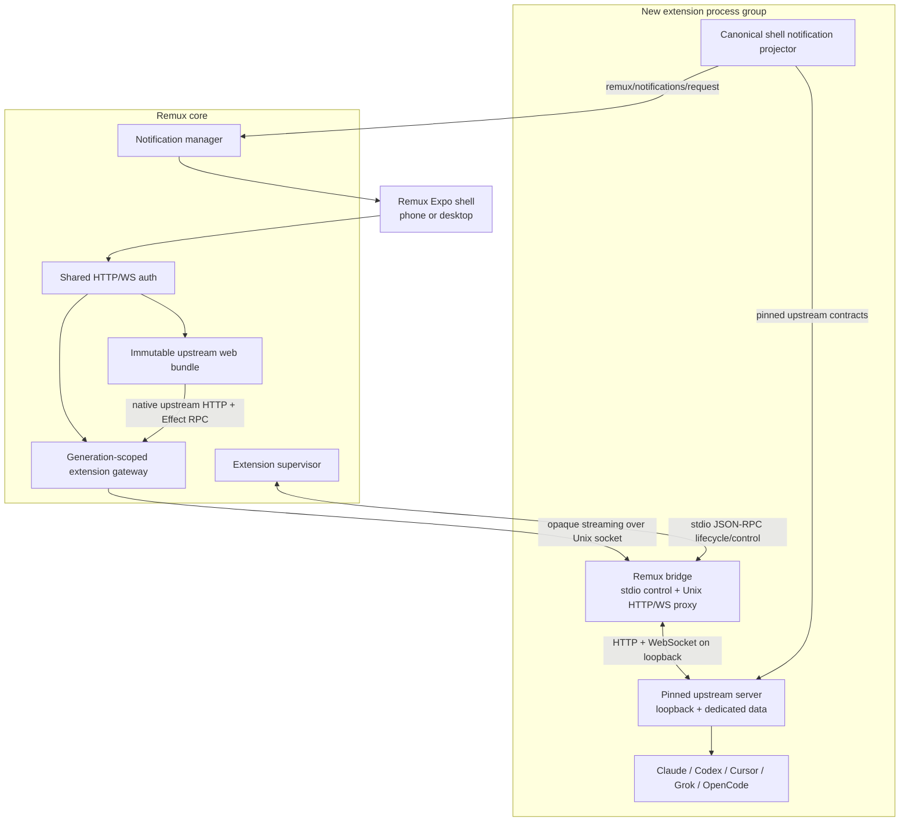

Status: Archived prototype
Last verified: 2026-09-02
Historical note: the standalone T3 Code source pin, capsule, bridge, and extension were removed when the native Agent became the product path. This archived specification remains as design evidence for the generic gateway, supervisor, lifecycle, and provider-adapter work retained elsewhere in Remux.
Superseded by: `agent-native-provider-runtime-v1.md`. The full upstream capsule
remains temporary implementation/reference material; it is no longer the target
Agent product architecture.
Upstream design baseline: `https://github.com/pingdotgg/t3code` at `d0b4acbd13b2b602710e4a7d60c42f4799a409be` (`apps/server` package version `0.0.37`, MIT license).
Selected initial implementation pin: `04efa7907e9ec207e2d6af459ce3b2ffd55f6107` (`apps/server` package version `0.0.38`, reviewed from upstream `main` on 2026-09-01).

# T3 Code extension

This document specifies how Remux should ship T3 Code as a new, first-class extension. The public display name is **T3 Code** and Remux-owned copy describes it as the T3 Code extension for Remux. “Upstream” means the pinned `pingdotgg/t3code` source. Distribution must preserve upstream attribution and must not imply that Remux itself is the official upstream T3 product or service.

The central decision is to consume the upstream server, contracts, client runtime, and complete web UI as one pinned capsule. Remux remains the native shell and remote-access product. A small bridge owns process lifecycle, authentication, an opaque HTTP/WebSocket gateway, notification projection, and host integration. Remux must not become a second implementation of the upstream Effect RPC client.

This is a new extension. It does not replace or silently migrate the existing `codex` or `agent` extensions. Those remain available until this extension has passed the rollout gates and the owner explicitly decides what, if anything, should be retired.

## Decision summary

1. Ship the whole upstream web application, not copied React components.
2. Run the matching upstream server at the exact same commit as the web build.
3. Bind the upstream server to loopback and a dedicated data directory. It is never exposed directly to the phone or LAN.
4. Add a generic, authenticated Remux extension gateway that streams HTTP and WebSocket traffic through a generation-scoped Unix socket.
5. Keep all upstream RPC and HTTP semantics end to end. Remux owns transport and policy, not orchestration translation.
6. Keep the Remux Expo shell, tabs, safe-area ownership, attachment picker, lifecycle signals, deep links, push registration, visibility suppression, and notification taps.
7. Add a narrow web integration layer for gateway base paths, Remux navigation, native attachments, lifecycle wakeups, and unsupported-feature hiding.
8. Project turn completion from the upstream server’s canonical shell stream in the bridge, so notifications work while the WebView is suspended or absent.
9. Pin upstream source. Updates are reviewed, built, tested, and promoted as a unit; neither `latest` nor upstream self-update is allowed in production.
10. Keep Fable/Sol delegation deliberately small: one normal Claude skill invokes a foreground Codex CLI runner for bounded Sol implementation, Fable inspects the result, and the same Codex session may be resumed for targeted corrections. The worker is not a Remux resource and receives no separate UI, orchestration state, or notifications.

## Naming decision

The public name and persistent identifiers are fixed before implementation:

| Identifier | Value |
| --- | --- |
| Display name | `T3 Code` |
| Remux description | `T3 Code extension for Remux` |
| `extensionId` | `t3-code` |
| Package namespace | `@remux/t3-code` |
| RPC prefix | `remux/t3-code/...` |
| Viewer route | `/viewers/t3-code` |
| Gateway mount | `/remux/extensions/t3-code/gateway/` |
| Resource kinds | `agentWorkspace` and `agentThread` |
| Data directory | `.remux/extensions/t3-code/` |

These values appear in routes, notification keys, logs, browser resources, and persisted data. Renaming them later requires an explicit migration. The launcher icon and concise descriptive copy may be finalized during Phase 0, but they must not change these identifiers.

## Goals

- Make Claude Code, Codex, Cursor, Grok, and OpenCode available through the upstream harness inside Remux.
- Preserve the strongest parts of the upstream product: its orchestration engine, provider adapters, checkpointing, VCS, terminal model, source-control surfaces, and complete responsive web UI.
- Preserve the strongest parts of Remux: one authenticated phone connection, native tabs, reliable mobile lifecycle handling, resource routing, local-first operation, Expo notifications, process containment, logs, and recovery.
- Receive upstream UI improvements by advancing one source pin rather than manually porting components.
- Keep upstream web and server versions inseparable so their Effect RPC contracts remain matched.
- Make a failed bridge, server crash, extension restart, app background, or network transition recover predictably.
- Keep the architecture reusable: the extension gateway and generic notification-audience API should serve future extensions too.
- Preserve user Claude instructions and skills, and provide one optional `codex-worker` skill that lets a Fable parent use Sol for bounded implementation instead of an Opus implementation subagent.
- Let Fable resume the same Codex session for a small number of concrete corrections without introducing a cross-provider thread service.

## Non-goals

- Rewriting the upstream orchestration engine in Rust or in the existing Codex extension.
- Translating every upstream Effect RPC into Remux JSON-RPC methods.
- Copying `ChatView`, `Sidebar`, or other upstream UI components into the current Remux chat UI.
- Embedding the upstream React Native mobile app in the Remux Expo app.
- Exposing the upstream server on a second public port or requiring the phone to pair with it separately.
- Supporting T3 Connect, Clerk, upstream APNs/Live Activities, upstream remote relay, or upstream self-update in Version 1.
- Automatically importing a user’s standalone `~/.t3` database.
- Silently installing or rewriting global `CLAUDE.md`, `AGENTS.md`, Claude skills, Codex configuration, or provider credentials.
- Treating the Codex worker as a first-class upstream thread, Remux resource, native Claude subagent, or independently addressable mobile session.
- Child-specific progress UI, notifications, approval routing, persistence, follow-up composer, or cancellation controls.
- Automatic planner-to-implementer thread creation, linked-thread provenance, cross-provider orchestration RPCs, worker pools, or parallel Sol workers.
- Shipping separate delegation skills for review, computer use, runtime verification, or other specializations in the initial implementation.
- Replacing Remux’s existing Agent or Codex history, storage, or notifications during the initial rollout.
- Promising every desktop-only upstream feature on the phone. External editor launch, arbitrary localhost previews, and OS integrations need explicit Remux adapters.

## Verified starting point

### Remux today

- The Expo app owns authenticated server connectivity, tabs, resource identity, WebView lifecycle, native attachment selection, notification registration, visibility suppression, and notification taps.
- The Rust runtime authenticates the entire HTTP and `/ws` surface with one bearer/cookie handoff.
- Extensions are supervised stdio JSON-RPC processes. Requests can be concurrent and cancellable; targeted notifications are routed by an opaque `_remuxOrigin`.
- Immutable viewer bundles are revisioned and retained across runtime restarts and long-lived mobile tabs.
- The extension process group and cgroup containment already include trusted child processes.
- `remux/notifications/request` is generic, but audience registration is currently inferred from hard-coded Agent, Codex, and Terminal RPC method names. A gateway-carried upstream command is invisible to that inference and therefore needs the generic audience API in this spec.
- Remux JSON-RPC has a 64-pending-request client cap and bounded outbound lanes. It is appropriate for control messages, not 50 MiB upstream attachments or arbitrary media streaming.

### Upstream at the pinned baseline

- The server is the execution boundary for provider processes, terminals, Git/VCS, checkpointing, filesystem reads, and orchestration persistence.
- Web, desktop, and mobile clients share `packages/client-runtime` and communicate through authenticated Effect RPC over WebSocket, with contracts in `packages/contracts`.
- The server’s orchestration model is event-sourced and persists command receipts, events, projections, and command results transactionally.
- The built-in providers are Codex, Claude, Cursor, Grok, and OpenCode.
- The web application is responsive and contains mobile sidebar, safe-area, composer, and timeline behavior, but it is an application rather than a published component library.
- HTTP is a required part of the client contract. It is used for environment descriptors, authentication, shell/thread snapshots, assets, file attachments, and other queries; a WebSocket-only adapter is insufficient.
- The shell subscription exposes `latestTurn.turnId`, `state`, timestamps, current session state, pending approval/input flags, and background liveness. This is enough for a server-side notification projector without scraping rendered UI.
- File attachments are capped by the pinned contract at 50 MiB per attachment and eight attachments per turn.
- The current model manifest includes `claude-fable-5-1` and `gpt-5.6-sol`.
- The Claude provider discovers skills from the configured Claude home's `skills` directory, then workspace `.agents/skills`, then workspace `.claude/skills`; the web composer exposes the discovered skills through its skill picker.
- A Codex CLI noninteractive run emits structured JSONL including its session ID, and the CLI can resume that session with a follow-up prompt. Those two primitives are sufficient for the bounded worker contract; no app-server integration is required.
- Upstream is moving quickly. In the local reference history on 2026-09-01, 160 commits landed in seven days and 319 in fourteen days. Across the last 160 commits, the server, web app, contracts, and client runtime changed 481 files with 45,653 insertions and 9,594 deletions. A floating dependency would be operationally reckless.

## Target architecture



There are two browser connections while the viewer is open:

- the normal Remux `/ws` connection used by viewer-kit for host navigation, lifecycle, native attachments, tab updates, and notification-audience registration;
- the upstream application’s native HTTP/WebSocket connection through the Remux gateway.

That separation is intentional. The first is a small Remux control plane. The second is an opaque upstream data plane and is not constrained by Remux JSON-RPC message size or pending-request limits.

## Ownership boundaries

| Concern | Owner | Notes |
| --- | --- | --- |
| Provider adapters and sessions | Upstream server | Remux must not wrap Claude/Codex protocols again. |
| Orchestration events, projections, checkpoints, thread history | Upstream server | Stored in the extension’s dedicated upstream data directory. |
| Agent workspace UI | Upstream web app | Consumed as a complete pinned build. |
| Remote device authentication | Remux | The phone never pairs directly with upstream. |
| Upstream session credential | Extension bridge | Stored mode `0600`; never exposed to browser JavaScript. |
| HTTP and WebSocket byte transport | Remux gateway + bridge | Streaming and protocol-opaque. |
| Process lifecycle and containment | Remux supervisor | One supervisor; the bridge exits when its upstream child dies unexpectedly. |
| Native tab/resource model | Remux app + small web adapter | Maps upstream routes to stable Remux resources. |
| Push tokens, visibility suppression, notification taps | Remux | No upstream APNs, FCM, Live Activities, or relay. |
| Completion detection | Bridge projector | Reads canonical upstream shell state, not DOM state. |
| Source version and promotion | Remux repository | Exact source pin, patch stack, build artifacts, and rollback metadata. |
| Upstream cloud, relay, analytics, and self-update | Disabled in this build | Re-enable only through a separate reviewed spec. |

## Repository and source layout

The target layout is:

```text
third_party/
  t3code/                         # git submodule at one reviewed upstream commit

extensions/t3-code/
  remux-extension.json
  package.json
  upstream.lock.json
  README.md
  NOTICE.upstream
  bridge/
    src/
      main.ts
      lifecycle.ts
      proxy.ts
      upstreamAuth.ts
      notificationProjector.ts
      health.ts
    tests/
  integration/
    src/
      bootstrap.ts
      gatewayUrls.ts
      hostNavigation.ts
      nativeAttachments.ts
      lifecycleWakeups.ts
      notificationAudience.ts
    tests/
  patches/
    0001-prefix-safe-web-runtime.patch
    0002-remux-host-lifecycle.patch
    0003-remux-mobile-web-layout.patch
  scripts/
    build-upstream.mjs
    verify-upstream.mjs
    update-upstream.mjs
  viewer/
    dist/                         # generated, immutable published bundle
```

### Why a submodule

A submodule makes the exact upstream tree and its history inspectable, produces a single commit-pointer diff during upgrades, and avoids copying a fast-moving monorepo into Remux history. Remux build/install tooling must use recursive checkout and fail clearly when the submodule is absent. If deployment infrastructure cannot support submodules, a verified source archive keyed by the same commit and SHA-256 is the acceptable fallback; a hand-copied vendor directory is not.

The existing ignored `/t3code` checkout remains a research clone and is not the production dependency.

### Lock file

`upstream.lock.json` is committed in addition to the gitlink. Its Version 1 shape is:

```json
{
  "version": 1,
  "repository": "https://github.com/pingdotgg/t3code.git",
  "commit": "04efa7907e9ec207e2d6af459ce3b2ffd55f6107",
  "serverPackageVersion": "0.0.38",
  "nodeRange": "^24.13.1",
  "packageManager": "pnpm@11.10.0",
  "license": "MIT",
  "licenseSha256": "<computed-at-vendor-time>",
  "patches": [
    { "path": "patches/0001-prefix-safe-web-runtime.patch", "sha256": "a25e12f2c70b2c025537ba3ec493d3a04540e8953c6591ead56fc76352ae114b" },
    { "path": "patches/0002-remux-host-lifecycle.patch", "sha256": "c669fc6ff36e3ad1fed3adac70ce705258e288e32c1f4911a9fced4d70412606" },
    { "path": "patches/0003-remux-mobile-web-layout.patch", "sha256": "e1f94509e02194e0f0138534cccb71d8db69db5dcbefe28231b15cd57e90e2e1" },
    { "path": "patches/0004-remux-hosted-recovery-ui.patch", "sha256": "8184778363e798acb5898c4e8222a571b397c9e139d146bf18903edd2d4a802f" }
  ],
  "webArtifactSha256": "1d395e6ef5b3e38edf236c3b28413537ee3baea926eba180f722c2876f3da061",
  "serverArtifactSha256": "bf8c48cee019ef52b7e5c5c50a341a96e88d3f3cfdf95a2b59b68bfe2103f27e",
  "serverRuntimeSha256": "3e220f06ec73c93c1d242958a23d69c624bdf2aec5a77409eb1df2600dbe83aa",
  "serverRuntime": { "platform": "linux", "architecture": "x64", "libc": "glibc" },
  "runtimeDependencies": {
    "@ff-labs/fff-bin-linux-x64-gnu": "0.9.4",
    "@ff-labs/fff-node": "0.9.4",
    "@yuuang/ffi-rs-linux-x64-gnu": "1.3.2",
    "ffi-rs": "1.3.2",
    "node-pty": "1.1.0"
  },
  "verifiedAt": "2026-09-02T00:00:00Z"
}
```

The build fails if the submodule HEAD, package version, license digest, patch digests, platform/runtime dependency metadata, or resulting web/server/runtime artifact digests disagree with the lock. The initial slim server capsule is deliberately limited to Linux x64 glibc; another deployment target requires a separately built and locked native capsule rather than silently reusing these binaries.

### Patch policy

- The submodule is never committed dirty.
- Build scripts copy or create a temporary worktree, apply the numbered patches there, and run `git apply --check` before installing dependencies.
- Patches may only cover platform seams: gateway base-path support, Remux bootstrap, host integration, and disabling unowned surfaces.
- Remux-specific behavior lives in `extensions/t3-code/integration`, imported through a build alias. Avoid embedding large Remux modules in patch hunks.
- A patch that edits a large feature component such as `ChatView.tsx` or `Sidebar.tsx` requires explicit architecture review. Repeated edits to those files are evidence that the seam is wrong.
- A generally useful fix should be proposed upstream. Once released upstream, remove the local patch in the same pin advance.
- Copying an upstream component into Remux is not an acceptable way to resolve patch drift.

### Reproducible build tooling

- Use a repository-controlled compatible Node version and an exact `pnpm@11.10.0` invocation (Corepack when present, otherwise the build script's version-qualified npm exec path).
- Use the upstream lockfile with frozen resolution. Do not run `npx t3@latest`, `curl | bash`, or install an unpinned global Vite+ binary in production builds.
- Invoke the upstream-local CLI (`pnpm exec vp` or the exact lockfile-resolved equivalent).
- Build native dependencies such as `node-pty` for the deployment host in the extension build phase.
- Keep the upstream dependency install isolated from Remux’s root npm workspace and lockfile.
- Emit a dependency license report and retain the upstream MIT notice in distributions.

## UI integration strategy

### What we reuse unchanged

The main view is the complete upstream web application. This gives Remux upstream’s timeline, composer, project/thread sidebar, model and provider settings, approvals, plan mode, checkpoint/diff UI, source-control surfaces, terminal UI, responsive layout, and continuing UI improvements.

Remux does not try to use upstream’s private components as a component library. The current web app has large, tightly coupled feature components and private workspace packages. Cherry-picking them would make Remux responsible for their internal state and CSS evolution while losing the advantage of an upstream pin.

### What remains Remux-native

- The native browser shell and tabs.
- A persistent, viewer-independent escape affordance back to the Remux tab overview.
- The settings/operations surface for starting, stopping, rebuilding, inspecting, and rolling back the extension.
- Safe-area container ownership, native keyboard/WebView behavior, and the viewport metrics projected into hosted viewers.
- Native photo/file selection.
- Push permission, Expo token registration, notification presentation, and notification taps.
- Host open-file/open-link policies.
- App background/foreground and reconnect signals.
- Resource identity and deep-link routing.

### Required web overlay seams

The integration layer must implement these narrow seams:

1. **Gateway target:** give the upstream client an HTTP and WebSocket base under the authenticated Remux gateway.
2. **Base-path URL construction:** preserve the gateway prefix for HTTP endpoints, asset URLs, and `/ws` instead of resetting each URL to the origin root.
3. **Host navigation:** mirror the active upstream thread into the current Remux tab and accept `host/navigate` intents from notification taps or tab reuse.
4. **Lifecycle wakeup:** connect native Remux lifecycle epochs and inactive duration to the upstream connection wakeup/resubscription mechanism. Short interruptions probe the existing session; meaningful or uncertain suspensions replace it.
5. **Native attachments:** on the Remux WebView, use `host/attachments/pick`, turn returned data URLs into browser `File` objects, and pass them into the existing upstream upload/composer path. Desktop browser drag/drop can remain native upstream behavior.
6. **External actions:** route open-file and supported external-link intents through Remux host APIs. Hide actions that require an Electron main process or an unimplemented native adapter.
7. **Theme, host chrome, and safe area:** a view may request `hostChrome: "minimal"`. Remux then renders a native 44-point overview control above the WebView and reports its occupied leading inset. The host viewport contract reports all four native safe-area insets, keyboard obstruction, and host-control inset; the adapter projects them to CSS variables. Shared upstream sheet, dialog, alert-dialog, menu, popover, command, settings-scroll, toast, and composer primitives consume those variables rather than relying only on root padding. Remux owns each outer inset exactly once; upstream remains responsible for its internal tokens and layout.
8. **Notification audience:** register the initiating Remux client around successful turn-start dispatches.
9. **Capability policy:** hide T3 Connect, upstream remote-environment pairing, self-update, and cloud account surfaces in Version 1.
10. **Managed connection presentation:** distinguish outer Remux connectivity, an expected extension build/restart, gateway startup, unexpected extension failure, and provider readiness. Expected generation replacement is a calm updating state with automatic recovery; it must not expose upstream Connections navigation. Provider state from a replaced generation becomes checking until the replacement publishes an authoritative snapshot.

### Base-path requirement

Upstream URL helpers currently replace `URL.pathname` with `/api/...` or `/ws`. That drops a reverse-proxy prefix. The overlay must centralize prefix-aware URL construction and cover at least:

- environment descriptor and session endpoints;
- OAuth/browser-session and WebSocket-ticket endpoints;
- shell and thread snapshot endpoints;
- relative asset and attachment upload URLs;
- direct and ticketed WebSocket URLs;
- any app-level helper that writes `url.pathname` directly.

The behavior must be opt-in for the Remux build and tested with a base such as `https://host/remux/extensions/example/gateway/`. Normal upstream root deployments must retain their current behavior. An upstreamable general `basePath` implementation is preferred to a permanent Remux-only fork.

### Mobile acceptance behavior

The upstream responsive UI is the starting layout, but “it renders at 390 px” is not sufficient. The Remux build must verify:

- no control is obscured by top or bottom safe areas;
- an always-visible native control opens the Remux tab overview even while the viewer is loading, disconnected, or failed;
- opening and dismissing the native keyboard does not strand the composer or scroll position;
- sidebar, dialogs, alert dialogs, menus, popovers, command palettes, approval prompts, diff panels, and settings remain reachable with touch and scroll above the bottom inset;
- the timeline does not jump on streaming updates, app resume, or orientation change;
- native image and file attachments upload through the gateway;
- the Android back action first closes upstream overlays/sidebar, then follows Remux tab behavior;
- long press, copy, selection, and external links have deliberate behavior;
- the host/provider turn continues while the WebView is suspended or absent;
- returning after WebView suspension preserves cached content while resynchronizing from authoritative upstream snapshots/events;
- short interruptions probe the existing upstream session, while long or uncertain suspensions replace it;
- a resume never duplicates a user turn, tool event, approval, or provider execution;
- unsent drafts remain drafts, and an unacknowledged turn is never blindly replayed;
- a dead WebView or client/server version mismatch reloads cleanly without making page reload the normal resume path;
- a notification tap opens the intended thread and, when present, focuses the intended turn.

## Generic extension gateway

The gateway is a Remux platform feature, not a T3-specific route in the Rust runtime.

### Manifest Version 3

Manifest Version 3 adds an optional top-level `gateway` declaration. It is valid only when a stdio server exists.

```json
{
  "version": 3,
  "id": "t3-code",
  "server": {
    "transport": "stdio",
    "command": "node",
    "args": ["bridge/dist/main.mjs"],
    "cwd": ".",
    "build": {
      "command": "npm",
      "args": ["run", "build"],
      "cwd": "."
    }
  },
  "gateway": {
    "transport": "http+websocket",
    "maxRequestBodyBytes": 67108864
  },
  "views": {
    "main": {
      "entry": "viewer/dist/index.html",
      "cache": "immutable",
      "hostChrome": "minimal"
    }
  }
}
```

Rules:

- `views.<id>.hostChrome` is optional and is either `none` (the default) or `minimal`; the catalog carries it to the native host without making it part of the web bundle URL.
- `transport` is exactly `http+websocket` in Version 3.
- The public mount is derived as `/remux/extensions/t3-code/gateway`; manifests cannot choose an arbitrary route.
- `maxRequestBodyBytes` defaults to 16 MiB and may be set from 1 MiB through 64 MiB. This extension uses 64 MiB to carry the upstream 50 MiB attachment contract with request overhead.
- The runtime creates a private generation-specific Unix socket path and passes it as `REMUX_EXTENSION_GATEWAY_SOCKET`.
- The socket lives under a mode-`0700` runtime directory and is mode `0600` where the platform permits.
- A gateway does not make a server “ready.” After its listener and private upstream probes succeed, the bridge sends a stdio JSON-RPC request named `remux/extension/gatewayReady` with `{ "gatewayReady": true }`. Remux activates the route only after validating the generation/socket and responds with `{ "gatewayReady": true, "generation": <current> }`; a notification or a child-supplied generation is insufficient.

### Outer route and authentication

The gateway route is merged under the same Remux HTTP authentication middleware as viewers and `/ws`. WebView subresources use the existing `remux_auth` same-origin cookie. The route is never exempt from authentication.

After Remux authorizes the request, the Rust gateway:

- strips the derived mount prefix before forwarding;
- removes Remux `Authorization`, `Cookie`, `Set-Cookie`, and query `token` material;
- removes hop-by-hop headers and untrusted forwarded headers;
- sends the request to the current extension-generation Unix socket;
- never accepts an extension-supplied upstream host or arbitrary proxy target;
- streams request and response bodies instead of buffering them;
- rewrites no application payloads;
- overwrites the internal generation header on the upstream request and every successful HTTP response or WebSocket handshake, so the browser can detect a replaced generation without trusting an upstream-supplied value; the header is diagnostics/recovery evidence, not authorization;
- rewrites a bridge-relative `Location` header back under the public mount and rejects a redirect to the private loopback upstream origin.

The bridge then applies upstream-specific authentication and origin rewriting. This two-stage split keeps the Rust gateway generic.

### HTTP behavior

| Contract | Requirement |
| --- | --- |
| Methods | Forward standard methods used by the upstream client. Reject `CONNECT` and `TRACE`. |
| Body | Stream with backpressure. Enforce the manifest byte cap and return `413` before forwarding further bytes. |
| Response | Stream status, headers, and body. Preserve content type, ETag, range, and content-length semantics when valid. |
| Compression | Do not recompress gateway responses in Remux; preserve upstream representation and range behavior. |
| Connect timeout | 2 seconds to the Unix listener. |
| Response-header timeout | 30 seconds. |
| Body idle timeout | 60 seconds; no fixed total timeout for a progressing upload/download. |
| Concurrency | Start with 128 in-flight HTTP requests per gateway generation; reject excess with `503` and `Retry-After: 1`. Tune from measurements. |
| Failure before ready | `503` JSON with stable code `extension_gateway_not_ready` and `Retry-After: 1`. |
| Extension restart | New requests use the new generation. Old HTTP streams terminate rather than crossing generations. |

### WebSocket behavior

- Upgrade only under the declared gateway mount.
- Preserve text, binary, ping, pong, close code, close reason, fragmentation semantics, ordering, and backpressure.
- Do not parse or translate Effect RPC messages in the Rust runtime.
- Tie every upgraded socket to the current supervisor generation and Unix socket.
- When the extension stops or restarts, close downstream sockets with code `1012` (“service restart”).
- If either side disappears uncleanly, close the peer and release all buffers.
- Bound queued, unwritten data per direction to 8 MiB. On overflow, close with `1013` (“try again later”); never silently drop or reorder frames.
- Permit at most 32 upgraded sockets per gateway generation initially. The expected steady state is one upstream socket per open viewer plus one bridge projector socket.
- Do not apply the Remux JSON-RPC 64-pending-request limit to gateway traffic.

### Generation fencing

The supervisor already has extension generations. The gateway must use them as follows:

1. Create a fresh Unix socket path before spawning a new extension generation.
2. Pass only that path to the child.
3. Mark the generation routable after stdio initialization reports gateway readiness.
4. Atomically switch new requests to the ready generation.
5. Close every old-generation upgrade with `1012`, stop accepting its HTTP streams, and unlink its socket after the child is reaped.
6. Never reuse a socket path across generations.

This prevents a late old child from accepting traffic after a restart.

## Extension bridge

The bridge is a small Remux-owned Node process. It participates in stdio JSON-RPC for lifecycle/control and listens on the assigned Unix socket for the opaque data plane.

### Responsibilities

- Validate `upstream.lock.json` at startup.
- Start one upstream server child with the pinned artifact.
- Keep the upstream server on `127.0.0.1` and discover its selected port from its persisted runtime-state file.
- Use the extension-specific upstream base directory.
- Obtain and rotate one private upstream owner session.
- Reverse-proxy gateway HTTP and WebSocket traffic to the fixed loopback origin.
- Strip all browser credentials and inject only the bridge-owned upstream credential.
- Rewrite `Host` and `Origin` to the expected loopback origin.
- Run the notification projector with the same pinned contracts.
- Report component health and exact versions over stdio.
- Forward sanitized upstream logs into the extension journal stream.
- Exit non-zero when the upstream child dies unexpectedly so Remux remains the only restart supervisor.
- On shutdown, stop accepting gateway traffic, close projector subscriptions, signal the upstream child, and let the Remux process-group deadline enforce final cleanup.

### Non-responsibilities

- It does not implement upstream orchestration RPCs.
- It does not persist a second copy of thread state.
- It does not retry or deduplicate user commands.
- It does not expose a public listener.
- It does not independently restart the upstream child in a loop.
- It does not send upstream cloud notifications.

### Startup state machine

```text
starting
  -> validating-pin
  -> preparing-auth
  -> starting-upstream
  -> waiting-runtime-state
  -> probing-descriptor
  -> starting-projector (once Phase 4 is enabled)
  -> gateway-ready
  -> running

Any state -> stopping -> stopped
Any pre-running failure -> failed -> bridge exits non-zero
Unexpected upstream exit while running -> failed -> bridge exits non-zero
```

Startup is ready only when all of these are true:

- the upstream child PID is live and in the extension process group;
- the runtime-state file names that PID and a loopback origin;
- the environment descriptor and probe succeed through the private origin;
- the descriptor/server version matches the lock;
- the private upstream credential can obtain a WebSocket ticket;
- once Phase 4 is enabled, the notification projector has consumed an initial shell snapshot and reached its synchronized marker;
- the Unix gateway listener is accepting requests.

During Phase 2 the projector reports `deferred` and is not a readiness dependency. Phase 4 changes that status and readiness condition in the same change that introduces the projector; the bridge must not claim a live projector before then.

The bridge reports a stable error code for each failed condition. The viewer must show a retry/rebuild/inspect-logs state instead of a generic blank page.

### Upstream launch contract

Launch the pinned server equivalent of:

```text
<pinned-t3-binary> serve
  --host 127.0.0.1
  --base-dir <repo>/.remux/extensions/t3-code/upstream
  --no-browser
```

Do not pass `--tailscale-serve`, a wildcard host, or a public relay configuration. Let the upstream launcher choose an available local port and read the authoritative port from its runtime-state file; do not scan stdout with a fragile regular expression.

The bridge validates that the reported origin is loopback before proxying a byte. A non-loopback origin is a fatal configuration error.

### Data directories

```text
.remux/extensions/t3-code/
  upstream/             # upstream database, auth records, settings, traces
  bridge/
    credential.json     # mode 0600
    projector.json      # notification cursor and dedupe state
    health.json         # last-known component state, no secrets
  backups/
    <upstream-commit>/  # pre-migration database backup metadata/data
```

The upstream base directory is separate from `~/.t3` by default. Pointing two live servers at one upstream database is forbidden. A future import tool may copy a stopped standalone database after validating version, ownership, available disk, and rollback; direct sharing is not supported.

### Upstream credential

The bridge needs an upstream session because the server correctly authenticates HTTP and WebSocket access even on loopback.

- Bootstrap the session while the private server/data directory is exclusively owned by the bridge.
- Store the session token and session ID in `credential.json`, mode `0600`, using atomic write + rename.
- Use a labeled owner session because Remux’s current auth model is already one trusted owner token. The browser never receives this bearer.
- Strip every browser `Authorization` and `Cookie` header, then inject the bearer on upstream HTTP requests.
- Allow the browser to receive only the upstream short-lived single-use WebSocket ticket returned by `/api/auth/websocket-ticket`.
- Strip upstream `Set-Cookie`; browser state must not become an independent upstream login.
- Rotate before expiry during an idle maintenance window. Verify the replacement before revoking the old session.
- Redact bearer tokens, WebSocket tickets, Remux cookies, pairing tokens, and query credentials from every log and error object.

If Remux later gains multiple roles or untrusted users, this owner-session design must be replaced with per-client scoped upstream sessions. That is not required to preserve today’s shared-owner security model.

### Health RPC

The bridge exposes a small control-plane RPC under the fixed `remux/t3-code/...` prefix:

```json
{
  "protocolVersion": 1,
  "bridge": { "status": "running", "generation": 7, "version": "<remux-bridge-version>" },
  "gateway": { "ready": true, "activeHttp": 2, "activeWebSockets": 2 },
  "upstream": {
    "status": "running",
    "commit": "04efa7907e9ec207e2d6af459ce3b2ffd55f6107",
    "packageVersion": "0.0.38",
    "pid": 1234,
    "origin": "loopback:redacted"
  },
  "projector": { "status": "deferred", "reason": "phase-4" }
}
```

The real loopback port is available in privileged logs but should not be sent to the viewer, where it invites bypass attempts.

## Client bootstrap, routing, and lifecycle

### One embedded environment in Version 1

The upstream web app is bootstrapped with exactly one platform-managed environment: the extension-owned local server through the gateway. Version 1 hides adding remote upstream environments, SSH launch, pairing, and T3 Connect. Remux already provides the remote-device boundary; nesting another remote topology would duplicate auth, updates, routing, and support burden.

### Gateway URLs

The immutable viewer receives only public, same-origin values:

```json
{
  "protocolVersion": 1,
  "httpBaseUrl": "https://<remux-authority>/remux/extensions/t3-code/gateway/",
  "wsBaseUrl": "wss://<remux-authority>/remux/extensions/t3-code/gateway/",
  "environmentMode": "remux-managed"
}
```

The bootstrap contains no upstream bearer or loopback origin. The integration adapter computes the authority and `http`/`https` plus `ws`/`wss` schemes from `window.location`, then uses prefix-aware endpoint helpers.

### Resource model

Version 1 defines:

| Surface | Resource kind | Resource ID | Focus |
| --- | --- | --- | --- |
| Workspace/home | `agentWorkspace` | `local` | none |
| Thread | `agentThread` | upstream `threadId` | optional `turn` / upstream `turnId` |

The single embedded environment makes the upstream thread ID sufficient. If multi-environment support is added later, introduce a versioned composite resource encoding; do not silently reinterpret Version 1 IDs.

When upstream routing opens a thread, the adapter calls `updateHostTab` with the thread resource and title. When upstream returns home, it updates the tab to the workspace resource. The adapter debounces identical updates and never changes the extension ID or view ID.

When `host/navigate` arrives:

- `agentWorkspace/local` navigates to the upstream workspace route;
- `agentThread/<threadId>` navigates to that thread through the upstream router;
- an optional `focusKind: turn` and `focusId` scrolls/focuses after thread state is loaded;
- an unknown resource or focus returns a typed diagnostic and leaves the current route intact.

All mapping functions are pure and unit tested. Do not parse or synthesize routes ad hoc in React components.

### Native lifecycle contract

Mobile correctness must not depend on JavaScript running while the screen is off. React Native owns the authoritative app-state clock and extends the generic viewer lifecycle payload additively:

```ts
type RemuxHostLifecycleEvent = {
  epoch: number;
  reason: "appState" | "connect" | "tabActive";
  state: "active" | "background" | "inactive";
  inactiveForMs: number | null;
};
```

`epoch` advances only when effective lifecycle state changes. `inactiveForMs` is populated on a transition to `active` from a native monotonic clock; it is `null` when the duration cannot be proven or the event is not an activation. A viewer receiving an older payload without the field parses it as `null`. The WebView must not calculate this duration because the operating system may suspend it before a background callback runs.

The Remux integration maps each new active epoch to exactly one upstream wakeup:

| Native evidence | Upstream wakeup | Required behavior |
| --- | --- | --- |
| `inactiveForMs < 10_000` | `application-active-probe` | Probe the current lease with the upstream mobile timeout and resubscribe from current cursors. |
| `inactiveForMs >= 10_000` | `application-active-reconnect` | Deliberately replace the session without waiting through normal reconnect backoff. |
| `inactiveForMs === null` after a plausible suspension | `application-active-reconnect` | Treat continuity as unknown and replace the session. |
| New Remux/gateway generation | `application-active-reconnect` | Replace every connection tied to the old generation. |
| Tab becomes active while the app stayed active | `application-active-probe` | Verify/resubscribe without manufacturing a long suspension. |

In Remux mode, native lifecycle is the wakeup authority. Browser `visibilitychange`, `pageshow`, and online signals remain useful diagnostics/connectivity evidence but do not independently emit upstream wakeups once the native host lifecycle is available. Host connection events are coalesced with lifecycle evidence; a new gateway generation is its own reconnect-strength recovery generation. Each native active epoch and each gateway replacement emits at most one classified wakeup. Normal upstream root deployments retain their existing browser wakeup behavior.

The Remux control WebSocket and upstream T3 WebSocket are separate liveness domains. Native Remux first verifies or reconnects its own control connection. The embedded app then independently probes or replaces the upstream connection through the authenticated gateway. “Remux connected” must never be presented as “T3 synchronized.”

### Resume and authoritative reconciliation

The upstream connection supervisor owns retry and state resubscription. The Remux integration feeds it native lifecycle evidence and must not create another retry loop.

On an active lifecycle epoch:

1. Preserve the most recent cached shell/thread UI and mark it `synchronizing`; do not blank the workspace.
2. Verify the Remux control socket and current extension/gateway generation.
3. Emit the single classified upstream wakeup from the table above.
4. Probe or replace the upstream session. An open browser socket is not proof of liveness after suspension.
5. Resume shell and active-thread subscriptions from their last applied sequence when the session and server support it.
6. Accept replayed events strictly above the applied cursor. If the gap cannot be replayed, load a fresh authoritative HTTP or stream snapshot.
7. Wait for the upstream shell and active-thread `synchronized` completion markers before presenting the state as `live` or enabling server mutations.

The convergence invariant is stronger than reconnect success: after synchronization, the rendered shell and active thread must equal the server's authoritative projections at or beyond the completion-marker sequence, with no duplicate turn, activity, approval, or tool event.

The host/provider turn continues on the upstream server while the phone is suspended, the WebView is evicted, or the app is absent. On return, a running turn, completed turn, or pending approval/input must be reconstructed from server state; background JavaScript and push delivery are not correctness dependencies.

### Drafts, commands, and reload policy

- Persist composer drafts continuously through the upstream draft store. Restore text and composer metadata after suspension or WebView recreation without dispatching them.
- Preserve successfully uploaded attachment references. An interrupted upload remains visibly failed/retryable or requires explicit reselection; it must never partially dispatch a turn.
- Every turn start retains its stable upstream command ID and receipt semantics. If the client disappears after dispatch but before acknowledgement, reconcile the receipt/thread state; never create a new command ID and blindly resend.
- Keep cached UI visible but visibly non-authoritative while synchronizing. The composer may accept local draft edits, but server mutations remain disabled until the relevant environment/thread is live.
- A healthy page uses probe/reconnect/resubscribe. Reload the immutable viewer only when the WebView fails its host health ping, its runtime is irrecoverably broken, or client/server pins mismatch.
- If the OS kills the app or evicts the WebView, cold bootstrap the matching immutable bundle, restore durable local state, and then reconcile authoritative upstream snapshots before enabling mutations.

On a Remux runtime or extension restart, gateway sockets close with `1012`; the upstream supervisor reconnects through the new generation. The immutable viewer bundle can stay loaded if it is compatible with the new generation. A server/client pin mismatch is a hard error and requests a viewer reload after the matching bundle publishes.

## Notifications

Remux remains the only push-notification owner. The upstream server’s relay/APNs/Live Activities path is disabled.

### Platform prerequisite: generic audience API

Add two viewer-facing core methods handled by `NotificationManager`:

```text
remux/notifications/audience/register
remux/notifications/audience/remove
```

Register Version 1 params:

```json
{
  "version": 1,
  "extensionId": "t3-code",
  "viewId": "main",
  "lifetime": "once",
  "match": {
    "resourceKind": "agentThread",
    "resourceId": "<thread-id>"
  },
  "expiresInMs": 86400000
}
```

Result:

```json
{ "audienceId": "<opaque-id>" }
```

Remove accepts `{ "version": 1, "audienceId": "<opaque-id>" }` and is idempotent.

Requirements:

- The notification manager associates registration with the calling Remux client/session and the request’s `remuxContext`; callers cannot choose another client ID or origin.
- `extensionId` and `viewId` must match the active viewer context.
- `once` audiences are independent records, not one map entry overwritten by a later registration.
- Resource matching ignores focus so a turn ID that becomes known later can still consume the initiating thread audience.
- Delivering one terminal notification consumes the oldest matching `once` record for that client. `target` lifetime remains available for terminal-like ongoing resources.
- Registrations expire after at most seven days; this extension requests 24 hours.
- Existing hard-coded Agent/Codex/Terminal inference remains backward compatible, then can migrate to the explicit API separately.
- The handler must receive the full request or an already validated host context; do not trust origin fields supplied inside params.

### Audience registration around turn start

The web integration wraps the upstream `thread.turn.start` operation at the shared command seam:

1. Register a `once` audience for the target thread immediately before dispatch.
2. Dispatch using the normal upstream command path and stable command ID.
3. If dispatch fails or is cancelled before acceptance, remove the audience.
4. If dispatch is accepted, retain the audience for the bridge projector to consume.

Registering before dispatch closes the crash gap between accepted command and audience creation. The upstream server permits only one active turn per thread, so resource-level FIFO matching is sufficient for Version 1. Tests must still cover two sequential queued starts and two different clients.

### Bridge notification projector

The bridge opens its own authenticated upstream RPC session using the pinned contracts and subscribes to `orchestration.subscribeShell` with a completion marker.

State persisted in `bridge/projector.json`:

```json
{
  "version": 1,
  "upstreamCommit": "<sha>",
  "shellSequence": 12345,
  "turns": {
    "<thread-id>:<turn-id>": {
      "lastState": "running",
      "notifiedState": null,
      "updatedAt": "<iso>"
    }
  }
}
```

Projection rules:

- Initial snapshot seeds state but does not notify historical completed turns.
- A live or replayed transition from `running` to `completed` emits one success intent.
- A transition from `running` to `error` emits one failure intent.
- `interrupted` emits no notification in Version 1.
- If a completed primary turn still has `backgroundLiveness`, the body says that background work continues; it does not claim all work is finished.
- Replayed events after a bridge restart may emit only when persisted state proves the turn was previously running and the terminal notification has not been recorded.
- Persist the dedupe record before asking Remux to deliver. A crash can therefore lose a notification rather than duplicate it; an outbox/ack protocol may be added if measurements show that tradeoff is unacceptable.
- Prune terminal dedupe records after 30 days, keeping a bounded recent set.
- Use the shell’s authoritative `latestTurn`, not DOM visibility, provider text heuristics, checkpoint completion, or WebSocket disconnect.

Notification intent:

```json
{
  "method": "remux/notifications/request",
  "params": {
    "extensionId": "t3-code",
    "viewId": "main",
    "id": "t3-code:turn:<thread-id>:<turn-id>:completed",
    "title": "Agent turn completed",
    "body": "Open the thread to review the result.",
    "target": {
      "resourceKind": "agentThread",
      "resourceId": "<thread-id>",
      "focusKind": "turn",
      "focusId": "<turn-id>"
    }
  }
}
```

Failure uses a stable failure title/body and a distinct ID suffix. Version 1 does not place prompts, model output, file names, branch names, or thread titles on the lock screen by default.

The existing native provider then:

- checks whether the intended resource is currently visible;
- suppresses banner/sound for the active visible thread;
- sends Expo push for an offline/background initiating client;
- opens or reuses the matching Remux resource on tap;
- dismisses notifications when that resource becomes active.

### Later notification types

After turn completion is reliable, add separate reviewed projections for:

- approval requested;
- user input requested;
- primary turn finished while background work continues;
- background work fully settled;
- provider/session authentication failure.

Each needs its own audience lifetime, dedupe key, privacy copy, and tap target. Do not overload “turn completed.”

## Fable parent with a Sol implementation worker

### Scope decision

This feature is an optional Claude workflow, not a new Remux orchestration subsystem. It exists for one purpose: after Fable has made the architectural and product decisions, it can hand a bounded implementation task to Sol instead of spawning an Opus implementation subagent.

Remux does not have Theo's unpublished skill verbatim and must not present its implementation as such. The design adopts the demonstrated pattern—Claude instructions plus a skill that invokes Codex—but defines a smaller Remux-owned contract.

```text
user -> Fable parent -> codex-worker skill -> foreground Codex/Sol process
                    <- compact result + session id <- edits/tests/report
                    -> optional targeted resume -> same Codex session
```

The user continues talking only to Fable. Sol never receives a Remux tab, composer, notification audience, or direct user follow-up route.

### Runtime prerequisites

The extension preserves the normal Claude environment rather than hiding it behind a clean profile:

- An empty Claude config override uses the user's normal Claude configuration and global skills.
- An explicitly selected alternate Claude config directory remains isolated and loads that profile's skills.
- Workspace `.agents/skills` and `.claude/skills` remain visible to both the Claude runtime and upstream skill picker.
- The Claude process receives a trusted `PATH` on which `codex` is either callable or predictably reported missing.
- Extension process-group and cgroup containment include Claude, its shell child, and the nested Codex process.

Preflight has four independent checks: Claude authenticated, Fable available, Codex authenticated and callable from the Claude environment, and the configured Sol model available. A worker preflight failure does not mark the standalone Claude or Codex provider globally broken.

### Shipped artifacts and installation

Remux maintains exactly these workflow artifacts:

```text
extensions/t3-code/skills/codex-worker/
  SKILL.md
  scripts/codex-worker.mjs
```

The skill is ordinary Claude configuration. During the owner canary it is explicitly linked or copied into either the selected Claude profile's `skills/codex-worker` directory or the project's `.agents/skills/codex-worker` directory. The source artifact remains canonical. Version 1 provides documentation or a narrow idempotent CLI install command; it does not add a settings screen, marketplace, background updater, or silent install.

The installer refuses to overwrite an unrelated skill with the same name. Removing the link or copied directory completely disables the feature without changing the upstream database or existing threads.

### Skill routing contract

The skill description should make the routing decision cheap for Fable:

- Use it for a bounded implementation, mechanical refactor, test addition, or focused debugging task after the desired behavior is understood.
- Prefer it over an Opus implementation subagent when Sol can work directly in the repository and return a verifiable diff.
- Do not use it for architecture, ambiguous product decisions, requirements discovery, final review, production operations, or work that requires user interaction while the worker is running.
- Do not invoke it while Fable or another worker is concurrently writing the same worktree.

Fable owns decomposition, the worker brief, acceptance criteria, review of the actual diff, verification, integration, and the final user response. The worker's summary is evidence to inspect, not proof that the task is complete.

### Runner contract

`codex-worker.mjs` has only two operations:

```text
run     start one foreground Codex exec session
resume  send one focused correction to a known Codex session id
```

For `run`, the helper:

1. Resolves and validates an explicit workspace path.
2. Reads the worker brief from standard input or an input file; generated prompt text is never interpolated into a shell command.
3. Spawns `codex exec` directly with an argument array, the configured Sol model, an explicit workspace-write sandbox, and JSONL output.
4. Captures the `thread.started` session ID, full event stream, final message, exit status, and timestamps in a mode-`0700` temporary run directory.
5. Prints only a compact machine-readable result to Claude: run ID, session ID, status, final-message path, event-log path, and failure summary when applicable.

For `resume`, the helper takes an explicit session ID and a focused follow-up prompt, invokes the Codex CLI's noninteractive resume command, and returns the same compact result shape. It does not infer “most recent” because concurrent repositories or unrelated Codex usage make that ambiguous.

The helper is synchronous and never daemonizes or detaches the worker. It has no `start-background`, `poll`, `list`, notification, or server mode. Interrupting the Claude turn, stopping the extension, or stopping Remux terminates and reaps the active worker through the existing process hierarchy. Temporary artifacts are diagnostics, not durable product state, and may be pruned after a short fixed retention window.

### Follow-up policy

After an initial worker returns, Fable:

1. Inspects the actual diff and changed files.
2. Checks the reported verification and runs any additional targeted checks it needs.
3. Resumes the same Codex session only when the implementation is substantially correct and the correction can be stated precisely.
4. Replans, starts a fresh worker, or finishes the change itself when assumptions, scope, or architecture were wrong.

One or two focused resume rounds are a guideline, not a protocol counter. Repeated corrections indicate a bad brief or unsuitable delegation target; the skill tells Fable to stop the loop and reassess. If the session ID is no longer present in the Claude transcript or temporary result, Fable starts a fresh worker from current repository state rather than guessing with `--last`.

A later user message still goes to Fable. Fable may resume the recorded worker session when the request is a direct continuation, but correctness must not depend on that session surviving compaction, cleanup, a host restart, or a Codex upgrade.

### Notifications and mobile behavior

There is no Sol notification path. While the foreground worker runs, the parent Claude turn remains nonterminal. The existing bridge projector sends at most the ordinary parent-turn notification after Sol has returned, Fable has reviewed the result, and the Claude turn itself finishes. On mobile, the nested invocation appears only through the normal Claude tool transcript.

### Acceptance criteria

- Fable can select the installed `codex-worker` skill from the embedded upstream session.
- A bounded task starts the configured Sol model, edits only the declared workspace, and returns a compact result containing the exact session ID.
- Fable can issue a targeted correction through `resume` and the same Codex session continues.
- Fable inspects the resulting diff and verification before claiming completion.
- Cancelling the parent turn or stopping the extension leaves no nested Codex process behind.
- Existing dirty work is preserved; the worker never resets, reverts, commits, pushes, rebases, or changes branches unless the brief explicitly authorizes that operation.
- No child resource, linked thread, child notification, or new cross-provider persistence record is created.
- Missing auth, missing binary, unavailable model, nonzero exit, malformed JSONL, timeout, and lost session ID all return bounded failures to Fable.

## Updates and keeping up with upstream

### No floating versions

Production never runs `npx t3@latest`, tracks upstream `main` automatically, or accepts an in-app upstream server update. The web client and server are one release unit identified by the exact commit and artifact hashes.

### Update command

`scripts/update-upstream.mjs --to <full-sha>` performs a reviewable local update:

1. Fetch the requested commit and verify it exists in the configured upstream repository.
2. Advance the submodule in a temporary branch/worktree without modifying production state.
3. Regenerate the source-diff report, package/license inventory, and lock metadata.
4. Apply every Remux patch with `git apply --check`; stop on fuzz or conflict.
5. Install from the upstream frozen lockfile using the pinned toolchain.
6. Build the server and web capsule together.
7. Run upstream targeted tests for server, web, contracts, client runtime, providers, auth, orchestration, and attachments.
8. Run all Remux gateway, bridge, integration, notification, desktop, and mobile automated tests.
9. Start a canary with a copied/sanitized database and run schema migrations.
10. Produce a human review report grouped into contract, auth, persistence migration, provider, UI, mobile, and dependency changes.
11. Update artifact hashes only after all gates pass.

The command does not commit, push, deploy, or change the running extension.

### Update cadence

- Review stable upstream releases first.
- Use selected upstream commits between releases only for a specific required fix or model/provider compatibility.
- Batch ordinary UI updates rather than advancing daily.
- Run at least one update rehearsal before public rollout so the patch and migration process is proven, not theoretical.

### Promotion and rollback

An update is staged as a new immutable viewer/server capsule. Promotion requires the extension to be idle unless the owner explicitly forces an interrupting update.

Before first boot of a commit that changes upstream persistence:

- detect the current schema/version;
- require enough disk for an atomic database backup plus migration headroom;
- copy the upstream data directory metadata and database into `backups/<new-commit>/`;
- record old/new commit and schema IDs;
- run the new server against a rehearsal copy first when the migration is not already covered by a representative fixture.

Rollback paths:

- If no persistence migration ran, atomically select the previous capsule and restart.
- If the old server can read the new schema, select the previous capsule after its compatibility test passes.
- If a migration is irreversible, stop the extension and restore the pre-migration backup as an explicit operator action. Never launch the old server speculatively against a newer database.

Retain at least the current and previous known-good capsule plus the latest pre-migration backup. Upstream’s own self-update/rollback mechanism is not used because Remux owns the capsule and process supervisor.

## Security, privacy, and policy

### Network boundary

- The upstream child binds only to `127.0.0.1`.
- The bridge gateway binds only to its Unix socket.
- Only the authenticated Remux route is reachable by a phone.
- The gateway has one fixed upstream origin learned from a validated runtime-state file; it is not a general reverse proxy and cannot be used for SSRF.
- Remux remains plain HTTP inside its existing WireGuard/Tailnet assumption. This spec does not change that transport-security model.

### Credential boundary

- Provider credentials stay in their normal host locations (`codex login`, `claude auth login`, provider-specific config directories).
- The upstream owner session is readable only by the local user and bridge.
- No upstream credential is written to WebView local storage.
- A short-lived WebSocket ticket may appear in the gateway URL as designed upstream; gateway and auth logs must redact it.
- Browser attempts to supply their own upstream bearer/cookie are stripped.

### Claude Code subscription fidelity

The Claude provider path remains upstream T3 Code -> Claude Agent SDK -> configured Claude Code executable. Remux must not place its Agent/Pi runtime or a Messages API translation layer in that path.

- Launch the bridge, upstream server, and Claude child as the same OS user that owns the Claude login.
- Preserve the real `HOME`, including platform credential/keychain access. An alternate Claude profile may set `CLAUDE_CONFIG_DIR`; it must not replace `HOME`.
- Point the Agent SDK at the configured installed `claude` executable and retain the upstream `claude_code` system-prompt preset plus user/project/local setting sources.
- Remux must not inject `ANTHROPIC_API_KEY`. If the host environment intentionally supplies one and Claude resolves to API-key billing, status must label that source and must not claim subscription use.
- Provider readiness must expose the resolved `subscriptionType`, `tokenSource`, and `apiProvider` when the pinned SDK supplies them. The owner can distinguish Claude subscription, API key, Bedrock, Vertex, and other modes before sending a turn.
- A subscription-fidelity canary runs with no API-key override, sends a real turn, resumes it after an extension restart, and verifies Claude instructions, skills, hooks, MCP, and a native subagent still load through normal setting sources.
- Pin and test the mutually compatible T3 source, Claude Agent SDK, and Claude CLI. Anthropic subscription policy remains an external dependency and is reviewed on every upstream/provider pin advance.

### Upstream services disabled

The self-hosted build must not carry production credentials for T3 Connect/Clerk. It must report relay/cloud features unavailable, disable upstream push and Live Activities, disable product analytics unless separately approved, and disable in-product server self-update. The upstream settings UI should hide those controls rather than let users enter a flow that cannot succeed.

### Previews and external launch

Arbitrary project dev-server previews are not automatically safe or reachable from a phone. Version 1 may show server-rendered files/diffs and upstream-owned assets through the fixed gateway, but it must not turn the gateway into a proxy to arbitrary localhost ports. A future preview proxy needs its own target allowlist, user intent, origin isolation, content policy, and lifecycle spec.

External editor/file-manager launch is a host operation. Route supported file opens through `host/file/open`; hide unsupported editor-launch actions on mobile.

### License and branding

Upstream is MIT at the pinned commit. Distribution must include its license and copyright notice and retain required third-party notices. Public Remux naming, icons, screenshots, and copy must not imply that the extension is the official T3 product. Internal source attribution and dependency metadata should name the upstream project accurately.

## Process, resource, and shutdown behavior

- The bridge and all upstream/provider/terminal descendants remain in the extension’s process group and cgroup slice.
- The upstream server is a long-lived interactive extension child, not a detached service.
- Provider subprocesses inherit containment. A bridge/extension restart may interrupt active provider work and terminals; Settings must state that clearly.
- The bridge does not daemonize, call upstream `service install`, or create an independent systemd unit.
- Resource monitoring reports aggregate RSS/CPU for bridge, upstream server, provider children, and terminal children under the extension ID.
- Heavy upstream builds and update verification run in a Remux-managed research/background workload rather than competing with the core or active phone UI.
- Graceful shutdown stops new gateway traffic, closes projector subscriptions, sends the upstream child its normal termination signal, and waits within the existing supervisor deadlines. The final process-group kill remains Remux’s backstop.
- Rebuild/restart should query upstream shell/terminal state and warn or refuse by default while a turn, background task, or terminal is active. A force action is explicit and records what it interrupted.

## Observability and operations UI

The Settings extension detail should show three components:

| Component | Healthy state | Failure detail |
| --- | --- | --- |
| Bridge/gateway | stdio responsive, Unix listener ready, current generation | startup state, stable error code, restart count |
| Upstream server | exact locked commit/version, descriptor/probe healthy | exit code/signal, migration/auth/probe failure |
| Notification projector | synchronized shell cursor and recent event time | last sequence, reconnect/backoff, decode mismatch |

Recommended journal labels:

```text
t3-code:bridge:starting
t3-code:upstream:spawned
t3-code:upstream:ready
t3-code:gateway:ready
t3-code:gateway:http-failed
t3-code:gateway:websocket-closed
t3-code:projector:synchronized
t3-code:projector:notification-emitted
t3-code:pin:mismatch
t3-code:migration:backup-created
t3-code:migration:failed
```

Logs include commit, generation, component, duration, status code, close code, and byte counts where useful. They never include request bodies, prompts, model output, cookies, bearer tokens, tickets, or attachment bytes by default. Verbose upstream WebSocket event logging is off in production.

Each foreground recovery emits one redacted diagnostic chain containing the native lifecycle epoch, inactive duration, Remux connection generation, gateway generation, upstream connection generation, probe/reconnect/reload decision, prior and resulting shell/thread sequences, completion-marker result, and time to synchronized. These fields diagnose stale-resume failures without logging prompts or model output.

Operational actions:

- Start/stop/restart extension.
- Rebuild current pinned capsule.
- Verify upstream pin and patches.
- Show bridge/upstream/projector logs separately.
- Export a redacted diagnostics bundle.
- Stage a tested capsule update.
- Promote staged capsule when idle.
- Roll back to the previous compatible capsule.
- Open the upstream data/backup location through a deliberate local-host action, not from the phone.

## Failure and recovery matrix

| Failure | Required behavior |
| --- | --- |
| Bridge fails before ready | Gateway returns stable `503`; viewer shows component error; supervisor applies crash budget/backoff. |
| Upstream child exits | Bridge stops proxying, closes sockets, records sanitized exit, exits non-zero; Remux restarts the whole generation. |
| Unix gateway listener disappears | Existing streams close; new requests get `503`; health fails and bridge generation restarts. |
| Phone loses network | Upstream command IDs and client supervisor govern reconnect; no Remux semantic replay. Draft remains local to the web app. |
| Brief app interruption | Server and projector continue. Native epoch emits one probe-strength wakeup; streams resubscribe from their applied cursors and reach completion markers before returning live. |
| App backgrounds/suspends WebView for at least 10 seconds | Server and projector continue. On foreground, replace the upstream session immediately, preserve cached UI while synchronizing, and converge from replay/snapshot state. |
| Suspension duration or socket continuity is unknown | Fail toward a fresh upstream session; never trust an apparently open half-dead socket. |
| WebView is evicted or native app is killed | Recreate the matching immutable bundle, restore durable drafts/cache, and reconcile authoritative state before enabling mutations. |
| Turn dispatch acknowledgement is lost | Query command receipt/thread state using the original command ID; never blindly resend with a new ID. |
| Remux runtime restarts | Cached viewer remains available; gateway sockets close/reconnect to the new generation; notification projector resumes from persisted cursor. |
| Viewer/server commit mismatch | Refuse normal operation, show exact expected/actual versions, publish/reload matching bundle. Do not “try anyway.” |
| Upstream auth expires | Stop accepting new gateway sessions, rotate credential in controlled maintenance, verify, then resume. Never leak auth error details to the viewer. |
| Patch no longer applies | Update command stops before build and reports exact hunk/file. No fuzzy production patching. |
| Database migration fails | Stop new server, retain error/log and untouched backup, require repair or restore. Do not loop migrations under crash restart. |
| Notification projector restarts | Resume shell cursor/replay; dedupe terminal transitions from persisted state; do not notify historical snapshot state. |
| No notification audience | Record a silent no-audience diagnostic; do not push every registered Remux client. |
| Attachment exceeds cap | Reject in upstream composer or gateway with clear 50 MiB/64 MiB boundary; never partially dispatch a turn. |
| Gateway backpressure overflow | Close WebSocket with `1013` or reject HTTP with `503`; never drop frames. |

## Test plan

### Platform unit tests

- Manifest Versions 1/2 remain valid and unchanged; Version 3 gateway validation covers every invalid combination and limit.
- Native lifecycle epochs advance only on effective state changes and report monotonic `inactiveForMs` on activation; an unknown duration remains explicitly `null`.
- Existing viewers that ignore the additive lifecycle duration remain compatible.
- Gateway routes require Remux auth for HTTP and upgrade requests.
- Mount derivation cannot escape or collide across extension IDs.
- Unix socket paths are generation-scoped, permissioned, cleaned, and never reused.
- Header stripping removes Remux auth/cookies/query tokens and all hop-by-hop headers.
- `Location` rewrite cannot expose loopback or proxy an arbitrary host.
- Request body cap handles exact-boundary, chunked, aborted, and oversized uploads.
- Response streaming preserves range/content-length and bypasses global recompression.
- HTTP connect/header/idle timeouts produce stable errors and release permits.
- WebSocket tests cover text, binary, fragmentation, ping/pong, close code/reason, abrupt peer loss, ordering, and backpressure overflow.
- Restart tests prove old-generation sockets close with `1012` and cannot receive new requests.
- Runtime shutdown reaps bridge, upstream server, provider fixture, terminal fixture, and gateway listener.

### Notification unit tests

- Explicit audience registration derives client/session/origin from the caller.
- A caller cannot register another extension/view/client.
- Multiple `once` records do not overwrite each other.
- Resource matching consumes the correct oldest record per client and ignores nonmatching threads.
- Failed turn dispatch removes the pre-registered audience.
- Existing Agent/Codex/Terminal inference behavior remains unchanged.
- Projector initial snapshot produces no historical notification.
- Live and replayed running-to-completed/error transitions emit exactly once.
- Interrupted and duplicate terminal states do not emit.
- Background liveness changes completion copy without changing dedupe identity.
- Restart between state persistence and notification request follows the documented at-most-once behavior.
- Notification target parses into the native `openResource` path and visible-resource suppression.

### Upstream overlay unit tests

- Every HTTP endpoint helper preserves an arbitrary gateway prefix.
- Asset and attachment URLs preserve the prefix even when upstream returns root-relative paths.
- Ticketed and direct socket URLs land at `<gateway-prefix>/ws` with query parameters intact.
- Root deployments retain upstream behavior when Remux mode is absent.
- Bootstrap contains no private origin or bearer.
- Upstream route to Remux resource and Remux resource to upstream route round-trip.
- A sub-10-second inactive duration maps to `application-active-probe`; a duration at or above 10 seconds, unknown continuity, or a new gateway generation maps to `application-active-reconnect`.
- Native lifecycle is authoritative in Remux mode; visibility/pageshow/online signals do not cause duplicate wakeups, and each active lifecycle epoch or gateway replacement invokes the upstream wakeup/resubscribe seam at most once.
- A short resume resubscribes shell/thread streams from the latest applied sequences and waits for completion markers before reporting live.
- A replacement session accepts replay above the cursor or an authoritative snapshot fallback and never duplicates reducer items at or below the applied sequence.
- Cached content remains visible as `synchronizing`; server mutations remain disabled until the relevant state is live.
- Draft restoration never dispatches a turn, and an uncertain acknowledgement reconciles the original upstream command ID instead of minting another.
- A healthy upstream reconnect does not reload the page; failed WebView health and pin mismatch do.
- Native attachment results become correct `File` objects and use the normal upstream upload queue.
- Cloud/update/SSH/unsupported external actions are absent in the Remux capability profile.

### Codex worker unit tests

- Skill discovery finds the explicitly installed `codex-worker` skill through the pinned Claude provider.
- Installer/link setup is idempotent, refuses an unrelated name collision, and removes only its own artifact.
- `run` passes the workspace, model, sandbox, and prompt to a directly spawned argument array; no shell parses generated text.
- JSONL parsing captures the exact `thread.started` session ID and produces a compact result without flooding Claude context with the event stream.
- `resume` uses the supplied session ID and never falls back to the most-recent session.
- Nonzero exit, missing session event, malformed/truncated JSONL, timeout, and output-write failure produce bounded machine-readable failures.
- Interrupt and extension shutdown terminate the fake worker process tree and leave no descendant behind.
- Temporary directories use private permissions, omit credentials from artifacts, and obey the fixed retention cleanup.
- The helper never runs Git reset, checkout, clean, commit, push, rebase, or branch commands on its own.

### Bridge integration tests

- Launch the real pinned upstream server in a temporary base directory and discover its runtime-state port.
- Reject a forged non-loopback runtime-state origin.
- Acquire an upstream credential, probe descriptor, obtain a ticket, and open a real Effect RPC session.
- Proxy descriptor, shell snapshot, thread snapshot, range asset, 50 MiB attachment fixture, and WebSocket stream through a Unix socket.
- Strip browser credentials and verify the upstream sees only the bridge credential.
- Kill the upstream child mid-request/mid-stream and verify bridge exit plus Remux restart behavior.
- Restart from the same data directory and recover projects/threads without notification duplicates.
- Run shell projector through snapshot, live completion, disconnect, replay, and resubscription.
- Verify exact client/server commit mismatch is fatal.
- Run the Claude provider probe with a fake account descriptor for subscription and API-key sources; status must preserve `subscriptionType`, `tokenSource`, and `apiProvider` without claiming the wrong billing mode.

### Product integration tests

Use an upstream fake provider or deterministic provider fixture for mandatory CI:

1. Start Remux with the new extension and an empty dedicated upstream base.
2. Open the immutable viewer through authenticated HTTP.
3. Create a project and thread.
4. Send a turn; stream reasoning/tool/assistant events through the real gateway.
5. Exercise approval, interruption, retry, checkpoint/diff, and thread navigation.
6. Reload the viewer during streaming and recover the authoritative state.
7. Restart only the extension, then the full Remux runtime.
8. Upload an image and a generic file through the native attachment seam.
9. Background the client, complete the turn, receive one Remux notification, tap it, and focus the turn.
10. Verify a second client that did not initiate the turn receives no push.

The deterministic provider fixture can pause before output, emit a chosen number of sequenced events, request approval/input, complete while no client is attached, fail, and create a replay gap that requires a snapshot. Mandatory lifecycle cases cover brief probe, long reconnect, half-open socket, gateway generation replacement, completion while absent, approval while absent, lost turn acknowledgement, interrupted upload, WebView recreation, extension restart, and full Remux restart.

Every lifecycle case asserts:

- the same workspace/thread identity is restored;
- shell and active-thread state reach authoritative synchronized markers;
- accepted turns are present and unaccepted turns are not invented;
- no user turn, activity, tool call, approval, or provider execution is duplicated;
- unsent drafts remain unsent and interrupted attachments are explicit;
- running/completed/error/pending-input state matches the server;
- cached UI does not become a blank page or permanent spinner; and
- provider and terminal children survive client absence and leave no orphan after an authorized server/extension stop.

Opt-in host tests use real authenticated Claude Code and Codex CLIs. They verify provider discovery, the intended Claude subscription/token source with no accidental `ANTHROPIC_API_KEY` override, Claude setting-source fidelity, Fable and Sol model visibility when installed CLI versions support them, one real turn per provider, lock/resume during a real turn, extension-restart session resume, one bounded Sol implementation launched through the Claude skill, one targeted resume using the captured session ID, parent cancellation with no orphan, and parent-only notification semantics. They are not required on every CI run because they consume external accounts and mutable provider services.

### Physical-phone matrix

At minimum validate one current iPhone and one current Android device over the actual Tailnet path:

| Scenario | iOS | Android |
| --- | --- | --- |
| Cold open and first bootstrap | Required | Required |
| Sidebar/thread navigation | Required | Required |
| Streaming with keyboard open/closed | Required | Required |
| Image and file attachment picker | Required | Required |
| Approval and user-input prompt | Required | Required |
| Screen off for 5 and 30 seconds | Required | Required |
| Background for 2 and 15 minutes during streaming | Required | Required |
| Turn completes while screen is off | Required | Required |
| Approval/input appears while screen is off | Required | Required |
| Notification presentation/tap/suppression | Required | Required |
| Wi-Fi to cellular/Tailnet transition | Required | Required |
| Runtime restart while viewer remains mounted | Required | Required |
| Extension restart while idle and while streaming | Required | Required |
| Native process kill and WebView recreation | Required | Required |
| Draft and interrupted attachment across suspension | Required | Required |
| Orientation and safe-area changes | Required | Required |
| Long thread and large diff scrolling | Required | Required |
| Two clients viewing the same thread | Required | Required |

### Performance gates

Measure before setting permanent absolute budgets. The first release must at least meet these relative gates on the reference host/phone:

- No statistically meaningful regression in Remux core watchdog responsiveness or `/ws` control latency while the upstream extension is idle.
- Gateway adds less than 10 ms p95 server-side overhead for small local HTTP/RPC traffic on the reference host.
- Warm bridge-to-ready completes within 8 seconds p95, excluding a source build or migration.
- Foreground reconnect after a normal network transition reaches synchronized shell and active-thread state within 3 seconds p95 on the Tailnet test path, measured from the native active epoch to both completion markers.
- Every lifecycle performance run also has a correctness gate: zero duplicate turns/events, no accepted-turn loss, no invented resend, and no stale terminal state after synchronization.
- Streaming does not create unbounded gateway queues or monotonically growing bridge memory.
- A 50 MiB attachment streams without buffering another full copy in Rust or the bridge.
- Timeline interaction remains subjectively smooth on the two physical test phones; collect frame/jank and memory traces before promotion.
- Record aggregate extension RSS by bridge/server/provider state and set an informed warning ceiling after the canary rather than guessing one in the manifest.

## Implementation phases and gates

### Phase 0 — source pin and proof spike

Implementation note (2026-09-01): the reviewed `04efa790` submodule pin, attribution, exact lock, detached-worktree build, artifact reproducibility check, relative static asset base, hash routing, and centralized HTTP/asset/WebSocket prefix patch are implemented. The disposable authenticated real-traffic proxy proves descriptor, snapshot, WebSocket Effect RPC, attachment upload, signed asset retrieval, complete viewer entry/assets, and clean process/data teardown through the fixed prefix. The production extension manifest has advanced to Version 3 now that Phase 1 support exists. Desktop and phone WebView acceptance runs remain before this gate is physically signed off.

Deliverables:

- Commit the fixed `t3-code` manifest identifiers, launcher icon/copy, source attribution, and data path.
- Production submodule location and initial lock.
- Reproducible upstream server/web build from the pinned commit.
- A disposable loopback server in a dedicated base directory.
- A throwaway path-prefix proxy proving descriptor, snapshot, asset, upload, and Effect RPC traffic.
- A real Remux WebView rendering the complete upstream app on desktop and one phone.

Gate: prove the full app can run under a path prefix and authenticated gateway before building notification or workflow features. If prefix support requires pervasive feature patches, reconsider the gateway mount design before continuing.

### Phase 1 — generic gateway platform

Implementation note (2026-09-01): implemented. Manifest Version 3, generation-private Unix sockets, the authenticated protocol-opaque streaming HTTP/WebSocket route, readiness fencing, status facet, restart close code `1012`, delayed socket cleanup after child reap, request limits/timeouts, header/query stripping, redirect policy, and compression exclusion are covered by the generic fixture. The full Remux Rust test suite passes (133 unit tests plus all integration suites), including the gateway and supervisor chaos tests. No T3-specific behavior exists in the Rust gateway module.

Deliverables:

- Manifest Version 3.
- Generation-scoped Unix socket provisioning.
- Authenticated streaming HTTP/WebSocket gateway.
- Header/path/security/backpressure/restart tests.
- Runtime and operations health integration.

Gate: a protocol-agnostic fixture extension passes the full gateway test suite. No upstream-specific code exists in `crates/remux/src/http/extension_gateways.rs`.

### Phase 2 — pinned extension capsule

Implementation note (2026-09-02): automated capsule proof is implemented. The matching viewer/server build, deterministic 35 MiB Linux-x64-glibc runtime capsule, lock verification, bridge lifecycle, dedicated data directory, private rotating owner credential, fixed loopback HTTP/WebSocket proxy, stdio readiness/health, sanitized logs, and Claude auth-source control status are implemented. The repeatable real-server bridge proof passes descriptor, shell snapshot, Effect RPC, attachment upload/signed-asset round trip, subscription-field preservation, private file modes, redaction, and clean child/socket teardown. A composed no-browser proof also boots Remux with the published immutable viewer and real bridge/server capsule and passes authenticated catalog access, trusted gateway-generation evidence, descriptor/snapshot/Effect RPC, bridge control/provider state, Claude subscription-source fidelity, and complete teardown. The projector correctly remains deferred to Phase 4. Desktop create/send/stream/reload/restart product acceptance and the opt-in real Claude subscription canary still gate physical Phase 2 sign-off.

Deliverables:

- Bridge lifecycle, upstream child launch, data directory, credential, proxy, health, and logs.
- Lock verification and reproducible build.
- Complete upstream viewer artifact with matching server artifact.
- Disabled upstream cloud/relay/update/analytics surfaces.
- Claude provider status exposes the resolved auth/billing source without changing the upstream Agent SDK/Claude Code path.

Gate: create/send/stream/reload/restart works through the real pinned server on desktop without a direct upstream port, and an opt-in Claude canary proves subscription-backed login and setting-source fidelity.

### Phase 3 — Remux host/mobile integration

Implementation note (2026-09-02): in progress. The generic native lifecycle clock now emits state-change epochs and a native-monotonic `inactiveForMs`, preserving `null` when continuity is unknown; viewer-kit parses the field additively for older viewers. The Remux-only upstream overlay consumes native lifecycle as the wakeup authority, classifies short/tab activations as probes and long/unknown activations as reconnects, coalesces duplicate evidence, and retains normal browser wakeups in non-Remux builds. It probes the descriptor for the actual managed environment ID, rejects routes for any other environment, mirrors workspace/thread resources into the host tab, accepts pending host navigation once the descriptor is known, and reconnects when the trusted gateway generation, Remux control generation, or managed environment identity changes. Native file/photo selection is converted to browser `File` objects for the existing upstream uploader; file and external links use host policy; and the Remux capability profile hides/guards editor, T3 Connect, and remote-connection routes.

The first physical iPhone pass exposed two concrete upstream assumptions: the fixed sidebar control used viewport `top: 0` and therefore bypassed the root safe-area padding, while new drafts forced the expanded mobile composer. The Remux mobile profile now safe-area offsets fixed controls, uses 44 px sidebar targets, retains upstream's sheet interaction at `min(92vw, 28rem)`, reserves phone header space and hides its low-priority action cluster, and starts drafts with the existing compact phone composer. These changes are limited to Remux builds and phone breakpoints. The corrected build still requires physical iOS retesting plus the broader matrix below. The published artifact is locked at web SHA-256 `1d395e6ef5b3e38edf236c3b28413537ee3baea926eba180f722c2876f3da061`, server SHA-256 `bf8c48cee019ef52b7e5c5c50a341a96e88d3f3cfdf95a2b59b68bfe2103f27e`, and runtime SHA-256 `3e220f06ec73c93c1d242958a23d69c624bdf2aec5a77409eb1df2600dbe83aa`.

The second iPhone pass verified the top correction and compact composer, then exposed the remaining ownership gap: fixed portal primitives in Settings do not consistently consume the bottom safe area, no viewer-independent path opens Remux tabs, and an intentional extension generation replacement appears as T3's generic external-environment failure with an unusable Connections action. Phase 3 therefore adopts a hosted-mobile-shell boundary. Remux owns minimal native host chrome, explicit native safe-area/keyboard/control metrics, overlay framing, and managed restart/recovery presentation. T3 continues to own the chat timeline, composer contents, thread and settings content, provider integration, persistence, and orchestration. This is a narrow patch stack over shared primitives and connection presentation, not a copied or forked viewer.

Implementation note (2026-09-02, hosted shell): the manifest/catalog now select `hostChrome: "minimal"`; the native viewer renders a persistent 44-point Remux tabs control above the WebView and injects/reports all safe-area and host-control metrics. The T3 adapter consumes metric changes for the sidebar, settings scroll container, sheets, dialogs, alert dialogs, command dialogs, menus, and popovers. Remux-hosted reconnects use managed-workspace recovery copy, omit the unowned Connections action, and hide stale provider status until the environment returns. The rebuilt viewer is live as immutable revision `sha256-e183f6bd63dcf008ba27af961a65c11468ce9d24c1ccbee99328c722299208cf`; the compatible iOS preview update is published for runtime `a100fc36093abfc62b43b2d93750f92f9bf78430`. Physical iOS confirmation remains required.

Automated evidence passes the lifecycle/resource/host-layout unit scripts, root and Expo typechecks, source/artifact verification, prefix contract (including the hosted-mobile-shell markers), real prefix and bridge proofs, the composed Remux runtime proof, and the complete Remux Rust suite (now 134 unit tests; the prior full integration run includes 37 chaos cases). This is not the Phase 3 gate. Turn-focus application after thread load, overlay-first Android back handling, and explicit product-level synchronized-state/zero-duplicate assertions remain to implement or prove. Native `DataTransfer` attachment behavior, the corrected safe-area/sidebar/composer layout, keyboard/touch behavior, screen-off/background recovery, network transitions, WebView recreation, and iOS/Android convergence still require the physical matrix below.

Deliverables:

- Gateway base-path adapter.
- Stable resource/deep-link mapping.
- Host tab updates and `host/navigate` handling.
- Generic native lifecycle duration/epoch evidence and a Remux-mode T3 wakeup adapter.
- Probe/reconnect classification, signal coalescing, sequence resume/snapshot fallback, and synchronized-state gating.
- Native attachment picker integration.
- Manifest-selected minimal native host chrome with an always-available overview action.
- Explicit native safe-area, keyboard, visible-viewport, and host-control metrics projected into the viewer.
- Shared overlay/settings primitive adaptation rather than per-screen safe-area fixes.
- Managed build/restart/startup/failure presentation with automatic generation recovery and no upstream Connections escape.
- Safe-area, keyboard, back, external-link, and unsupported-action policy.

Gate: desktop automated suite and physical iOS/Android matrix pass for idle and streaming threads, including screen-off completion, pending approval, network transition, WebView recreation, and zero-duplicate authoritative convergence.

### Phase 4 — notifications

Deliverables:

- Generic explicit audience APIs.
- Turn-start audience integration.
- Bridge shell projector, cursor, dedupe, and privacy-safe intents.
- Native notification tap/suppression validation.

Gate: one initiating phone receives exactly one background completion/failure push, a noninitiating phone receives none, active-view suppression works, and tap focuses the turn after cold start.

### Phase 5 — update and migration hardening

Deliverables:

- Update verification command and review report.
- Staged capsule promotion.
- Idle/force preflight.
- Database backup, migration rehearsal, compatible rollback, and diagnostics export.
- One successful advance from the initial pin to a later reviewed pin.

Gate: canary upgrades and rolls back without losing the pre-upgrade database, and patch drift fails before touching running state.

### Phase 6 — optional Fable/Sol implementation worker

Deliverables:

- One canonical `codex-worker` Claude skill and its `run`/`resume` helper.
- Documented explicit user- or project-scope installation with collision refusal and clean removal.
- Cross-provider preflight for Claude auth, Fable availability, nested Codex callability/auth, and Sol availability.
- Safe prompt input, exact session-ID capture, compact result output, bounded temporary artifacts, and targeted resume.
- Foreground cancellation, process containment, dirty-worktree preservation, and parent-only notification validation.
- Fake-CLI tests plus opt-in real Fable-to-Sol implementation and resume validation.

Gate: Fable can use Sol as a bounded foreground implementation worker and resume it for a focused correction; no child UI, notification, persistent orchestration record, concurrent writer, or orphan process is introduced.

### Phase 7 — rollout

1. Keep the extension opt-in and nondefault.
2. Run a single-host/single-owner canary with copied or new upstream data.
3. Soak idle, active-turn, background, terminal, notification, and restart paths.
4. Advance one upstream pin through the complete update pipeline.
5. Enable for the owner’s normal phone workflow while retaining Codex and Agent fallback tabs.
6. Make it a normal bundled extension only after logs, resource use, migration, and mobile reliability are understood.
7. Discuss default/retirement decisions separately; they are not implied by technical success.

## File-level implementation map

### Remux runtime

- `crates/remux/src/extensions/manifest.rs`: Version 3 `GatewaySpec` parse/validation.
- `crates/remux/src/extensions/supervisor.rs`: generation socket provisioning, env injection, readiness, close-on-restart, cleanup.
- `crates/remux/src/http/extension_gateways.rs`: generic authenticated HTTP/WebSocket Unix-socket proxy.
- `crates/remux/src/http/mod.rs`: route/state integration and compression exclusion.
- `crates/remux/src/runtime.rs`: gateway registry construction and supervisor wiring.
- `crates/remux/src/notifications.rs`: explicit audience register/remove, independent audience IDs, resource matching, compatibility tests.
- `crates/remux/tests/chaos.rs`: gateway child/socket/orphan/restart scenarios.

### Viewer kit and native app

- `packages/viewer-kit/src/host.ts`: expose lifecycle duration/epoch evidence and the context-safe notification-audience calls if they do not belong in a new `notifications.ts` module.
- `packages/viewer-kit/src/ipc.ts`: parse and distribute the additive generic lifecycle duration; no upstream data-plane or T3-specific semantics.
- `app/src/surfaces/viewer/ExtensionWebView.tsx`: measure generic inactive duration from the native lifecycle clock and reuse existing attachment, host navigation, health, and tab context; add no T3 semantics.
- `app/src/notifications/RemuxNotificationProvider.tsx`: reuse parsing/open/suppression; add new resource kinds only if current generic parsing requires it.
- `app/src/browser/browserStore.ts`: verify `agentWorkspace`/`agentThread` update and cold-open behavior through generic resource routing.

### New extension

- `bridge`: all T3-specific lifecycle/auth/proxy/projector logic.
- `integration`: all Remux-specific web platform seams.
- `patches`: minimal changes required to import those seams into the upstream build.
- `scripts`: deterministic source build, verification, and update review.
- `skills/codex-worker/SKILL.md`: optional Fable-to-Sol routing and accountability contract.
- `skills/codex-worker/scripts/codex-worker.mjs`: foreground `run`/`resume` helper and compact result encoder.
- `viewer/dist`: immutable artifact from the exact locked web source.

## Risks and mitigations

| Risk | Consequence | Mitigation |
| --- | --- | --- |
| Fast upstream churn | Constant conflicts and regressions | Exact pin, batched updates, narrow patch stack, canary, N-1 capsule. |
| Copying UI instead of embedding app | Permanent manual merge burden | Consume complete web app; prohibit component copies as update strategy. |
| Client/server skew | Decode errors or unsafe commands | One lock/artifact unit; hard mismatch failure. |
| Path-prefix incompatibility | Widespread URL bugs | Phase 0 proof, centralized helper, exhaustive endpoint/asset/socket tests, upstreamable patch. |
| Upstream DB migration | Rollback/data-loss risk | Pre-migration backup, rehearsal, schema compatibility check, explicit restore. |
| Nested supervisors | Restart storms/orphans | Bridge exits on child death; Remux is sole restart owner. |
| Mobile WebView suspension | Missed live frames/stale UI | Native suspension duration, canonical server state, completion markers, sequence resubscription, and forced new session when continuity is long or uncertain. |
| Duplicate native/browser wake signals | Repeated reconnects and subscription churn | Native lifecycle authority in Remux mode, generation coalescing, and at most one classified wakeup per active epoch or gateway replacement. |
| Lost turn acknowledgement on suspend | Duplicate user turn/provider execution | Stable upstream command ID and receipt reconciliation; never blind replay. |
| Gateway becomes a general proxy | SSRF or LAN exposure | Fixed validated loopback origin, derived mount, no target parameter, Unix socket. |
| Credential leakage | Full local control | Bridge-only mode-0600 bearer, strip browser auth/cookies, redact tickets/logs. |
| Notification tied to UI | No background notification | Headless shell projector in bridge. |
| Notification sent to every phone | Privacy/noise regression | Explicit initiating-client audience, no-audience means no push. |
| Background subagents outlive turn | Misleading “finished” push | Canonical primary turn signal plus background-liveness copy; later separate settled event. |
| Nested worker is mistaken for a first-class thread | Broken expectations about direct follow-up, child progress, or notifications | Describe it only as parent-turn work; do not create child UI or resource concepts. |
| Delegation skill or helper builds unsafe shell commands | Wrong model, prompt injection, leaked paths/secrets, or unbounded writes | Versioned skill, argument-array spawn, stdin/input-file prompts, explicit workspace validation, and security tests. |
| Fable and Sol write the worktree concurrently | Data races or overwritten changes | Synchronous foreground invocation and a one-writer skill rule; parallel workers are out of scope. |
| Fable loops on an unsuitable worker session | Token waste and compounding incorrect assumptions | Resume only for precise corrections; after repeated failure, replan or start fresh. |
| Heavy Node/provider tree harms Remux | Core responsiveness loss | Extension cgroup/process group, managed build workloads, aggregate monitoring, measured ceiling. |
| Upstream cloud/update UI remains visible | Conflicting auth/update ownership | Build capability policy, hidden controls, no cloud credentials, update blocked. |

## Rejected alternatives

### Replace the existing Codex extension server with the upstream server

Rejected. It entangles a proven Codex-specific viewer/storage contract with a fast-moving multi-provider engine and creates a destructive migration path. A new extension gives us fallback and honest isolation.

### Reimplement upstream RPCs as Remux JSON-RPC

Rejected. The upstream group changes quickly, includes streams and HTTP assets, and already has a typed client runtime. A translation layer would be a second client and would lag every feature.

### Tunnel only WebSocket frames over extension stdio

Rejected for the complete UI. It preserves Effect RPC but does not serve descriptors, HTTP snapshots, range assets, or 50 MiB uploads, and it pushes bulk data through Remux’s bounded JSON-RPC control plane.

### Expose the upstream loopback/Tailnet port directly

Rejected. It creates separate phone pairing, auth, cookies, firewall/Tailnet configuration, update ownership, and notification identity. The phone should know one Remux endpoint.

### Port the upstream React Native app into Remux

Rejected. It duplicates the Expo shell and still leaves two navigation, notification, update, and connection systems. The responsive web app is the reusable surface.

### Copy upstream web components into the current Remux UI

Rejected. The web app is not a stable component package, and feature components are deeply coupled. Copying forfeits easy upstream updates.

### Promote every delegated Sol run to an upstream thread

Rejected for the initial worker. Fable is the only actor that needs to inspect or follow up with Sol, and the Codex CLI already supplies an exact resumable session ID. Promoting the worker would add cross-provider state, child navigation, cancellation ownership, notification routing, and recovery semantics without improving the target workflow.

### Run the Sol worker as a detached background service

Rejected. Foreground execution naturally keeps Fable accountable, prevents concurrent writers, delays parent completion until the implementation returns, and inherits existing cancellation and process containment. A daemon would require polling, durable ownership, orphan recovery, and a second notification model.

### Use Codex app-server for the nested worker

Rejected for Version 1. App-server is appropriate when Remux needs a first-class streamed Codex timeline or direct child controls. The worker only needs noninteractive run, exact session-ID capture, and resume, all of which the CLI already provides with a materially smaller integration surface.

### Track upstream `main` or `latest` automatically

Rejected. The observed change rate, matched client/server contract, provider dependencies, and persistence migrations require reviewed promotion.

### Use upstream self-update and T3 Connect inside the extension

Rejected. Remux already owns supervision, remote reachability, authentication, viewer publication, and notifications. Two owners would make failures and rollback ambiguous.

## Open decisions before implementation

Only these product choices remain intentionally open; the architecture should not be reopened without new evidence:

1. Final launcher icon and concise descriptive copy; the `T3 Code` display name and `t3-code` identifiers are fixed.
2. Whether the initial canary starts with a new upstream database or a one-time copy/import of an existing stopped standalone database.
3. Whether generic gateway support is acceptable as manifest Version 3 or should be introduced behind an experimental runtime flag before versioning.
4. Default notification privacy copy and whether thread titles may be enabled by an explicit user setting.
5. Whether the first release exposes upstream terminals and source-control integrations immediately or capability-gates them until their physical-phone tests pass.

## Definition of done

The extension is ready for normal opt-in use only when:

- the manifest and artifacts use the fixed `T3 Code` / `t3-code` naming decision and include required upstream attribution;
- source, license, patches, web artifact, and server artifact are exactly locked and reproducible;
- the upstream server is loopback-only and the phone reaches it exclusively through authenticated Remux;
- HTTP, assets, 50 MiB uploads, and Effect RPC WebSockets pass through the generic gateway without semantic translation or full-body buffering;
- server, client, contracts, and projector all report the same locked commit/version;
- the complete upstream UI works on desktop plus physical iOS and Android with navigation, keyboard, safe area, attachments, approvals, streaming, and lifecycle recovery;
- native resume evidence classifies brief, long, and uncertain suspensions; shell and active-thread state reach authoritative completion markers before returning live;
- screen-off completion, pending approval, network transition, gateway replacement, WebView recreation, and cold app restart converge with zero duplicate turns/events, no accepted-turn loss, and no invented resend;
- cached state remains usable for reading and drafts while synchronizing, server mutations stay gated, and a full page reload occurs only for failed WebView health or pin mismatch;
- Remux resources and notification taps reliably open/focus the correct upstream thread/turn;
- an initiating background client receives exactly one privacy-safe terminal notification and noninitiating clients do not;
- bridge/server/provider processes are contained, observable, gracefully stopped, and forcibly reaped when necessary;
- a real upstream pin advance passes patch, build, contract, migration, canary, and rollback gates;
- a real Claude canary reports subscription-backed authentication with no accidental API-key override and preserves Claude Code settings, skills, hooks, MCP, native subagents, and session resume;
- the existing Codex and Agent extensions remain intact as fallback;
- the optional `codex-worker` skill can run one bounded Sol implementation and resume the exact session for a focused correction;
- the nested worker is foreground, contained, preserves existing work, leaves no orphan on cancellation, and creates no child resource or notification;
- Fable remains responsible for inspecting the diff, verification, integration, and the final user response.
